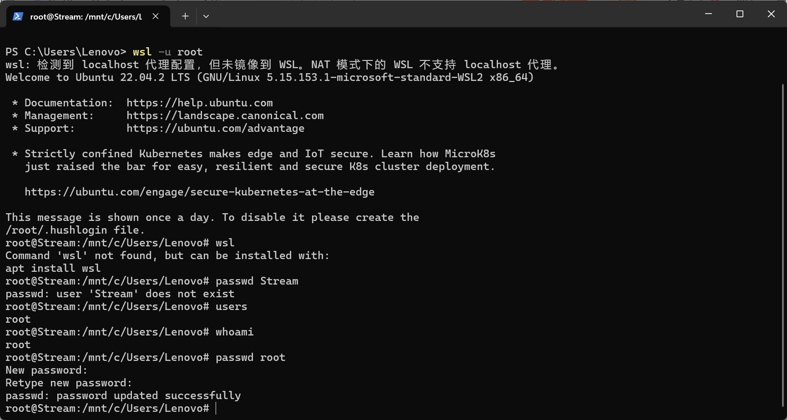

# 周报

## 上来就忘记wsl的密码，直接重置



## 安装gcc

```shell
root@Stream:/mnt/c/Users/Lenovo# sudo apt update
Hit:1 http://archive.ubuntu.com/ubuntu jammy InRelease
Get:2 http://security.ubuntu.com/ubuntu jammy-security InRelease [129 kB]
Get:3 http://archive.ubuntu.com/ubuntu jammy-updates InRelease [128 kB]
Get:4 http://archive.ubuntu.com/ubuntu jammy-backports InRelease [127 kB]
Get:5 http://security.ubuntu.com/ubuntu jammy-security/main amd64 Packages [1640 kB]
Get:6 http://archive.ubuntu.com/ubuntu jammy-updates/main i386 Packages [665 kB]
Get:7 http://archive.ubuntu.com/ubuntu jammy-updates/main amd64 Packages [1848 kB]
Get:8 http://archive.ubuntu.com/ubuntu jammy-updates/main Translation-en [333 kB]
Get:9 http://archive.ubuntu.com/ubuntu jammy-updates/main amd64 c-n-f Metadata [17.7 kB]
Get:10 http://archive.ubuntu.com/ubuntu jammy-updates/restricted amd64 Packages [2177 kB]
Get:11 http://archive.ubuntu.com/ubuntu jammy-updates/restricted Translation-en [373 kB]
Get:12 http://archive.ubuntu.com/ubuntu jammy-updates/restricted amd64 c-n-f Metadata [604 B]
Get:13 http://archive.ubuntu.com/ubuntu jammy-updates/universe i386 Packages [722 kB]
Get:14 http://security.ubuntu.com/ubuntu jammy-security/main i386 Packages [508 kB]
Get:15 http://security.ubuntu.com/ubuntu jammy-security/main Translation-en [276 kB]
Get:16 http://archive.ubuntu.com/ubuntu jammy-updates/universe amd64 Packages [1107 kB]
Get:17 http://security.ubuntu.com/ubuntu jammy-security/main amd64 c-n-f Metadata [13.0 kB]
Get:18 http://security.ubuntu.com/ubuntu jammy-security/restricted amd64 Packages [2120 kB]
Get:19 http://archive.ubuntu.com/ubuntu jammy-updates/universe Translation-en [258 kB]
Get:20 http://archive.ubuntu.com/ubuntu jammy-updates/universe amd64 c-n-f Metadata [25.4 kB]
Get:21 http://archive.ubuntu.com/ubuntu jammy-updates/multiverse amd64 c-n-f Metadata [444 B]
Get:22 http://archive.ubuntu.com/ubuntu jammy-backports/universe i386 Packages [17.2 kB]
Get:23 http://archive.ubuntu.com/ubuntu jammy-backports/universe amd64 Packages [28.8 kB]
Get:24 http://archive.ubuntu.com/ubuntu jammy-backports/universe Translation-en [16.5 kB]
Get:25 http://security.ubuntu.com/ubuntu jammy-security/restricted Translation-en [363 kB]
Get:26 http://security.ubuntu.com/ubuntu jammy-security/restricted amd64 c-n-f Metadata [572 B]
Get:27 http://security.ubuntu.com/ubuntu jammy-security/universe amd64 Packages [885 kB]
Get:28 http://security.ubuntu.com/ubuntu jammy-security/universe i386 Packages [618 kB]
Get:29 http://security.ubuntu.com/ubuntu jammy-security/universe Translation-en [173 kB]
Get:30 http://security.ubuntu.com/ubuntu jammy-security/universe amd64 c-n-f Metadata [18.9 kB]
Get:31 http://security.ubuntu.com/ubuntu jammy-security/multiverse amd64 c-n-f Metadata [228 B]
Fetched 14.6 MB in 12s (1217 kB/s)
Reading package lists... Done
Building dependency tree... Done
Reading state information... Done
66 packages can be upgraded. Run 'apt list --upgradable' to see them.
root@Stream:/mnt/c/Users/Lenovo# sudo apt install gcc
Reading package lists... Done
Building dependency tree... Done
Reading state information... Done
gcc is already the newest version (4:11.2.0-1ubuntu1).
gcc set to manually installed.
0 upgraded, 0 newly installed, 0 to remove and 66 not upgraded.
root@Stream:/mnt/c/Users/Lenovo# gcc --version
gcc (Ubuntu 11.4.0-1ubuntu1~22.04) 11.4.0
Copyright (C) 2021 Free Software Foundation, Inc.
This is free software; see the source for copying conditions.  There is NO
warranty; not even for MERCHANTABILITY or FITNESS FOR A PARTICULAR PURPOSE.
```

## 安装redis

```shell
root@Stream:/mnt/c/Users/Lenovo# sudo apt-get install redis
Reading package lists... Done
Building dependency tree... Done
Reading state information... Done
The following additional packages will be installed:
  libjemalloc2 liblua5.1-0 liblzf1 lua-bitop lua-cjson redis-server redis-tools
Suggested packages:
  ruby-redis
The following NEW packages will be installed:
  libjemalloc2 liblua5.1-0 liblzf1 lua-bitop lua-cjson redis redis-server redis-tools
0 upgraded, 8 newly installed, 0 to remove and 66 not upgraded.
Need to get 1276 kB of archives.
After this operation, 5793 kB of additional disk space will be used.
Do you want to continue? [Y/n] Y
Get:1 http://archive.ubuntu.com/ubuntu jammy/universe amd64 libjemalloc2 amd64 5.2.1-4ubuntu1 [240 kB]
Get:2 http://archive.ubuntu.com/ubuntu jammy/universe amd64 liblua5.1-0 amd64 5.1.5-8.1build4 [99.9 kB]
Get:3 http://archive.ubuntu.com/ubuntu jammy/universe amd64 liblzf1 amd64 3.6-3 [7444 B]
Get:4 http://archive.ubuntu.com/ubuntu jammy/universe amd64 lua-bitop amd64 1.0.2-5 [6680 B]
Get:5 http://archive.ubuntu.com/ubuntu jammy/universe amd64 lua-cjson amd64 2.1.0+dfsg-2.1 [17.4 kB]
Get:6 http://archive.ubuntu.com/ubuntu jammy/universe amd64 redis-tools amd64 5:6.0.16-1ubuntu1 [856 kB]
Get:7 http://archive.ubuntu.com/ubuntu jammy/universe amd64 redis-server amd64 5:6.0.16-1ubuntu1 [45.9 kB]
Get:8 http://archive.ubuntu.com/ubuntu jammy/universe amd64 redis all 5:6.0.16-1ubuntu1 [2930 B]
Fetched 1276 kB in 3s (432 kB/s)
Selecting previously unselected package libjemalloc2:amd64.
(Reading database ... 32403 files and directories currently installed.)
Preparing to unpack .../0-libjemalloc2_5.2.1-4ubuntu1_amd64.deb ...
Unpacking libjemalloc2:amd64 (5.2.1-4ubuntu1) ...
Selecting previously unselected package liblua5.1-0:amd64.
Preparing to unpack .../1-liblua5.1-0_5.1.5-8.1build4_amd64.deb ...
Unpacking liblua5.1-0:amd64 (5.1.5-8.1build4) ...
Selecting previously unselected package liblzf1:amd64.
Preparing to unpack .../2-liblzf1_3.6-3_amd64.deb ...
Unpacking liblzf1:amd64 (3.6-3) ...
Selecting previously unselected package lua-bitop:amd64.
Preparing to unpack .../3-lua-bitop_1.0.2-5_amd64.deb ...
Unpacking lua-bitop:amd64 (1.0.2-5) ...
Selecting previously unselected package lua-cjson:amd64.
Preparing to unpack .../4-lua-cjson_2.1.0+dfsg-2.1_amd64.deb ...
Unpacking lua-cjson:amd64 (2.1.0+dfsg-2.1) ...
Selecting previously unselected package redis-tools.
Preparing to unpack .../5-redis-tools_5%3a6.0.16-1ubuntu1_amd64.deb ...
Unpacking redis-tools (5:6.0.16-1ubuntu1) ...
Selecting previously unselected package redis-server.
Preparing to unpack .../6-redis-server_5%3a6.0.16-1ubuntu1_amd64.deb ...
Unpacking redis-server (5:6.0.16-1ubuntu1) ...
Selecting previously unselected package redis.
Preparing to unpack .../7-redis_5%3a6.0.16-1ubuntu1_all.deb ...
Unpacking redis (5:6.0.16-1ubuntu1) ...
Setting up libjemalloc2:amd64 (5.2.1-4ubuntu1) ...
Setting up lua-cjson:amd64 (2.1.0+dfsg-2.1) ...
Setting up liblzf1:amd64 (3.6-3) ...
Setting up lua-bitop:amd64 (1.0.2-5) ...
Setting up liblua5.1-0:amd64 (5.1.5-8.1build4) ...
Setting up redis-tools (5:6.0.16-1ubuntu1) ...
Setting up redis-server (5:6.0.16-1ubuntu1) ...
Created symlink /etc/systemd/system/redis.service → /lib/systemd/system/redis-server.service.
Created symlink /etc/systemd/system/multi-user.target.wants/redis-server.service → /lib/systemd/system/redis-server.service.
Setting up redis (5:6.0.16-1ubuntu1) ...
Processing triggers for man-db (2.10.2-1) ...
Processing triggers for libc-bin (2.35-0ubuntu3.8) ...
root@Stream:/usr/bin# ll
total 130000
drwxr-xr-x  2 root root       36864 Jul 20 09:13  ./
drwxr-xr-x 14 root root        4096 May  2  2023  ../
lrwxrwxrwx  1 root root           4 Feb 17  2020  NF -> col1*
-rwxr-xr-x  1 root root       51632 Feb  8  2022 '['*
-rwxr-xr-x  1 root root       35344 Oct 19  2022  aa-enabled*
-rwxr-xr-x  1 root root       35344 Oct 19  2022  aa-exec*
-rwxr-xr-x  1 root root       31248 Oct 19  2022  aa-features-abi*
-rwxr-xr-x  1 root root       14478 Feb  3  2023  add-apt-repository*
-rwxr-xr-x  1 root root       14720 Apr  9 23:32  addpart*
lrwxrwxrwx  1 root root          26 Jan 23 23:08  addr2line -> x86_64-linux-gnu-addr2line*
-rwxr-xr-x  1 root root        2558 Nov 24  2022  apport-bug*
-rwxr-xr-x  1 root root       13360 Apr 13  2023  apport-cli*
lrwxrwxrwx  1 root root          10 Apr 13  2023  apport-collect -> apport-bug*
-rwxr-xr-x  1 root root        2070 Apr 13  2023  apport-unpack*
lrwxrwxrwx  1 root root           6 Mar 18  2022  apropos -> whatis*
-rwxr-xr-x  1 root root       18824 Oct 31  2022  apt*
lrwxrwxrwx  1 root root          18 Feb  3  2023  apt-add-repository -> add-apt-repository*
-rwxr-xr-x  1 root root       84448 Oct 31  2022  apt-cache*
-rwxr-xr-x  1 root root       27104 Oct 31  2022  apt-cdrom*
-rwxr-xr-x  1 root root       27024 Oct 31  2022  apt-config*
-rwxr-xr-x  1 root root       23008 Oct 31  2022  apt-extracttemplates*
-rwxr-xr-x  1 root root      236008 Oct 31  2022  apt-ftparchive*
-rwxr-xr-x  1 root root       51680 Oct 31  2022  apt-get*
-rwxr-xr-x  1 root root       28173 Oct 31  2022  apt-key*
-rwxr-xr-x  1 root root       51680 Oct 31  2022  apt-mark*
-rwxr-xr-x  1 root root       39320 Oct 31  2022  apt-sortpkgs*
lrwxrwxrwx  1 root root          19 Jan 23 23:08  ar -> x86_64-linux-gnu-ar*
-rwxr-xr-x  1 root root       31232 Feb  8  2022  arch*
lrwxrwxrwx  1 root root          19 Jan 23 23:08  as -> x86_64-linux-gnu-as*
lrwxrwxrwx  1 root root          21 May  2  2023  awk -> /etc/alternatives/awk*
-rwxr-xr-x  1 root root       51720 Feb  8  2022  b2sum*
-rwxr-xr-x  1 root root       35328 Feb  8  2022  base32*
-rwxr-xr-x  1 root root       35328 Feb  8  2022  base64*
-rwxr-xr-x  1 root root       35328 Feb  8  2022  basename*
-rwxr-xr-x  1 root root       47616 Feb  8  2022  basenc*
-rwxr-xr-x  1 root root     1396520 Mar 14 19:31  bash*
-rwxr-xr-x  1 root root        6818 Mar 14 19:31  bashbug*
-rwxr-xr-x  1 root root       72184 Mar 20  2023  bootctl*
-rwxr-xr-x  3 root root       39296 Mar 23  2022  bunzip2*
-rwxr-xr-x  1 root root       92664 Mar 20  2023  busctl*
-rwxr-xr-x  1 root root     2193264 Feb  5  2022  busybox*
-rwxr-xr-x  1 root root        8363 Feb 17  2020  byobu*
-rwxr-xr-x  1 root root         996 Feb 17  2020  byobu-config*
-rwxr-xr-x  1 root root        4774 Feb 17  2020  byobu-ctrl-a*
-rwxr-xr-x  1 root root        1295 Feb 17  2020  byobu-disable*
-rwxr-xr-x  1 root root        1341 Feb 17  2020  byobu-disable-prompt*
-rwxr-xr-x  1 root root        1182 Feb 17  2020  byobu-enable*
-rwxr-xr-x  1 root root        1453 Feb 17  2020  byobu-enable-prompt*
-rwxr-xr-x  1 root root        1351 Feb 17  2020  byobu-export*
-rwxr-xr-x  1 root root        6440 Feb 17  2020  byobu-janitor*
-rwxr-xr-x  1 root root        1506 Feb 17  2020  byobu-keybindings*
-rwxr-xr-x  1 root root        3329 Feb 17  2020  byobu-launch*
-rwxr-xr-x  1 root root        1910 Feb 17  2020  byobu-launcher*
-rwxr-xr-x  1 root root        2459 Feb 17  2020  byobu-launcher-install*
-rwxr-xr-x  1 root root        1561 Feb 17  2020  byobu-launcher-uninstall*
-rwxr-xr-x  1 root root        3348 Feb 17  2020  byobu-layout*
-rwxr-xr-x  1 root root        1156 Feb 17  2020  byobu-prompt*
-rwxr-xr-x  1 root root        1410 Feb 17  2020  byobu-quiet*
-rwxr-xr-x  1 root root        3298 Feb 17  2020  byobu-reconnect-sockets*
lrwxrwxrwx  1 root root           5 Feb 17  2020  byobu-screen -> byobu*
-rwxr-xr-x  1 root root        1452 Feb 17  2020  byobu-select-backend*
-rwxr-xr-x  1 root root        5123 Feb 17  2020  byobu-select-profile*
-rwxr-xr-x  1 root root        1012 Feb 17  2020  byobu-select-session*
-rwxr-xr-x  1 root root        1600 Feb 17  2020  byobu-shell*
-rwxr-xr-x  1 root root        1306 Feb 17  2020  byobu-silent*
-rwxr-xr-x  1 root root        6015 Feb 17  2020  byobu-status*
-rwxr-xr-x  1 root root        1207 Feb 17  2020  byobu-status-detail*
lrwxrwxrwx  1 root root           5 Feb 17  2020  byobu-tmux -> byobu*
-rwxr-xr-x  1 root root        4667 Feb 17  2020  byobu-ugraph*
-rwxr-xr-x  1 root root       11996 Feb 17  2020  byobu-ulevel*
-rwxr-xr-x  3 root root       39296 Mar 23  2022  bzcat*
lrwxrwxrwx  1 root root           6 Mar 23  2022  bzcmp -> bzdiff*
-rwxr-xr-x  1 root root        2225 Mar 23  2022  bzdiff*
lrwxrwxrwx  1 root root           6 Mar 23  2022  bzegrep -> bzgrep*
-rwxr-xr-x  1 root root        4893 Nov 27  2021  bzexe*
lrwxrwxrwx  1 root root           6 Mar 23  2022  bzfgrep -> bzgrep*
-rwxr-xr-x  1 root root        3775 Mar 23  2022  bzgrep*
-rwxr-xr-x  3 root root       39296 Mar 23  2022  bzip2*
-rwxr-xr-x  1 root root       14640 Mar 23  2022  bzip2recover*
lrwxrwxrwx  1 root root           6 Mar 23  2022  bzless -> bzmore*
-rwxr-xr-x  1 root root        1297 Mar 23  2022  bzmore*
lrwxrwxrwx  1 root root          21 Aug 19  2023  c++ -> /etc/alternatives/c++*
lrwxrwxrwx  1 root root          24 Jan 23 23:08  c++filt -> x86_64-linux-gnu-c++filt*
lrwxrwxrwx  1 root root          21 Aug 19  2023  c89 -> /etc/alternatives/c89*
-rwxr-xr-x  1 root root         428 Nov 18  2020  c89-gcc*
lrwxrwxrwx  1 root root          21 Aug 19  2023  c99 -> /etc/alternatives/c99*
-rwxr-xr-x  1 root root         454 Nov 18  2020  c99-gcc*
-rwxr-xr-x  1 root root        6963 Jun  5 11:28  c_rehash*
lrwxrwxrwx  1 root root           3 May 17  2023  captoinfo -> tic*
-rwxr-xr-x  1 root root       35280 Feb  8  2022  cat*
-rwxr-xr-x  1 root root       35592 Mar 18  2022  catman*
lrwxrwxrwx  1 root root          20 Aug 19  2023  cc -> /etc/alternatives/cc*
-rwxr-sr-x  1 root shadow     72184 Feb  6 20:54  chage*
-rwxr-xr-x  1 root root       14656 Jun  2  2022  chattr*
-rwxr-xr-x  1 root root       59904 Feb  8  2022  chcon*
-rwsr-xr-x  1 root root       72712 Feb  6 20:54  chfn*
-rwxr-xr-x  1 root root       55808 Feb  8  2022  chgrp*
-rwxr-xr-x  1 root root       55808 Feb  8  2022  chmod*
-rwxr-xr-x  1 root root       22912 Apr  9 23:32  choom*
-rwxr-xr-x  1 root root       59904 Feb  8  2022  chown*
-rwxr-xr-x  1 root root       27008 Apr  9 23:32  chrt*
-rwsr-xr-x  1 root root       44808 Feb  6 20:54  chsh*
-rwxr-xr-x  1 root root       14568 Dec 16  2022  chvt*
-rwxr-xr-x  1 root root      149817 Nov 23  2021  ckbcomp*
-rwxr-xr-x  1 root root       35232 Feb  8  2022  cksum*
-rwxr-xr-x  1 root root       14656 May 17  2023  clear*
-rwxr-xr-x  1 root root       14568 Mar 14 19:31  clear_console*
-rwxr-xr-x  1 root root       43408 Mar 23  2022  cmp*
-rwxr-xr-x  1 root root       14488 Dec 16  2022  codepage*
-rwxr-xr-x  1 root root       22920 Apr  9 23:32  col*
-rwxr-xr-x  1 root root         963 Feb 17  2020  col1*
lrwxrwxrwx  1 root root           4 Feb 17  2020  col2 -> col1*
lrwxrwxrwx  1 root root           4 Feb 17  2020  col3 -> col1*
lrwxrwxrwx  1 root root           4 Feb 17  2020  col4 -> col1*
lrwxrwxrwx  1 root root           4 Feb 17  2020  col5 -> col1*
lrwxrwxrwx  1 root root           4 Feb 17  2020  col6 -> col1*
lrwxrwxrwx  1 root root           4 Feb 17  2020  col7 -> col1*
lrwxrwxrwx  1 root root           4 Feb 17  2020  col8 -> col1*
lrwxrwxrwx  1 root root           4 Feb 17  2020  col9 -> col1*
-rwxr-xr-x  1 root root       14728 Apr  9 23:32  colcrt*
-rwxr-xr-x  1 root root       14728 Apr  9 23:32  colrm*
-rwxr-xr-x  1 root root       35208 Apr  9 23:32  column*
-rwxr-xr-x  1 root root       35336 Feb  8  2022  comm*
-rwxr-xr-x  1 root root       15375 Nov 23  2023  corelist*
-rwxr-xr-x  1 root root      141824 Feb  8  2022  cp*
-rwxr-xr-x  1 root root        8360 Nov 23  2023  cpan*
-rwxr-xr-x  1 root root        8381 Nov 23  2023  cpan5.34-x86_64-linux-gnu*
-rwxr-xr-x  1 root root      145040 Apr 28 20:30  cpio*
lrwxrwxrwx  1 root root           6 Aug  5  2021  cpp -> cpp-11*
lrwxrwxrwx  1 root root          23 May 13  2023  cpp-11 -> x86_64-linux-gnu-cpp-11*
-rwxr-sr-x  1 root crontab    39568 Mar 23  2022  crontab*
-rwxr-xr-x  1 root root      109056 Feb  8  2022  csplit*
-rwxr-xr-x  1 root root         960 Feb 17  2020  ctail*
lrwxrwxrwx  1 root root           6 Mar 24  2022  ctstat -> lnstat*
-rwxr-xr-x  1 root root      260328 Mar 19 20:16  curl*
-rwxr-xr-x  1 root root       39424 Feb  8  2022  cut*
-rwxr-xr-x  1 root root      303512 Apr  4  2023  cvtsudoers*
-rwxr-xr-x  1 root root      125688 Mar 23  2022  dash*
-rwxr-xr-x  1 root root      104960 Feb  8  2022  date*
-rwxr-xr-x  1 root root       14632 Oct 25  2022  dbus-cleanup-sockets*
-rwxr-xr-x  1 root root      232776 Oct 25  2022  dbus-daemon*
-rwxr-xr-x  1 root root       30864 Oct 25  2022  dbus-launch*
-rwxr-xr-x  1 root root       26920 Oct 25  2022  dbus-monitor*
-rwxr-xr-x  1 root root       14632 Oct 25  2022  dbus-run-session*
-rwxr-xr-x  1 root root       26920 Oct 25  2022  dbus-send*
-rwxr-xr-x  1 root root       14632 Oct 25  2022  dbus-update-activation-environment*
-rwxr-xr-x  1 root root       14632 Oct 25  2022  dbus-uuidgen*
-rwxr-xr-x  1 root root       68112 Feb  8  2022  dd*
-rwxr-xr-x  1 root root       14568 Dec 16  2022  deallocvt*
-rwxr-xr-x  1 root root       21394 Dec  8  2021  deb-systemd-helper*
-rwxr-xr-x  1 root root        6156 Feb 16  2022  deb-systemd-invoke*
-rwxr-xr-x  1 root root        2859 Feb 20  2022  debconf*
-rwxr-xr-x  1 root root       11541 Feb 20  2022  debconf-apt-progress*
-rwxr-xr-x  1 root root         608 Feb 20  2022  debconf-communicate*
-rwxr-xr-x  1 root root        1719 Feb 20  2022  debconf-copydb*
-rwxr-xr-x  1 root root         647 Feb 20  2022  debconf-escape*
-rwxr-xr-x  1 root root        2995 Feb 20  2022  debconf-set-selections*
-rwxr-xr-x  1 root root        1827 Feb 20  2022  debconf-show*
-rwxr-xr-x  1 root root       23504 Mar 23  2022  debian-distro-info*
-rwxr-xr-x  1 root root       14720 Apr  9 23:32  delpart*
-rwxr-xr-x  1 root root       45896 Feb 13 03:29  delv*
-rwxr-xr-x  1 root root       85064 Feb  8  2022  df*
-rwxr-xr-x  1 root root        4414 Nov 11  2021  dh_bash-completion*
-rwxr-xr-x  1 root root      133680 Mar 23  2022  diff*
-rwxr-xr-x  1 root root       55824 Mar 23  2022  diff3*
-rwxr-xr-x  1 root root      150352 Feb 13 03:29  dig*
-rwxr-xr-x  1 root root      138208 Feb  8  2022  dir*
-rwxr-xr-x  1 root root       39432 Feb  8  2022  dircolors*
-rwxr-xr-x  1 root root      443408 Jul  5  2022  dirmngr*
-rwxr-xr-x  1 root root       56240 Jul  5  2022  dirmngr-client*
-rwxr-xr-x  1 root root       31104 Feb  8  2022  dirname*
lrwxrwxrwx  1 root root          18 Mar 23  2022  distro-info -> ubuntu-distro-info*
-rwxr-xr-x  1 root root       72304 Apr  9 23:32  dmesg*
lrwxrwxrwx  1 root root           8 Mar 23  2022  dnsdomainname -> hostname*
-rwxr-xr-x  1 root root       10602 Feb 10  2023  do-release-upgrade*
lrwxrwxrwx  1 root root           8 Mar 23  2022  domainname -> hostname*
-rwxr-xr-x  1 root root      318144 May 25  2022  dpkg*
-rwxr-xr-x  1 root root       13832 Apr  1  2023  dpkg-architecture*
-rwxr-xr-x  1 root root        7565 Apr  1  2023  dpkg-buildflags*
-rwxr-xr-x  1 root root       32425 Apr  1  2023  dpkg-buildpackage*
-rwxr-xr-x  1 root root        7624 Apr  1  2023  dpkg-checkbuilddeps*
-rwxr-xr-x  1 root root      137720 May 25  2022  dpkg-deb*
-rwxr-xr-x  1 root root        2782 Apr  1  2023  dpkg-distaddfile*
-rwxr-xr-x  1 root root      121336 May 25  2022  dpkg-divert*
-rwxr-xr-x  1 root root       17106 Apr  1  2023  dpkg-genbuildinfo*
-rwxr-xr-x  1 root root       17687 Apr  1  2023  dpkg-genchanges*
-rwxr-xr-x  1 root root       14580 Apr  1  2023  dpkg-gencontrol*
-rwxr-xr-x  1 root root       10902 Apr  1  2023  dpkg-gensymbols*
-rwxr-xr-x  1 root root       21209 May 25  2022  dpkg-maintscript-helper*
-rwxr-xr-x  1 root root        8903 Apr  1  2023  dpkg-mergechangelogs*
-rwxr-xr-x  1 root root        6789 Apr  1  2023  dpkg-name*
-rwxr-xr-x  1 root root        4947 Apr  1  2023  dpkg-parsechangelog*
-rwxr-xr-x  1 root root      141848 May 25  2022  dpkg-query*
-rwxr-xr-x  1 root root        4189 May 25  2022  dpkg-realpath*
-rwxr-xr-x  1 root root        8705 Apr  1  2023  dpkg-scanpackages*
-rwxr-xr-x  1 root root        9174 Apr  1  2023  dpkg-scansources*
-rwxr-xr-x  1 root root       31700 Apr  1  2023  dpkg-shlibdeps*
-rwxr-xr-x  1 root root       23106 Apr  1  2023  dpkg-source*
-rwxr-xr-x  1 root root      100872 May 25  2022  dpkg-split*
-rwxr-xr-x  1 root root       47368 May 25  2022  dpkg-statoverride*
-rwxr-xr-x  1 root root       43424 May 25  2022  dpkg-trigger*
-rwxr-xr-x  1 root root        3262 Apr  1  2023  dpkg-vendor*
-rwxr-xr-x  1 root root      150016 Feb  8  2022  du*
-rwxr-xr-x  1 root root      162520 Dec 16  2022  dumpkeys*
lrwxrwxrwx  1 root root          20 Jan 23 23:08  dwp -> x86_64-linux-gnu-dwp*
-rwxr-xr-x  1 root root       35120 Feb  8  2022  echo*
-rwxr-xr-x  1 root root       55800 Feb 13  2022  ed*
lrwxrwxrwx  1 root root          24 May  2  2023  editor -> /etc/alternatives/editor*
-rwxr-xr-x  1 root root          28 Mar 23  2022  egrep*
-rwxr-xr-x  1 root root       43240 Apr  9 23:32  eject*
lrwxrwxrwx  1 root root          24 Jan 23 23:08  elfedit -> x86_64-linux-gnu-elfedit*
-rwxr-xr-x  1 root root       41819 Nov 23  2023  enc2xs*
-rwxr-xr-x  1 root root        3078 Nov 23  2023  encguess*
-rwxr-xr-x  1 root root       43968 Feb  8  2022  env*
-rwxr-xr-x  1 root root       35200 Mar 25  2022  envsubst*
-rwxr-xr-x  1 root root      192968 Mar 23  2022  eqn*
lrwxrwxrwx  1 root root          20 May  2  2023  ex -> /etc/alternatives/ex*
-rwxr-xr-x  1 root root       35352 Feb  8  2022  expand*
-rwxr-sr-x  1 root shadow     23136 Feb  6 20:54  expiry*
-rwxr-xr-x  1 root root      108960 Feb  8  2022  expr*
-rwxr-xr-x  1 root root       72192 Feb  8  2022  factor*
-rwxr-xr-x  1 root root       23136 Feb  6 20:54  faillog*
-rwxr-xr-x  1 root root       31120 Mar  6  2022  faked-sysv*
-rwxr-xr-x  1 root root       31112 Mar  6  2022  faked-tcp*
lrwxrwxrwx  1 root root          26 Aug 19  2023  fakeroot -> /etc/alternatives/fakeroot*
-rwxr-xr-x  1 root root        3995 Mar  6  2022  fakeroot-sysv*
-rwxr-xr-x  1 root root        3990 Mar  6  2022  fakeroot-tcp*
-rwxr-xr-x  1 root root       22912 Apr  9 23:32  fallocate*
-rwxr-xr-x  1 root root       26928 Feb  8  2022  false*
-rwxr-xr-x  1 root root       14568 Dec 16  2022  fgconsole*
-rwxr-xr-x  1 root root          28 Mar 23  2022  fgrep*
-rwxr-xr-x  1 root root       27200 Sep 12  2023  file*
-rwxr-xr-x  1 root root       22960 Apr  9 23:32  fincore*
-rwxr-xr-x  1 root root      282088 Mar 23  2022  find*
-rwxr-xr-x  1 root root       65136 Apr  9 23:32  findmnt*
-rwxr-xr-x  1 root root       23024 Apr  9 23:32  flock*
-rwxr-xr-x  1 root root       39424 Feb  8  2022  fmt*
-rwxr-xr-x  1 root root       35328 Feb  8  2022  fold*
-rwxr-xr-x  1 root root       26864 Oct 31  2023  free*
lrwxrwxrwx  1 root root          21 May  2  2023  ftp -> /etc/alternatives/ftp*
-rwxr-xr-x  1 root root       40256 Mar 25  2022  fuser*
lrwxrwxrwx  1 root root          11 Mar 23  2022  fusermount -> fusermount3*
-rwsr-xr-x  1 root root       35200 Mar 23  2022  fusermount3*
lrwxrwxrwx  1 root root           6 Aug  5  2021  g++ -> g++-11*
lrwxrwxrwx  1 root root          23 May 13  2023  g++-11 -> x86_64-linux-gnu-g++-11*
-rwxr-xr-x  1 root root       22920 May  9 01:22  gapplication*
-rwxr-xr-x  1 root root      704984 Aug 17  2023  gawk*
lrwxrwxrwx  1 root root           6 Aug  5  2021  gcc -> gcc-11*
lrwxrwxrwx  1 root root          23 May 13  2023  gcc-11 -> x86_64-linux-gnu-gcc-11*
lrwxrwxrwx  1 root root           9 Aug  5  2021  gcc-ar -> gcc-ar-11*
lrwxrwxrwx  1 root root          26 May 13  2023  gcc-ar-11 -> x86_64-linux-gnu-gcc-ar-11*
lrwxrwxrwx  1 root root           9 Aug  5  2021  gcc-nm -> gcc-nm-11*
lrwxrwxrwx  1 root root          26 May 13  2023  gcc-nm-11 -> x86_64-linux-gnu-gcc-nm-11*
lrwxrwxrwx  1 root root          13 Aug  5  2021  gcc-ranlib -> gcc-ranlib-11*
lrwxrwxrwx  1 root root          30 May 13  2023  gcc-ranlib-11 -> x86_64-linux-gnu-gcc-ranlib-11*
lrwxrwxrwx  1 root root           7 Aug  5  2021  gcov -> gcov-11*
lrwxrwxrwx  1 root root          24 May 13  2023  gcov-11 -> x86_64-linux-gnu-gcov-11*
lrwxrwxrwx  1 root root          12 Aug  5  2021  gcov-dump -> gcov-dump-11*
lrwxrwxrwx  1 root root          29 May 13  2023  gcov-dump-11 -> x86_64-linux-gnu-gcov-dump-11*
lrwxrwxrwx  1 root root          12 Aug  5  2021  gcov-tool -> gcov-tool-11*
lrwxrwxrwx  1 root root          29 May 13  2023  gcov-tool-11 -> x86_64-linux-gnu-gcov-tool-11*
-rwxr-xr-x  1 root root       51592 May  9 01:22  gdbus*
-rwxr-xr-x  1 root root       27000 May  7 04:34  gencat*
lrwxrwxrwx  1 root root           3 Mar 23  2022  geqn -> eqn*
-rwxr-xr-x  1 root root       35112 May  7 04:34  getconf*
-rwxr-xr-x  1 root root       39576 May  7 04:34  getent*
-rwxr-xr-x  1 root root       14568 Dec 16  2022  getkeycodes*
-rwxr-xr-x  1 root root       22912 Apr  9 23:32  getopt*
-rwxr-xr-x  1 root root       35200 Mar 25  2022  gettext*
-rwxr-xr-x  1 root root        5188 Mar 25  2022  gettext.sh*
lrwxrwxrwx  1 root root          12 Feb  6  2022  ginstall-info -> install-info*
-rwxr-xr-x  1 root root       92568 May  9 01:22  gio*
lrwxrwxrwx  1 root root          49 May  9 01:22  gio-querymodules -> ../lib/x86_64-linux-gnu/glib-2.0/gio-querymodules*
-rwxr-xr-x  1 root root     3710360 May 20 20:14  git*
lrwxrwxrwx  1 root root           3 May 20 20:14  git-receive-pack -> git*
-rwxr-xr-x  1 root root      565840 May 20 20:14  git-shell*
lrwxrwxrwx  1 root root           3 May 20 20:14  git-upload-archive -> git*
lrwxrwxrwx  1 root root           3 May 20 20:14  git-upload-pack -> git*
lrwxrwxrwx  1 root root          53 May  9 01:22  glib-compile-schemas -> ../lib/x86_64-linux-gnu/glib-2.0/glib-compile-schemas*
lrwxrwxrwx  1 root root           4 Feb 15  2022  gmake -> make*
lrwxrwxrwx  1 root root          21 Jan 23 23:08  gold -> x86_64-linux-gnu-gold*
-rwsr-xr-x  1 root root       72072 Feb  6 20:54  gpasswd*
-rwxr-xr-x  1 root root     1050624 Jul  5  2022  gpg*
-rwxr-xr-x  1 root root      320472 Jul  5  2022  gpg-agent*
-rwxr-xr-x  1 root root       84984 Jul  5  2022  gpg-connect-agent*
-rwxr-xr-x  1 root root      117816 Jul  5  2022  gpg-wks-server*
-rwxr-xr-x  1 root root        3516 Jul  5  2022  gpg-zip*
-rwxr-xr-x  1 root root      508400 Jul  5  2022  gpgcompose*
-rwxr-xr-x  1 root root      129776 Jul  5  2022  gpgconf*
-rwxr-xr-x  1 root root       35200 Jul  5  2022  gpgparsemail*
-rwxr-xr-x  1 root root      428952 Jul  5  2022  gpgsm*
-rwxr-xr-x  1 root root       27184 Jul  5  2022  gpgsplit*
-rwxr-xr-x  1 root root       64912 Jul  5  2022  gpgtar*
-rwxr-xr-x  1 root root      277544 Jul  5  2022  gpgv*
lrwxrwxrwx  1 root root           3 Mar 23  2022  gpic -> pic*
lrwxrwxrwx  1 root root          22 Jan 23 23:08  gprof -> x86_64-linux-gnu-gprof*
-rwxr-xr-x  1 root root      182728 Mar 23  2022  grep*
-rwxr-xr-x  1 root root       22840 May  9 01:22  gresource*
-rwxr-xr-x  1 root root       96768 Mar 23  2022  groff*
-rwxr-xr-x  1 root root        2776 Mar 23  2022  grog*
-rwxr-xr-x  1 root root      166456 Mar 23  2022  grops*
-rwxr-xr-x  1 root root      121368 Mar 23  2022  grotty*
-rwxr-xr-x  1 root root       35328 Feb  8  2022  groups*
-rwxr-xr-x  1 root root       31032 May  9 01:22  gsettings*
lrwxrwxrwx  1 root root           3 Mar 23  2022  gtbl -> tbl*
-rwxr-xr-x  2 root root        2346 Sep  5  2022  gunzip*
-rwxr-xr-x  1 root root        6447 Sep  5  2022  gzexe*
-rwxr-xr-x  1 root root       93424 Sep  5  2022  gzip*
-rwxr-xr-x  1 root root       29227 Nov 23  2023  h2ph*
-rwxr-xr-x  1 root root       60934 Nov 23  2023  h2xs*
-rwxr-xr-x  1 root root       35256 Apr  9 23:32  hardlink*
lrwxrwxrwx  1 root root           7 Apr  9 23:32  hd -> hexdump*
-rwxr-xr-x  1 root root       43520 Feb  8  2022  head*
-rwxr-xr-x  1 root root        2514 Jan  4  2022  helpztags*
-rwxr-xr-x  1 root root       51600 Apr  9 23:32  hexdump*
-rwxr-xr-x  1 root root      121672 Feb 13 03:29  host*
-rwxr-xr-x  1 root root       31232 Feb  8  2022  hostid*
-rwxr-xr-x  1 root root       22760 Mar 23  2022  hostname*
-rwxr-xr-x  1 root root       31104 Mar 20  2023  hostnamectl*
-rwxr-xr-x  1 root root      283840 Mar 23  2022  htop*
-rwxr-xr-x  1 root root       10830 Dec  2  2022  hwe-support-status*
lrwxrwxrwx  1 root root           7 Apr  9 23:32  i386 -> setarch*
-rwxr-xr-x  1 root root       68000 May  7 04:34  iconv*
-rwxr-xr-x  1 root root       39424 Feb  8  2022  id*
-rwxr-xr-x  1 root root      308984 Feb  6  2022  info*
lrwxrwxrwx  1 root root          29 May  2  2023  infobrowser -> /etc/alternatives/infobrowser*
-rwxr-xr-x  1 root root       63872 May 17  2023  infocmp*
lrwxrwxrwx  1 root root           3 May 17  2023  infotocap -> tic*
-rwxr-xr-x  1 root root      145936 Feb  8  2022  install*
-rwxr-xr-x  1 root root      105704 Feb  6  2022  install-info*
-rwxr-xr-x  1 root root        4373 Nov 23  2023  instmodsh*
-rwxr-xr-x  1 root root       18816 Apr  9 23:32  ionice*
-rwxr-xr-x  1 root root      718896 Mar 24  2022  ip*
-rwxr-xr-x  1 root root       22984 Apr  9 23:32  ipcmk*
-rwxr-xr-x  1 root root       18816 Apr  9 23:32  ipcrm*
-rwxr-xr-x  1 root root       39296 Apr  9 23:32  ipcs*
lrwxrwxrwx  1 root root          28 Mar 24  2022  iptables-xml -> ../sbin/xtables-legacy-multi*
-rwxr-xr-x  1 root root       14536 Mar 23  2022  ischroot*
-rwxr-xr-x  1 root root       47656 Feb  8  2022  join*
-rwxr-xr-x  1 root root       80272 Mar 20  2023  journalctl*
-rwxr-xr-x  1 root root        4992 Nov 23  2023  json_pp*
-rwxr-xr-x  1 root root       14872 Dec 16  2022  kbd_mode*
-rwxr-xr-x  1 root root       18664 Dec 16  2022  kbdinfo*
-rwxr-xr-x  1 root root       64336 Jul  5  2022  kbxutil*
lrwxrwxrwx  1 root root           7 Jan 16  2014  keep-one-running -> run-one*
-rwxr-xr-x  1 root root        4902 Mar 11  2022  kernel-install*
-rwxr-xr-x  1 root root         961 Jan  2  2022  keyring*
-rwxr-xr-x  1 root root       30952 Oct 31  2023  kill*
-rwxr-xr-x  1 root root       32096 Mar 25  2022  killall*
-rwxr-xr-x  1 root root      170352 Aug 17  2021  kmod*
-rwxr-xr-x  1 root root       35200 Apr  9 23:32  last*
lrwxrwxrwx  1 root root           4 Apr  9 23:32  lastb -> last*
-rwxr-xr-x  1 root root       28288 Feb  6 20:54  lastlog*
-rwxr-xr-x  1 root root        7784 Jun 16  2020  lcf*
lrwxrwxrwx  1 root root          19 Jan 23 23:08  ld -> x86_64-linux-gnu-ld*
lrwxrwxrwx  1 root root          23 Jan 23 23:08  ld.bfd -> x86_64-linux-gnu-ld.bfd*
lrwxrwxrwx  1 root root          24 Jan 23 23:08  ld.gold -> x86_64-linux-gnu-ld.gold*
-rwxr-xr-x  1 root root        5443 May  7 04:34  ldd*
-rwxr-xr-x  1 root root      199048 Apr 28 04:32  less*
-rwxr-xr-x  1 root root       14656 Apr 28 04:32  lessecho*
lrwxrwxrwx  1 root root           8 Apr 28 04:32  lessfile -> lesspipe*
-rwxr-xr-x  1 root root       24272 Apr 28 04:32  lesskey*
-rwxr-xr-x  1 root root        9047 Dec 29  2021  lesspipe*
-rwxr-xr-x  1 root root      102144 Mar 18  2022  lexgrog*
-rwxr-xr-x  1 root root       15778 Nov 23  2023  libnetcfg*
-rwxr-xr-x  1 root root       31232 Feb  8  2022  link*
lrwxrwxrwx  1 root root           7 Apr  9 23:32  linux32 -> setarch*
lrwxrwxrwx  1 root root           7 Apr  9 23:32  linux64 -> setarch*
-rwxr-xr-x  1 root root       59904 Feb  8  2022  ln*
-rwxr-xr-x  1 root root       23200 Mar 24  2022  lnstat*
-rwxr-xr-x  1 root root      203528 Dec 16  2022  loadkeys*
-rwxr-xr-x  1 root root       31048 Dec 16  2022  loadunimap*
-rwxr-xr-x  1 root root       58944 May  7 04:34  locale*
-rwxr-xr-x  1 root root       14488 Feb 17  2023  locale-check*
-rwxr-xr-x  1 root root       27000 Mar 20  2023  localectl*
-rwxr-xr-x  1 root root      334808 May  7 04:34  localedef*
-rwxr-xr-x  1 root root       35808 Apr  9 23:32  logger*
-rwxr-xr-x  1 root root       52976 Feb  6 20:54  login*
-rwxr-xr-x  1 root root       59888 Mar 20  2023  loginctl*
-rwxr-xr-x  1 root root       31232 Feb  8  2022  logname*
-rwxr-xr-x  1 root root       18824 Apr  9 23:32  look*
-rwxr-xr-x  1 root root      117736 Nov  1  2022  lowntfs-3g*
-rwxr-xr-x  1 root root      138208 Feb  8  2022  ls*
-rwxr-xr-x  1 root root       14656 Jun  2  2022  lsattr*
-rwxr-xr-x  1 root root        3638 Aug 26  2019  lsb_release*
-rwxr-xr-x  1 root root      125320 Apr  9 23:32  lsblk*
-rwxr-xr-x  1 root root      100736 Apr  9 23:32  lscpu*
-rwxr-xr-x  1 root root      922824 Mar 25  2022  lshw*
-rwxr-xr-x  1 root root       51584 Apr  9 23:32  lsipc*
-rwxr-xr-x  1 root root       31440 Apr  9 23:32  lslocks*
-rwxr-xr-x  1 root root       51584 Apr  9 23:32  lslogins*
-rwxr-xr-x  1 root root       35200 Apr  9 23:32  lsmem*
lrwxrwxrwx  1 root root           4 Aug 17  2021  lsmod -> kmod*
-rwxr-xr-x  1 root root       39304 Apr  9 23:32  lsns*
-rwxr-xr-x  1 root root      167544 Mar 25  2022  lsof*
-rwxr-xr-x  1 root root       94288 Aug 30  2021  lspci*
-rwxr-xr-x  1 root root        1081 Aug 28  2017  lspgpot*
-rwxr-xr-x  1 root root      252432 Mar 25  2022  lsusb*
lrwxrwxrwx  1 root root          28 May 13  2023  lto-dump-11 -> x86_64-linux-gnu-lto-dump-11*
lrwxrwxrwx  1 root root          23 May  2  2023  lzcat -> /etc/alternatives/lzcat*
lrwxrwxrwx  1 root root          23 May  2  2023  lzcmp -> /etc/alternatives/lzcmp*
lrwxrwxrwx  1 root root          24 May  2  2023  lzdiff -> /etc/alternatives/lzdiff*
lrwxrwxrwx  1 root root          25 May  2  2023  lzegrep -> /etc/alternatives/lzegrep*
lrwxrwxrwx  1 root root          25 May  2  2023  lzfgrep -> /etc/alternatives/lzfgrep*
lrwxrwxrwx  1 root root          24 May  2  2023  lzgrep -> /etc/alternatives/lzgrep*
lrwxrwxrwx  1 root root          24 May  2  2023  lzless -> /etc/alternatives/lzless*
lrwxrwxrwx  1 root root          22 May  2  2023  lzma -> /etc/alternatives/lzma*
-rwxr-xr-x  1 root root       14568 Apr  8  2022  lzmainfo*
lrwxrwxrwx  1 root root          24 May  2  2023  lzmore -> /etc/alternatives/lzmore*
-rwxr-xr-x  1 root root      255696 Feb 15  2022  make*
-rwxr-xr-x  1 root root        4905 Feb 15  2022  make-first-existing-target*
-rwxr-xr-x  1 root root      120504 Mar 18  2022  man*
-rwxr-xr-x  1 root root       36536 Mar 18  2022  man-recode*
-rwxr-xr-x  1 root root      143296 Mar 18  2022  mandb*
-rwxr-xr-x  1 root root        1942 Feb 17  2020  manifest*
-rwxr-xr-x  1 root root       31520 Mar 18  2022  manpath*
-rwxr-xr-x  1 root root       31048 Dec 16  2022  mapscrn*
-rwxr-xr-x  1 root root      158504 Jan 24  2022  mawk*
-rwxr-xr-x  1 root root       27080 Apr  9 23:32  mcookie*
-rwxr-xr-x  1 root root       43424 Feb  8  2022  md5sum*
lrwxrwxrwx  1 root root           6 Feb  8  2022  md5sum.textutils -> md5sum*
-rwxr-xr-x  1 root root       51608 Feb 13 03:29  mdig*
-rwxr-xr-x  1 root root        7495 May  7 04:34  memusage*
-rwxr-xr-x  1 root root       22904 May  7 04:34  memusagestat*
-rwxr-xr-x  1 root root       14720 Apr  9 23:32  mesg*
-rwxr-xr-x  1 root root        3060 Dec 19  2021  migrate-pubring-from-classic-gpg*
-rwxr-xr-x  1 root root       16163 Dec 16  2022  mk_modmap*
-rwxr-xr-x  1 root root       68096 Feb  8  2022  mkdir*
-rwxr-xr-x  1 root root       39424 Feb  8  2022  mkfifo*
-rwxr-xr-x  1 root root       43520 Feb  8  2022  mknod*
-rwxr-xr-x  1 root root      260792 Mar 25  2022  mksquashfs*
-rwxr-xr-x  1 root root       39424 Feb  8  2022  mktemp*
-rwxr-xr-x  1 root root       43400 Apr  9 23:32  more*
-rwsr-xr-x  1 root root       47488 Apr  9 23:32  mount*
-rwxr-xr-x  1 root root       18816 Apr  9 23:32  mountpoint*
lrwxrwxrwx  1 root root          20 May  2  2023  mt -> /etc/alternatives/mt*
-rwxr-xr-x  1 root root       68336 Apr 28 20:30  mt-gnu*
-rwxr-xr-x  1 root root       73984 Jan 11  2022  mtr*
-rwxr-xr-x  1 root root       39216 Jan 11  2022  mtr-packet*
-rwxr-xr-x  1 root root        6583 May  7 04:34  mtrace*
-rwxr-xr-x  1 root root      137744 Feb  8  2022  mv*
-rwxr-xr-x  1 root root       22912 Apr  9 23:32  namei*
-rwxr-xr-x  1 root root      283144 Feb 19  2022  nano*
lrwxrwxrwx  1 root root          22 May  2  2023  nawk -> /etc/alternatives/nawk*
lrwxrwxrwx  1 root root          20 May  2  2023  nc -> /etc/alternatives/nc*
-rwxr-xr-x  1 root root       39560 Feb 23  2022  nc.openbsd*
-rwxr-xr-x  1 root root         913 Mar 23  2022  neqn*
lrwxrwxrwx  1 root root          24 May  2  2023  netcat -> /etc/alternatives/netcat*
-rwxr-xr-x  1 root root      104832 Mar 20  2023  networkctl*
-rwxr-xr-x  1 root root       20185 May  4  2022  networkd-dispatcher*
-rwsr-xr-x  1 root root       40496 Feb  6 20:54  newgrp*
-rwxr-xr-x  1 root root       35200 Mar 25  2022  ngettext*
-rwxr-xr-x  1 root root       35328 Feb  8  2022  nice*
lrwxrwxrwx  1 root root           8 Mar 23  2022  nisdomainname -> hostname*
-rwxr-xr-x  1 root root      100928 Feb  8  2022  nl*
lrwxrwxrwx  1 root root          19 Jan 23 23:08  nm -> x86_64-linux-gnu-nm*
-rwxr-xr-x  1 root root       35232 Feb  8  2022  nohup*
-rwxr-xr-x  1 root root       35328 Feb  8  2022  nproc*
-rwxr-xr-x  1 root root        3293 Mar 23  2022  nroff*
-rwxr-xr-x  1 root root       27240 Apr  9 23:32  nsenter*
-rwxr-xr-x  1 root root      121672 Feb 13 03:29  nslookup*
-rwxr-xr-x  1 root root       31104 Mar 24  2022  nstat*
-rwxr-xr-x  1 root root       76344 Feb 13 03:29  nsupdate*
-rwxr-xr-x  1 root root      162824 Nov  1  2022  ntfs-3g*
-rwxr-xr-x  1 root root       14720 Nov  1  2022  ntfs-3g.probe*
-rwxr-xr-x  1 root root       27008 Nov  1  2022  ntfscat*
-rwxr-xr-x  1 root root       39304 Nov  1  2022  ntfscluster*
-rwxr-xr-x  1 root root       31104 Nov  1  2022  ntfscmp*
-rwxr-xr-x  1 root root       43400 Nov  1  2022  ntfsdecrypt*
-rwxr-xr-x  1 root root       27016 Nov  1  2022  ntfsfallocate*
-rwxr-xr-x  1 root root       35208 Nov  1  2022  ntfsfix*
-rwxr-xr-x  1 root root       55688 Nov  1  2022  ntfsinfo*
-rwxr-xr-x  1 root root       28112 Nov  1  2022  ntfsls*
-rwxr-xr-x  1 root root       31112 Nov  1  2022  ntfsmove*
-rwxr-xr-x  1 root root      108928 Nov  1  2022  ntfsrecover*
-rwxr-xr-x  1 root root       80752 Nov  1  2022  ntfssecaudit*
-rwxr-xr-x  1 root root       26936 Nov  1  2022  ntfstruncate*
-rwxr-xr-x  1 root root       18736 Nov  1  2022  ntfsusermap*
-rwxr-xr-x  1 root root       43936 Nov  1  2022  ntfswipe*
-rwxr-xr-x  1 root root       55840 Feb  8  2022  numfmt*
lrwxrwxrwx  1 root root          24 Jan 23 23:08  objcopy -> x86_64-linux-gnu-objcopy*
lrwxrwxrwx  1 root root          24 Jan 23 23:08  objdump -> x86_64-linux-gnu-objdump*
-rwxr-xr-x  1 root root       68096 Feb  8  2022  od*
-rwxr-xr-x  1 root root        8792 Apr 13  2023  oem-getlogs*
lrwxrwxrwx  1 root root          17 Jul 21  2019  on_ac_power -> /sbin/on_ac_power*
-rwxr-xr-x  1 root root     1001272 Jun  5 11:28  openssl*
-rwxr-xr-x  1 root root       23128 Dec 16  2022  openvt*
lrwxrwxrwx  1 root root          23 May  2  2023  pager -> /etc/alternatives/pager*
-rwxr-xr-x  1 root root       59784 Apr  9 23:32  partx*
-rwsr-xr-x  1 root root       59976 Feb  6 20:54  passwd*
-rwxr-xr-x  1 root root       35232 Feb  8  2022  paste*
-rwxr-xr-x  1 root root       16502 Nov 24  2021  pastebinit*
-rwxr-xr-x  1 root root      190992 Mar 25  2022  patch*
-rwxr-xr-x  1 root root       35328 Feb  8  2022  pathchk*
lrwxrwxrwx  1 root root           5 Nov 24  2021  pbget -> pbput*
-rwxr-xr-x  1 root root        2569 Aug  3  2019  pbput*
lrwxrwxrwx  1 root root           5 Nov 24  2021  pbputs -> pbput*
lrwxrwxrwx  1 root root           7 Aug 18  2022  pdb3 -> pdb3.10*
lrwxrwxrwx  1 root root          24 Nov 20  2023  pdb3.10 -> ../lib/python3.10/pdb.py*
-rwxr-xr-x  1 root root       14640 Mar 25  2022  peekfd*
-rwxr-xr-x  2 root root     3802104 Nov 23  2023  perl*
-rwxr-xr-x  1 root root       14648 Nov 23  2023  perl5.34-x86_64-linux-gnu*
-rwxr-xr-x  2 root root     3802104 Nov 23  2023  perl5.34.0*
-rwxr-xr-x  2 root root       45183 Nov 23  2023  perlbug*
-rwxr-xr-x  1 root root         125 Aug 26  2021  perldoc*
-rwxr-xr-x  1 root root       10867 Nov 23  2023  perlivp*
-rwxr-xr-x  2 root root       45183 Nov 23  2023  perlthanks*
-rwxr-xr-x  1 root root       30968 Oct 31  2023  pgrep*
-rwxr-xr-x  1 root root      204840 Mar 23  2022  pic*
lrwxrwxrwx  1 root root          22 May  2  2023  pico -> /etc/alternatives/pico*
-rwxr-xr-x  1 root root        8360 Nov 23  2023  piconv*
lrwxrwxrwx  1 root root          14 Dec 15  2021  pidof -> /sbin/killall5*
-rwxr-xr-x  1 root root       30968 Oct 31  2023  pidwait*
lrwxrwxrwx  1 root root          26 May  2  2023  pinentry -> /etc/alternatives/pinentry*
-rwxr-xr-x  1 root root       60056 Mar 25  2022  pinentry-curses*
-rwxr-xr-x  1 root root       76672 Feb  5  2022  ping*
lrwxrwxrwx  1 root root           4 Feb  5  2022  ping4 -> ping*
lrwxrwxrwx  1 root root           4 Feb  5  2022  ping6 -> ping*
-rwxr-xr-x  1 root root       35232 Feb  8  2022  pinky*
-rwxr-xr-x  1 root root         221 Nov 10  2023  pip*
-rwxr-xr-x  1 root root         221 Nov 10  2023  pip3*
-rwxr-xr-x  1 root root         221 Nov 10  2023  pip3.10*
-rwxr-xr-x  1 root root       18736 Feb 26  2022  pkaction*
-rwxr-xr-x  1 root root       22832 Feb 26  2022  pkcheck*
-rwxr-xr-x  1 root root       59704 Mar 15  2022  pkcon*
-rwsr-xr-x  1 root root       30872 Feb 26  2022  pkexec*
lrwxrwxrwx  1 root root           5 Oct 31  2023  pkill -> pgrep*
-rwxr-xr-x  1 root root       22840 Mar 15  2022  pkmon*
-rwxr-xr-x  1 root root       18736 Feb 26  2022  pkttyagent*
-rwxr-xr-x  1 root root        4536 Nov 23  2023  pl2pm*
-rwxr-xr-x  1 root root       22904 May  7 04:34  pldd*
-rwxr-xr-x  1 root root       47408 Mar 18  2022  plymouth*
-rwxr-xr-x  1 root root       35064 Oct 31  2023  pmap*
-rwxr-xr-x  1 root root        4137 Nov 23  2023  pod2html*
-rwxr-xr-x  1 root root       15034 Nov 23  2023  pod2man*
-rwxr-xr-x  1 root root       10803 Nov 23  2023  pod2text*
-rwxr-xr-x  1 root root        4107 Nov 23  2023  pod2usage*
-rwxr-xr-x  1 root root        3658 Nov 23  2023  podchecker*
-rwxr-xr-x  1 root root       68168 Feb  8  2022  pr*
-rwxr-xr-x  1 root root       55784 Mar 23  2022  preconv*
-rwxr-xr-x  1 root root       31104 Feb  8  2022  printenv*
-rwxr-xr-x  1 root root       51632 Feb  8  2022  printf*
-rwxr-xr-x  1 root root       27536 Apr  9 23:32  prlimit*
lrwxrwxrwx  1 root root          16 Apr  6  2023  pro -> ubuntu-advantage*
-rwxr-xr-x  1 root root       13658 Nov 23  2023  prove*
-rwxr-xr-x  1 root root       22912 Mar 25  2022  prtstat*
-rwxr-xr-x  1 root root      141776 Oct 31  2023  ps*
lrwxrwxrwx  1 root root           9 Dec 16  2022  psfaddtable -> psfxtable*
lrwxrwxrwx  1 root root           9 Dec 16  2022  psfgettable -> psfxtable*
lrwxrwxrwx  1 root root           9 Dec 16  2022  psfstriptable -> psfxtable*
-rwxr-xr-x  1 root root       26856 Dec 16  2022  psfxtable*
-rwxr-xr-x  1 root root       14640 Mar 25  2022  pslog*
-rwxr-xr-x  1 root root       36168 Mar 25  2022  pstree*
lrwxrwxrwx  1 root root           6 Mar 25  2022  pstree.x11 -> pstree*
-rwxr-xr-x  1 root root        3566 Nov 23  2023  ptar*
-rwxr-xr-x  1 root root        2645 Nov 23  2023  ptardiff*
-rwxr-xr-x  1 root root        4395 Nov 23  2023  ptargrep*
-rwxr-xr-x  1 root root      129584 Feb  8  2022  ptx*
-rwxr-xr-x  1 root root        1149 Feb 17  2020  purge-old-kernels*
-rwxr-xr-x  1 root root       35328 Feb  8  2022  pwd*
-rwxr-xr-x  1 root root       14568 Oct 31  2023  pwdx*
-rwxr-xr-x  1 root root        7813 Aug 18  2022  py3clean*
-rwxr-xr-x  1 root root       13191 Aug 18  2022  py3compile*
lrwxrwxrwx  1 root root          31 Aug 18  2022  py3versions -> ../share/python3/py3versions.py*
lrwxrwxrwx  1 root root           9 Aug 18  2022  pydoc3 -> pydoc3.10*
-rwxr-xr-x  1 root root          79 Nov 20  2023  pydoc3.10*
lrwxrwxrwx  1 root root          13 Aug 18  2022  pygettext3 -> pygettext3.10*
-rwxr-xr-x  1 root root       24235 Jun  7  2023  pygettext3.10*
lrwxrwxrwx  1 root root          10 Aug 18  2022  python3 -> python3.10*
lrwxrwxrwx  1 root root          17 Aug 18  2022  python3-config -> python3.10-config*
-rwxr-xr-x  1 root root     5904904 Nov 20  2023  python3.10*
lrwxrwxrwx  1 root root          34 Nov 20  2023  python3.10-config -> x86_64-linux-gnu-python3.10-config*
lrwxrwxrwx  1 root root          23 Jan 23 23:08  ranlib -> x86_64-linux-gnu-ranlib*
lrwxrwxrwx  1 root root           4 Mar 14 19:31  rbash -> bash*
lrwxrwxrwx  1 root root          21 May  2  2023  rcp -> /etc/alternatives/rcp*
-rwxr-xr-x  1 root root      100880 Mar 24  2022  rdma*
lrwxrwxrwx  1 root root          24 Jan 23 23:08  readelf -> x86_64-linux-gnu-readelf*
-rwxr-xr-x  1 root root       39328 Feb  8  2022  readlink*
-rwxr-xr-x  1 root root       39328 Feb  8  2022  realpath*
-rwxr-xr-x  1 root root          89 Feb 13  2022  red*
-rwxr-xr-x  1 root root      748200 Mar  4  2022  redis-benchmark*
-rwxr-xr-x  1 root root     1474504 Mar  4  2022  redis-check-aof*
-rwxr-xr-x  1 root root     1474504 Mar  4  2022  redis-check-rdb*
-rwxr-xr-x  1 root root      362632 Mar  4  2022  redis-cli*
lrwxrwxrwx  1 root root          15 Mar  4  2022  redis-server -> redis-check-rdb*
-rwxr-xr-x  1 root root       14720 Apr  9 23:32  renice*
lrwxrwxrwx  1 root root           4 May 17  2023  reset -> tset*
-rwxr-xr-x  1 root root       26952 Dec 16  2022  resizecons*
-rwxr-xr-x  1 root root       22912 Apr  9 23:32  resizepart*
-rwxr-xr-x  1 root root      133656 Mar 20  2023  resolvectl*
-rwxr-xr-x  1 root root       14720 Apr  9 23:32  rev*
-rwxr-xr-x  1 root root          30 Jan 29  2020  rgrep*
lrwxrwxrwx  1 root root          24 May  2  2023  rlogin -> /etc/alternatives/rlogin*
-rwxr-xr-x  1 root root       59904 Feb  8  2022  rm*
-rwxr-xr-x  1 root root       43424 Feb  8  2022  rmdir*
lrwxrwxrwx  1 root root           4 Feb 19  2022  rnano -> nano*
-rwxr-xr-x  1 root root         208 Mar 24  2022  routef*
-rwxr-xr-x  1 root root        1656 Mar 24  2022  routel*
-rwxr-xr-x  1 root root       96864 Mar 25  2022  rpcgen*
-rwxr-xr-x  1 root root       12639 Feb 28  2023  rrsync*
lrwxrwxrwx  1 root root          21 May  2  2023  rsh -> /etc/alternatives/rsh*
-rwxr-xr-x  1 root root      518272 Feb 28  2023  rsync*
-rwxr-xr-x  1 root root        5136 Feb 28  2023  rsync-ssl*
lrwxrwxrwx  1 root root           6 Mar 24  2022  rtstat -> lnstat*
-rwxr-xr-x  1 root root        3592 Jan 16  2014  run-one*
lrwxrwxrwx  1 root root           7 Jan 16  2014  run-one-constantly -> run-one*
lrwxrwxrwx  1 root root           7 Jan 16  2014  run-one-until-failure -> run-one*
lrwxrwxrwx  1 root root           7 Jan 16  2014  run-one-until-success -> run-one*
-rwxr-xr-x  1 root root       27176 Mar 23  2022  run-parts*
lrwxrwxrwx  1 root root           7 Jan 16  2014  run-this-one -> run-one*
-rwxr-xr-x  1 root root       35328 Feb  8  2022  runcon*
lrwxrwxrwx  1 root root          23 May  2  2023  rview -> /etc/alternatives/rview*
lrwxrwxrwx  1 root root          22 May  2  2023  rvim -> /etc/alternatives/rvim*
-rwxr-xr-x  1 root root       10487 Mar 23  2022  savelog*
-rwxr-xr-x  1 root root      133720 Jun 26 21:11  scp*
-rwxr-xr-x  1 root root      481512 Feb  2  2022  screen*
-rwxr-xr-x  1 root root       14488 Dec 16  2022  screendump*
-rwxr-xr-x  1 root root       51584 Apr  9 23:32  script*
-rwxr-xr-x  1 root root       43392 Apr  9 23:32  scriptlive*
-rwxr-xr-x  1 root root       35200 Apr  9 23:32  scriptreplay*
-rwxr-xr-x  1 root root       47504 Mar 23  2022  sdiff*
-rwxr-xr-x  1 root root      113224 Mar 25  2022  sed*
-rwxr-xr-x  1 root root        2450 Aug 30  2021  select-editor*
-rwxr-xr-x  1 root root        1290 Aug 30  2021  sensible-browser*
-rwxr-xr-x  1 root root        1269 Aug 30  2021  sensible-editor*
-rwxr-xr-x  1 root root         565 Aug 30  2021  sensible-pager*
-rwxr-xr-x  1 root root       47616 Feb  8  2022  seq*
-rwxr-xr-x  1 root root       27288 Apr  9 23:32  setarch*
-rwxr-xr-x  1 root root       51528 Dec 16  2022  setfont*
-rwxr-xr-x  1 root root       14568 Dec 16  2022  setkeycodes*
-rwxr-xr-x  1 root root       18648 Dec 16  2022  setleds*
-rwxr-xr-x  1 root root       14568 Dec 16  2022  setlogcons*
-rwxr-xr-x  1 root root       14600 Dec 16  2022  setmetamode*
-rwxr-xr-x  1 root root       31112 Aug 30  2021  setpci*
-rwxr-xr-x  1 root root       39304 Apr  9 23:32  setpriv*
-rwxr-xr-x  1 root root       14720 Apr  9 23:32  setsid*
-rwxr-xr-x  1 root root       35200 Apr  9 23:32  setterm*
-rwxr-xr-x  1 root root       39233 Nov 23  2021  setupcon*
-rwxr-xr-x  1 root root      146088 Jun 26 21:11  sftp*
lrwxrwxrwx  1 root root           6 Feb  6 20:54  sg -> newgrp*
lrwxrwxrwx  1 root root           4 May  2  2023  sh -> dash*
-rwxr-xr-x  1 root root       43424 Feb  8  2022  sha1sum*
-rwxr-xr-x  1 root root       51616 Feb  8  2022  sha224sum*
-rwxr-xr-x  1 root root       51616 Feb  8  2022  sha256sum*
-rwxr-xr-x  1 root root       55712 Feb  8  2022  sha384sum*
-rwxr-xr-x  1 root root       55712 Feb  8  2022  sha512sum*
-rwxr-xr-x  1 root root        9979 Nov 23  2023  shasum*
-rwxr-xr-x  1 root root       18664 Dec 16  2022  showconsolefont*
-rwxr-xr-x  1 root root       18664 Dec 16  2022  showkey*
-rwxr-xr-x  1 root root       51712 Feb  8  2022  shred*
-rwxr-xr-x  1 root root       47616 Feb  8  2022  shuf*
lrwxrwxrwx  1 root root          21 Jan 23 23:08  size -> x86_64-linux-gnu-size*
-rwxr-xr-x  1 root root       30952 Oct 31  2023  skill*
-rwxr-xr-x  1 root root       22768 Oct 31  2023  slabtop*
-rwxr-xr-x  1 root root       35328 Feb  8  2022  sleep*
lrwxrwxrwx  1 root root           3 Jun 26 21:11  slogin -> ssh*
-rwxr-xr-x  1 root root    16138392 May 29  2023  snap*
lrwxrwxrwx  1 root root          20 May 29  2023  snapctl -> ../lib/snapd/snapctl*
-rwxr-xr-x  1 root root       35048 May 29  2023  snapfuse*
lrwxrwxrwx  1 root root           5 Oct 31  2023  snice -> skill*
-rwxr-xr-x  1 root root       31208 Mar 23  2022  soelim*
-rwxr-xr-x  1 root root      101168 Feb  8  2022  sort*
-rwxr-xr-x  1 root root        4308 May  7 04:34  sotruss*
-rwxr-xr-x  1 root root       19414 Nov 23  2023  splain*
-rwxr-xr-x  1 root root       52184 Feb  8  2022  split*
-rwxr-xr-x  1 root root       14488 Dec 16  2022  splitfont*
-rwxr-xr-x  1 root root       35192 May  7 04:34  sprof*
lrwxrwxrwx  1 root root          10 Mar 25  2022  sqfscat -> unsquashfs*
lrwxrwxrwx  1 root root          10 Mar 25  2022  sqfstar -> mksquashfs*
-rwxr-xr-x  1 root root      128072 Mar 24  2022  ss*
-rwxr-xr-x  1 root root      846888 Jun 26 21:11  ssh*
-rwxr-xr-x  1 root root      170416 Jun 26 21:11  ssh-add*
-rwxr-sr-x  1 root _ssh      293304 Jun 26 21:11  ssh-agent*
-rwxr-xr-x  1 root root        1455 Mar 14 04:24  ssh-argv0*
-rwxr-xr-x  1 root root       12676 Feb 23  2022  ssh-copy-id*
-rwxr-xr-x  1 root root      457152 Jun 26 21:11  ssh-keygen*
-rwxr-xr-x  1 root root      195008 Jun 26 21:11  ssh-keyscan*
-rwxr-xr-x  1 root root       80392 Feb  8  2022  stat*
lrwxrwxrwx  1 root root           7 Feb  5  2022  static-sh -> busybox*
-rwxr-xr-x  1 root root       43520 Feb  8  2022  stdbuf*
-rwxr-xr-x  1 root root     1972848 Feb 16  2022  strace*
-rwxr-xr-x  1 root root        1821 Feb 16  2021  strace-log-merge*
-rwxr-xr-x  1 root root        7941 Nov 23  2023  streamzip*
lrwxrwxrwx  1 root root          24 Jan 23 23:08  strings -> x86_64-linux-gnu-strings*
lrwxrwxrwx  1 root root          22 Jan 23 23:08  strip -> x86_64-linux-gnu-strip*
-rwxr-xr-x  1 root root       76288 Feb  8  2022  stty*
-rwsr-xr-x  1 root root       55680 Apr  9 23:32  su*
-rwsr-xr-x  1 root root      232416 Apr  4  2023  sudo*
lrwxrwxrwx  1 root root           4 Apr  4  2023  sudoedit -> sudo*
-rwxr-xr-x  1 root root       89744 Apr  4  2023  sudoreplay*
-rwxr-xr-x  1 root root       35232 Feb  8  2022  sum*
-rwxr-xr-x  1 root root       35232 Feb  8  2022  sync*
-rwxr-xr-x  1 root root     1119856 Mar 20  2023  systemctl*
lrwxrwxrwx  1 root root          20 Mar 20  2023  systemd -> /lib/systemd/systemd*
-rwxr-xr-x  1 root root     1809160 Mar 20  2023  systemd-analyze*
-rwxr-xr-x  1 root root       18928 Mar 20  2023  systemd-ask-password*
-rwxr-xr-x  1 root root       18816 Mar 20  2023  systemd-cat*
-rwxr-xr-x  1 root root       23016 Mar 20  2023  systemd-cgls*
-rwxr-xr-x  1 root root       39312 Mar 20  2023  systemd-cgtop*
-rwxr-xr-x  1 root root       51744 Mar 20  2023  systemd-cryptenroll*
-rwxr-xr-x  1 root root       27000 Mar 20  2023  systemd-delta*
-rwxr-xr-x  1 root root       18808 Mar 20  2023  systemd-detect-virt*
-rwxr-xr-x  1 root root       22904 Mar 20  2023  systemd-escape*
-rwxr-xr-x  1 root root      121504 Mar 20  2023  systemd-hwdb*
-rwxr-xr-x  1 root root       27000 Mar 20  2023  systemd-id128*
-rwxr-xr-x  1 root root       22928 Mar 20  2023  systemd-inhibit*
-rwxr-xr-x  1 root root       18928 Mar 20  2023  systemd-machine-id-setup*
-rwxr-xr-x  1 root root       51808 Mar 20  2023  systemd-mount*
-rwxr-xr-x  1 root root       22912 Mar 20  2023  systemd-notify*
-rwxr-xr-x  1 root root       18808 Mar 20  2023  systemd-path*
-rwxr-xr-x  1 root root       64072 Mar 20  2023  systemd-run*
-rwxr-xr-x  1 root root       27000 Mar 20  2023  systemd-socket-activate*
-rwxr-xr-x  1 root root       22912 Mar 20  2023  systemd-stdio-bridge*
-rwxr-xr-x  1 root root       47608 Mar 20  2023  systemd-sysext*
-rwxr-xr-x  1 root root       64184 Mar 20  2023  systemd-sysusers*
-rwxr-xr-x  1 root root      100936 Mar 20  2023  systemd-tmpfiles*
-rwxr-xr-x  1 root root       35192 Mar 20  2023  systemd-tty-ask-password-agent*
lrwxrwxrwx  1 root root          13 Mar 20  2023  systemd-umount -> systemd-mount*
-rwxr-xr-x  1 root root       18744 May 17  2023  tabs*
-rwxr-xr-x  1 root root      104864 Feb  8  2022  tac*
-rwxr-xr-x  1 root root       68120 Feb  8  2022  tail*
-rwxr-xr-x  1 root root      517952 Dec  5  2023  tar*
-rwxr-xr-x  1 root root       22912 Apr  9 23:32  taskset*
-rwxr-xr-x  1 root root      129512 Mar 23  2022  tbl*
-rwxr-xr-x  1 root root     1331320 Feb 11  2023  tcpdump*
-rwxr-xr-x  1 root root       35328 Feb  8  2022  tee*
lrwxrwxrwx  1 root root          24 May  2  2023  telnet -> /etc/alternatives/telnet*
-rwxr-xr-x  1 root root      110144 Mar 25  2022  telnet.netkit*
-rwxr-xr-x  1 root root       14360 Mar 23  2022  tempfile*
-rwxr-xr-x  1 root root       43440 Feb  8  2022  test*
-rwxr-xr-x  1 root root       88488 May 17  2023  tic*
-rwxr-xr-x  1 root root       27160 Mar 25  2022  time*
-rwxr-xr-x  1 root root       47480 Mar 20  2023  timedatectl*
-rwxr-xr-x  1 root root       39872 Feb  8  2022  timeout*
-rwxr-xr-x  1 root root       18680 Oct 31  2023  tload*
-rwxr-xr-x  1 root root      971320 Jan 31  2023  tmux*
-rwxr-xr-x  1 root root      183192 Mar 25  2022  tnftp*
-rwxr-xr-x  1 root root       22840 May 17  2023  toe*
-rwxr-xr-x  1 root root      133184 Oct 31  2023  top*
-rwxr-xr-x  1 root root       92672 Feb  8  2022  touch*
-rwxr-xr-x  1 root root       26968 May 17  2023  tput*
-rwxr-xr-x  1 root root       47616 Feb  8  2022  tr*
-rwxr-xr-x  1 root root       22672 Feb  5  2022  tracepath*
-rwxr-xr-x  1 root root      735856 Mar 23  2022  troff*
-rwxr-xr-x  1 root root       26928 Feb  8  2022  true*
-rwxr-xr-x  1 root root       35328 Feb  8  2022  truncate*
-rwxr-xr-x  1 root root       26944 May 17  2023  tset*
-rwxr-xr-x  1 root root       47616 Feb  8  2022  tsort*
-rwxr-xr-x  1 root root       31232 Feb  8  2022  tty*
-rwxr-xr-x  1 root root       15378 May  7 04:34  tzselect*
lrwxrwxrwx  1 root root          16 Apr  6  2023  ua -> ubuntu-advantage*
-rwxr-xr-x  1 root root        1018 Apr  6  2023  ubuntu-advantage*
lrwxrwxrwx  1 root root          10 Apr 13  2023  ubuntu-bug -> apport-bug*
lrwxrwxrwx  1 root root          25 May 29  2023  ubuntu-core-launcher -> ../lib/snapd/snap-confine*
-rwxr-xr-x  1 root root       23440 Mar 23  2022  ubuntu-distro-info*
-rwxr-xr-x  1 root root       22783 Dec  2  2022  ubuntu-security-status*
-rwxr-xr-x  1 root root       41883 Jun 16  2020  ucf*
-rwxr-xr-x  1 root root       19367 Jun 16  2020  ucfq*
-rwxr-xr-x  1 root root       10719 Jun 16  2020  ucfr*
-rwxr-xr-x  1 root root       27008 Apr  9 23:32  uclampset*
-rwxr-xr-x  1 root root     1131856 Mar 20  2023  udevadm*
-rwxr-xr-x  1 root root       22920 Apr  9 23:32  ul*
-rwsr-xr-x  1 root root       35200 Apr  9 23:32  umount*
-rwxr-xr-x  1 root root       35328 Feb  8  2022  uname*
-rwxr-xr-x  1 root root       99547 Jan 15  2022  unattended-upgrade*
lrwxrwxrwx  1 root root          18 Jan 15  2022  unattended-upgrades -> unattended-upgrade*
-rwxr-xr-x  2 root root        2346 Sep  5  2022  uncompress*
-rwxr-xr-x  1 root root       35352 Feb  8  2022  unexpand*
-rwxr-xr-x  1 root root        2762 Dec 16  2022  unicode_start*
-rwxr-xr-x  1 root root         530 Dec 16  2022  unicode_stop*
-rwxr-xr-x  1 root root       43520 Feb  8  2022  uniq*
-rwxr-xr-x  1 root root       31232 Feb  8  2022  unlink*
lrwxrwxrwx  1 root root          24 May  2  2023  unlzma -> /etc/alternatives/unlzma*
-rwxr-xr-x  1 root root       31336 Apr  9 23:32  unshare*
-rwxr-xr-x  1 root root      135064 Mar 25  2022  unsquashfs*
lrwxrwxrwx  1 root root           2 Apr  8  2022  unxz -> xz*
-rwxr-xr-x  1 root root       59640 May 25  2022  update-alternatives*
-rwxr-xr-x  1 root root       59624 Jan 14  2022  update-mime-database*
-rwxr-xr-x  1 root root       14568 Oct 31  2023  uptime*
-rwxr-xr-x  1 root root        4429 Mar 25  2022  usb-devices*
-rwxr-xr-x  1 root root       31112 Mar 25  2022  usbhid-dump*
-rwxr-xr-x  1 root root       14640 Mar 25  2022  usbreset*
-rwxr-xr-x  1 root root       35328 Feb  8  2022  users*
-rwxr-xr-x  1 root root       22912 Apr  9 23:32  utmpdump*
-rwxr-xr-x  1 root root       18816 Apr  9 23:32  uuidgen*
-rwxr-xr-x  1 root root       22912 Apr  9 23:32  uuidparse*
-rwxr-xr-x  1 root root      138208 Feb  8  2022  vdir*
lrwxrwxrwx  1 root root          20 May  2  2023  vi -> /etc/alternatives/vi*
lrwxrwxrwx  1 root root          22 May  2  2023  view -> /etc/alternatives/view*
-rwxr-xr-x  1 root root        2640 Feb 17  2020  vigpg*
lrwxrwxrwx  1 root root          21 May  2  2023  vim -> /etc/alternatives/vim*
-rwxr-xr-x  1 root root     3787824 Mar 14 17:05  vim.basic*
-rwxr-xr-x  1 root root     1520320 Mar 14 17:05  vim.tiny*
lrwxrwxrwx  1 root root          25 May  2  2023  vimdiff -> /etc/alternatives/vimdiff*
-rwxr-xr-x  1 root root        2154 Mar 14 17:05  vimtutor*
-rwxr-xr-x  1 root root       39160 Oct 31  2023  vmstat*
-rwxr-xr-x  1 root root       22760 Oct 31  2023  w*
-rwxr-xr-x  1 root root       22912 Apr  9 23:32  wall*
-rwxr-xr-x  1 root root       27240 Oct 31  2023  watch*
-rwxr-xr-x  1 root root       18744 Jul  5  2022  watchgnupg*
-rwxr-xr-x  1 root root       43432 Feb  8  2022  wc*
-rwxr-xr-x  1 root root       31128 Apr  9 23:32  wdctl*
-rwxr-xr-x  1 root root      470032 Jun 19 20:15  wget*
-rwxr-xr-x  1 root root       48416 Mar 18  2022  whatis*
-rwxr-xr-x  1 root root       31576 Apr  9 23:32  whereis*
lrwxrwxrwx  1 root root          23 May  2  2023  which -> /etc/alternatives/which*
-rwxr-xr-x  1 root root         946 Mar 23  2022  which.debianutils*
-rwxr-xr-x  1 root root       30888 Mar 18  2022  whiptail*
-rwxr-xr-x  1 root root       51728 Feb  8  2022  who*
-rwxr-xr-x  1 root root       31232 Feb  8  2022  whoami*
-rwxr-xr-x  1 root root        2107 Feb 17  2020  wifi-status*
lrwxrwxrwx  1 root root          23 May  2  2023  write -> /etc/alternatives/write*
-rwxr-xr-x  1 root root       22920 Apr  9 23:32  write.ul*
lrwxrwxrwx  1 root root           5 Jan 13  2024  wslinfo -> /init*
lrwxrwxrwx  1 root root           5 Aug 18  2023  wslpath -> /init*
lrwxrwxrwx  1 root root           7 Apr  9 23:32  x86_64 -> setarch*
-rwxr-xr-x  1 root root       27344 Jan 23 23:08  x86_64-linux-gnu-addr2line*
-rwxr-xr-x  1 root root       55792 Jan 23 23:08  x86_64-linux-gnu-ar*
-rwxr-xr-x  1 root root      467352 Jan 23 23:08  x86_64-linux-gnu-as*
-rwxr-xr-x  1 root root       22800 Jan 23 23:08  x86_64-linux-gnu-c++filt*
lrwxrwxrwx  1 root root           6 Aug  5  2021  x86_64-linux-gnu-cpp -> cpp-11*
-rwxr-xr-x  1 root root      928584 May 13  2023  x86_64-linux-gnu-cpp-11*
-rwxr-xr-x  1 root root     1904000 Jan 23 23:08  x86_64-linux-gnu-dwp*
-rwxr-xr-x  1 root root       35552 Jan 23 23:08  x86_64-linux-gnu-elfedit*
lrwxrwxrwx  1 root root           6 Aug  5  2021  x86_64-linux-gnu-g++ -> g++-11*
-rwxr-xr-x  1 root root      932680 May 13  2023  x86_64-linux-gnu-g++-11*
lrwxrwxrwx  1 root root           6 Aug  5  2021  x86_64-linux-gnu-gcc -> gcc-11*
-rwxr-xr-x  1 root root      928584 May 13  2023  x86_64-linux-gnu-gcc-11*
lrwxrwxrwx  1 root root           9 Aug  5  2021  x86_64-linux-gnu-gcc-ar -> gcc-ar-11*
-rwxr-xr-x  1 root root       27176 May 13  2023  x86_64-linux-gnu-gcc-ar-11*
lrwxrwxrwx  1 root root           9 Aug  5  2021  x86_64-linux-gnu-gcc-nm -> gcc-nm-11*
-rwxr-xr-x  1 root root       27176 May 13  2023  x86_64-linux-gnu-gcc-nm-11*
lrwxrwxrwx  1 root root          13 Aug  5  2021  x86_64-linux-gnu-gcc-ranlib -> gcc-ranlib-11*
-rwxr-xr-x  1 root root       27176 May 13  2023  x86_64-linux-gnu-gcc-ranlib-11*
lrwxrwxrwx  1 root root           7 Aug  5  2021  x86_64-linux-gnu-gcov -> gcov-11*
-rwxr-xr-x  1 root root      409608 May 13  2023  x86_64-linux-gnu-gcov-11*
lrwxrwxrwx  1 root root          12 Aug  5  2021  x86_64-linux-gnu-gcov-dump -> gcov-dump-11*
-rwxr-xr-x  1 root root      257880 May 13  2023  x86_64-linux-gnu-gcov-dump-11*
lrwxrwxrwx  1 root root          12 Aug  5  2021  x86_64-linux-gnu-gcov-tool -> gcov-tool-11*
-rwxr-xr-x  1 root root      282552 May 13  2023  x86_64-linux-gnu-gcov-tool-11*
lrwxrwxrwx  1 root root          24 Jan 23 23:08  x86_64-linux-gnu-gold -> x86_64-linux-gnu-ld.gold*
-rwxr-xr-x  1 root root      114472 Jan 23 23:08  x86_64-linux-gnu-gprof*
lrwxrwxrwx  1 root root          23 Jan 23 23:08  x86_64-linux-gnu-ld -> x86_64-linux-gnu-ld.bfd*
-rwxr-xr-x  1 root root     1744376 Jan 23 23:08  x86_64-linux-gnu-ld.bfd*
-rwxr-xr-x  1 root root     3189920 Jan 23 23:08  x86_64-linux-gnu-ld.gold*
-rwxr-xr-x  1 root root    24887296 May 13  2023  x86_64-linux-gnu-lto-dump-11*
-rwxr-xr-x  1 root root       44672 Jan 23 23:08  x86_64-linux-gnu-nm*
-rwxr-xr-x  1 root root      166440 Jan 23 23:08  x86_64-linux-gnu-objcopy*
-rwxr-xr-x  1 root root      373888 Jan 23 23:08  x86_64-linux-gnu-objdump*
lrwxrwxrwx  1 root root          34 Aug 18  2022  x86_64-linux-gnu-python3-config -> x86_64-linux-gnu-python3.10-config*
-rwxr-xr-x  1 root root        3123 Nov 20  2023  x86_64-linux-gnu-python3.10-config*
-rwxr-xr-x  1 root root       55792 Jan 23 23:08  x86_64-linux-gnu-ranlib*
-rwxr-xr-x  1 root root      776640 Jan 23 23:08  x86_64-linux-gnu-readelf*
-rwxr-xr-x  1 root root       31184 Jan 23 23:08  x86_64-linux-gnu-size*
-rwxr-xr-x  1 root root       31344 Jan 23 23:08  x86_64-linux-gnu-strings*
-rwxr-xr-x  1 root root      166472 Jan 23 23:08  x86_64-linux-gnu-strip*
-rwxr-xr-x  1 root root       63912 Mar 23  2022  xargs*
-rwxr-xr-x  1 root root       56280 Mar 25  2022  xauth*
-rwxr-xr-x  1 root root         234 Mar 25  2022  xdg-user-dir*
-rwxr-xr-x  1 root root       26856 Mar 25  2022  xdg-user-dirs-update*
-rwxr-xr-x  1 root root        5167 Nov 23  2023  xsubpp*
-rwxr-xr-x  1 root root       18720 Mar 14 17:05  xxd*
-rwxr-xr-x  1 root root       84504 Apr  8  2022  xz*
lrwxrwxrwx  1 root root           2 Apr  8  2022  xzcat -> xz*
lrwxrwxrwx  1 root root           6 Apr  8  2022  xzcmp -> xzdiff*
-rwxr-xr-x  1 root root        7023 Apr  8  2022  xzdiff*
lrwxrwxrwx  1 root root           6 Apr  8  2022  xzegrep -> xzgrep*
lrwxrwxrwx  1 root root           6 Apr  8  2022  xzfgrep -> xzgrep*
-rwxr-xr-x  1 root root        6015 Apr  8  2022  xzgrep*
-rwxr-xr-x  1 root root        1799 Apr  8  2022  xzless*
-rwxr-xr-x  1 root root        2162 Apr  8  2022  xzmore*
-rwxr-xr-x  1 root root       31104 Feb  8  2022  yes*
lrwxrwxrwx  1 root root           8 Mar 23  2022  ypdomainname -> hostname*
-rwxr-xr-x  1 root root        1984 Sep  5  2022  zcat*
-rwxr-xr-x  1 root root        1678 Sep  5  2022  zcmp*
-rwxr-xr-x  1 root root        5898 Sep  5  2022  zdiff*
-rwxr-xr-x  1 root root       26840 May  7 04:34  zdump*
-rwxr-xr-x  1 root root          29 Sep  5  2022  zegrep*
-rwxr-xr-x  1 root root          29 Sep  5  2022  zfgrep*
-rwxr-xr-x  1 root root        2081 Sep  5  2022  zforce*
-rwxr-xr-x  1 root root        8103 Sep  5  2022  zgrep*
-rwxr-xr-x  1 root root       60065 Nov 23  2023  zipdetails*
-rwxr-xr-x  1 root root        2206 Sep  5  2022  zless*
-rwxr-xr-x  1 root root        1842 Sep  5  2022  zmore*
-rwxr-xr-x  1 root root        4577 Sep  5  2022  znew*
```

## 启动redis

```shell
root@Stream:/usr/bin# redis-server
7858:C 20 Jul 2024 09:22:55.292 # oO0OoO0OoO0Oo Redis is starting oO0OoO0OoO0Oo
7858:C 20 Jul 2024 09:22:55.292 # Redis version=6.0.16, bits=64, commit=00000000, modified=0, pid=7858, just started
7858:C 20 Jul 2024 09:22:55.292 # Warning: no config file specified, using the default config. In order to specify a config file use redis-server /path/to/redis.conf
7858:M 20 Jul 2024 09:22:55.292 * Increased maximum number of open files to 10032 (it was originally set to 1024).
7858:M 20 Jul 2024 09:22:55.293 # Could not create server TCP listening socket *:6379: bind: Address already in use
root@Stream:/usr/bin# sudo service redis-server stop
root@Stream:/usr/bin# redis-server
8168:C 20 Jul 2024 09:24:09.074 # oO0OoO0OoO0Oo Redis is starting oO0OoO0OoO0Oo
8168:C 20 Jul 2024 09:24:09.074 # Redis version=6.0.16, bits=64, commit=00000000, modified=0, pid=8168, just started
8168:C 20 Jul 2024 09:24:09.074 # Warning: no config file specified, using the default config. In order to specify a config file use redis-server /path/to/redis.conf
8168:M 20 Jul 2024 09:24:09.074 * Increased maximum number of open files to 10032 (it was originally set to 1024).
                _._
           _.-``__ ''-._
      _.-``    `.  `_.  ''-._           Redis 6.0.16 (00000000/0) 64 bit
  .-`` .-```.  ```\/    _.,_ ''-._
 (    '      ,       .-`  | `,    )     Running in standalone mode
 |`-._`-...-` __...-.``-._|'` _.-'|     Port: 6379
 |    `-._   `._    /     _.-'    |     PID: 8168
  `-._    `-._  `-./  _.-'    _.-'
 |`-._`-._    `-.__.-'    _.-'_.-'|
 |    `-._`-._        _.-'_.-'    |           http://redis.io
  `-._    `-._`-.__.-'_.-'    _.-'
 |`-._`-._    `-.__.-'    _.-'_.-'|
 |    `-._`-._        _.-'_.-'    |
  `-._    `-._`-.__.-'_.-'    _.-'
      `-._    `-.__.-'    _.-'
          `-._        _.-'
              `-.__.-'

8168:M 20 Jul 2024 09:24:09.075 # Server initialized
8168:M 20 Jul 2024 09:24:09.075 # WARNING overcommit_memory is set to 0! Background save may fail under low memory condition. To fix this issue add 'vm.overcommit_memory = 1' to /etc/sysctl.conf and then reboot or run the command 'sysctl vm.overcommit_memory=1' for this to take effect.
8168:M 20 Jul 2024 09:24:09.075 # WARNING you have Transparent Huge Pages (THP) support enabled in your kernel. This will create latency and memory usage issues with Redis. To fix this issue run the command 'echo madvise > /sys/kernel/mm/transparent_hugepage/enabled' as root, and add it to your /etc/rc.local in order to retain the setting after a reboot. Redis must be restarted after THP is disabled (set to 'madvise' or 'never').
8168:M 20 Jul 2024 09:24:09.076 * Ready to accept connections
```

