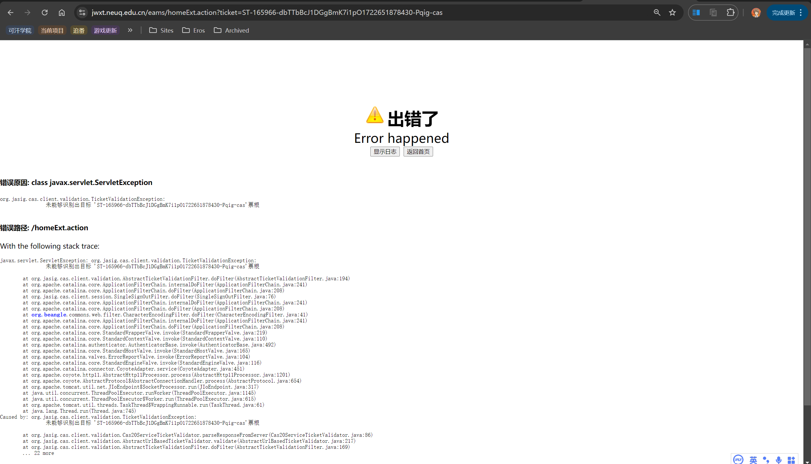

# 周报

这周学到了登录，就不得不放出一张图：

这周我在忙别的项目，看完了课，技术部这边大抵是没时间做demo了，但是可以来一起分析一下这张图。

我就厚着脸皮用ChatGPT写了：

TicketValidationException 是一个在软件开发和票务系统（例如身份验证、授权和票务处理）中常见的异常类型。它通常表示在验证票据（ticket）时发生了错误或异常情况。下面是关于 TicketValidationException 的详细解释：

1. 定义
   
    TicketValidationException 是一个异常类，通常用于票务系统或身份验证框架中。当一个票据无法通过验证时，该异常会被抛出。这个票据可以是用于身份验证的凭证（如 OAuth 或 SAML 票据），也可以是用于访问特定服务或资源的票据（如 API 密钥或访问令牌）。

2. 用途

   TicketValidationException 的主要用途是在验证票据时捕获和处理错误情况。以下是一些可能的场景：

        身份验证失败：用户提供的票据无效，无法验证其身份。
        票据过期：票据已超过有效期，不再有效。
        票据格式错误：票据的格式不正确，无法解析或验证。
        签名无效：票据的数字签名不匹配，可能被篡改。

3. 常见使用场景

   单点登录（SSO）系统：在 SSO 系统中，TicketValidationException 通常用于处理身份验证票据的验证错误。例如，CAS（Central Authentication Service）是一个常见的 SSO 框架，它在验证服务票据时可能会抛出 TicketValidationException。
   API 网关：在 API 网关中，当客户端提供的访问令牌无法通过验证时，可能会抛出 TicketValidationException。
   授权服务：在授权服务中，当请求的票据无效或不具备访问某资源的权限时，会抛出该异常。

根据图片中的错误信息和调用栈，可以分析出以下几点：

1. 错误类型：主要错误是javax.servlet.ServletException，其根本原因是org.jasig.cas.client.validation.TicketValidationException，即票据验证失败。

2. 错误信息：票据ST-165966-dbTTbBcJ1DGgBmK7i1p01722651878430-Pqig-cas的验证失败。

3. 调用栈解析：

   调用栈的起点是org.jasig.cas.client.validation.AbstractTicketValidationFilter.doFilter(AbstractTicketValidationFilter.java:194)。该方法调用了doFilter，这表示开始了一个过滤器链的执行。
   
   继续往下，org.apache.catalina.core.ApplicationFilterChain.internalDoFilter(ApplicationFilterChain.java:241)显示了过滤器链的执行过程。
   
   org.apache.catalina.core.ApplicationFilterChain.doFilter(ApplicationFilterChain.java:208)是具体执行过滤器链的地方。
   
   org.apache.catalina.core.ApplicationFilterChain.internalDoFilter(ApplicationFilterChain.java:250)和org.apache.catalina.core.ApplicationFilterChain.doFilter(ApplicationFilterChain.java:208)再次出现，表示过滤器链继续执行。
   
   org.jasig.cas.client.session.SingleSignOutFilter.doFilter(SingleSignOutFilter.java:76)：这是CAS客户端的单点登出过滤器。
   
   org.apache.catalina.core.ApplicationFilterChain.internalDoFilter(ApplicationFilterChain.java:250)和org.apache.catalina.core.ApplicationFilterChain.doFilter(ApplicationFilterChain.java:208)继续执行。
   
   org.apache.catalina.core.StandardWrapperValve.invoke(StandardWrapperValve.java:259)：Tomcat的标准WrapperValve处理请求。
   
   org.apache.catalina.core.StandardContextValve.invoke(StandardContextValve.java:106)：Tomcat的标准ContextValve处理请求。
   
   org.apache.catalina.authenticator.AuthenticatorBase.invoke(AuthenticatorBase.java:496)：Tomcat的身份验证器处理请求。
   
   org.apache.catalina.core.StandardHostValve.invoke(StandardHostValve.java:139)：Tomcat的标准HostValve处理请求。
   
   org.apache.catalina.valves.ErrorReportValve.invoke(ErrorReportValve.java:92)：Tomcat的错误报告阀处理请求。
   
   org.apache.catalina.core.StandardEngineValve.invoke(StandardEngineValve.java:87)：Tomcat的标准EngineValve处理请求。
   
   org.apache.catalina.connector.CoyoteAdapter.service(CoyoteAdapter.java:343)：Tomcat的CoyoteAdapter处理请求。
   
   org.apache.coyote.http11.Http11Processor.service(Http11Processor.java:615)：处理HTTP请求。
   
   org.apache.coyote.AbstractProcessorLight.process(AbstractProcessorLight.java:65)：抽象处理器处理请求。
   
   org.apache.coyote.AbstractProtocol$ConnectionHandler.process(AbstractProtocol.java:818)：协议连接处理请求。
   
   org.apache.tomcat.util.net.NioEndpoint$SocketProcessor.doRun(NioEndpoint.java:1626)和org.apache.tomcat.util.net.SocketProcessorBase.run(SocketProcessorBase.java:49)处理socket。
   
   org.apache.tomcat.util.threads.ThreadPoolExecutor.runWorker(ThreadPoolExecutor.java:1191)和org.apache.tomcat.util.threads.ThreadPoolExecutor$Worker.run(ThreadPoolExecutor.java:659)：线程池执行任务。
   
   java.lang.Thread.run(Thread.java:829)：Java线程运行。
   
4. 根本原因：

   Caused by: org.jasig.cas.client.validation.TicketValidationException在调用栈底部指出了具体的异常。

   具体的异常发生在org.jasig.cas.client.validation.Cas20ServiceTicketValidator.parseResponseFromServer(Cas20ServiceTicketValidator.java:86)，这意味着在从服务器解析响应时发生了错误。

   org.jasig.cas.client.validation.AbstractUrlBasedTicketValidator.validate(AbstractUrlBasedTicketValidator.java:217)和org.jasig.cas.client.validation.AbstractTicketValidationFilter.doFilter(AbstractTicketValidationFilter.java:169)继续说明了验证过程。

5. 总结来说，错误发生在CAS客户端票据验证过程中。具体的验证逻辑可以概括如下：

   请求经过了多个过滤器（如单点登出过滤器）。

   最终请求到达票据验证过滤器。

   在验证过程中，从服务器解析票据响应时发生错误，导致票据验证失败，从而抛出TicketValidationException。

   这个异常被捕获并包装成ServletException，最终在页面上显示出错误信息。