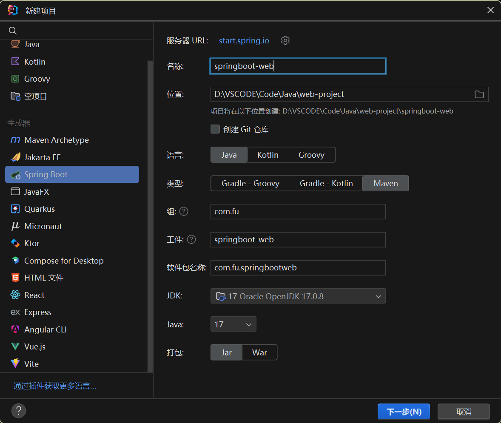
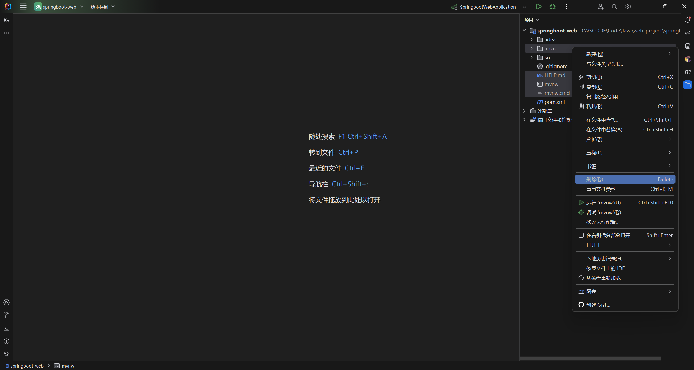
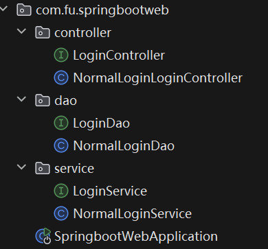
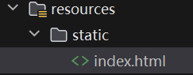
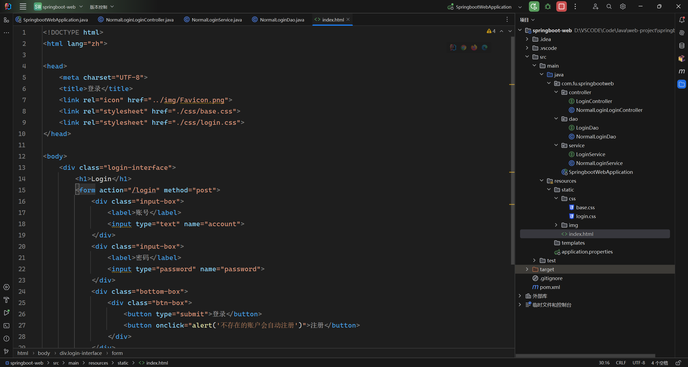
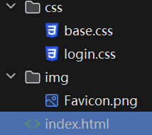
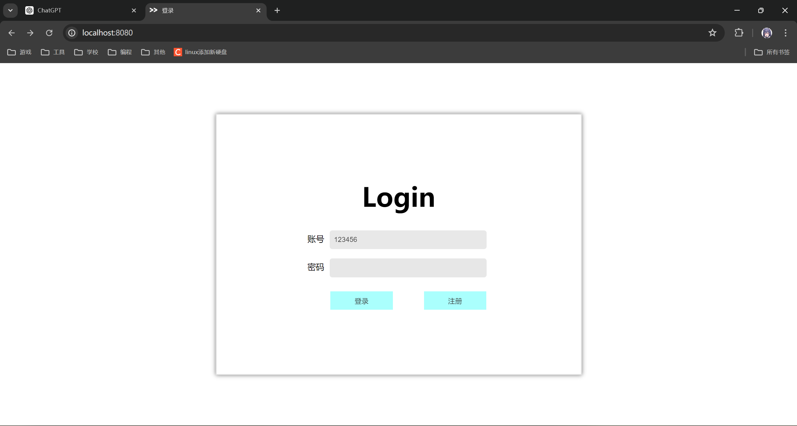
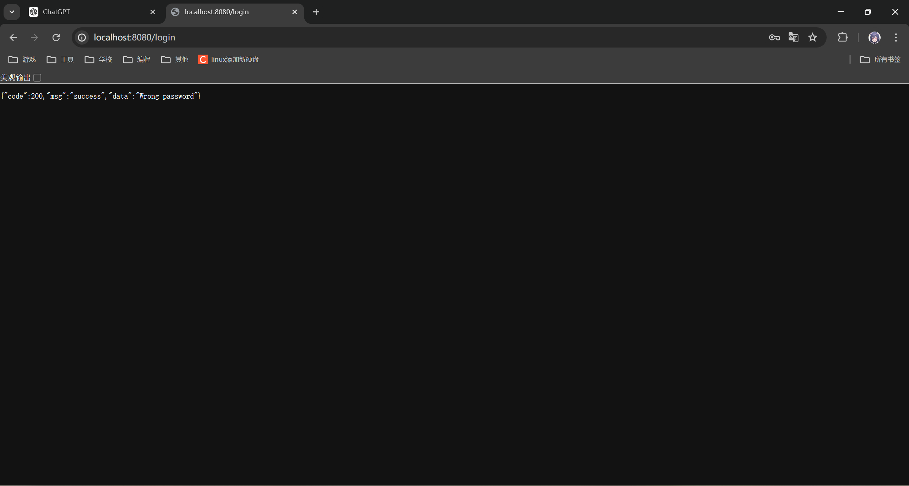

# 0705 周报

#### 学习笔记/记录

1.学习了 springboot 三层结构 和 http web 请求

2.搭建 springboot 项目

2.1.初始化工程

> 创建工程
> 

---

> 移除不需要的文件
> 

---

> 创建三层架构：控制层、业务处理层、数据访问层
> 

2.2.编辑初始化页面：html+css

> 创建首页 index.html
> 

---

> 编辑首页 index.html
> 

---

> 添加样式 css
> 

2.3.具体实现三层架构

2.4.运行 springboot 项目

> 登录界面
> 

---

> 登录成功，提示 Login Successful
> 

---

> 登录失败，提示 Wrong password
> 

3.刷力扣题，做 SQL 连接章节

#### 遇到难题解决方法

1.表单提交信息为空

> input 标签的容器需要设置 name 键名

2.给已经写好的样式添加一层 form 样式会导致内部样式左移

> 未找到原因，只能增加 margin-left 的数值

#### leetcode 刷题

##### 力扣 1378. 使用唯一标识码替换员工 ID

##### 题解

外连接保留 null

##### 代码

```mysql
select
EmployeeUNI.unique_id, Employees.name
from
EmployeeUNI
right outer join
Employees
on
EmployeeUNI.id = Employees.id
```

##### 力扣 570. 至少有 5 名直接下属的经理

##### 题解

二重查询

##### 代码

```mysql
# Write your MySQL query statement below
select
name
from
Employee
where
Employee.id in (
    select
    managerId
    from
    Employee
    where
    managerId is not null
    group by
    managerId
    having
    count(*) >= 5
)
```
