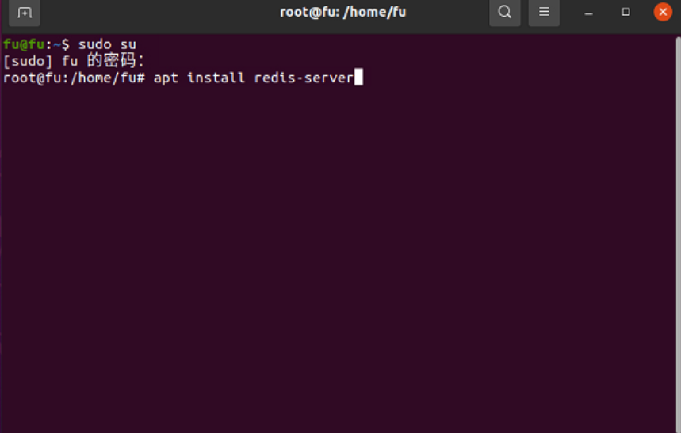
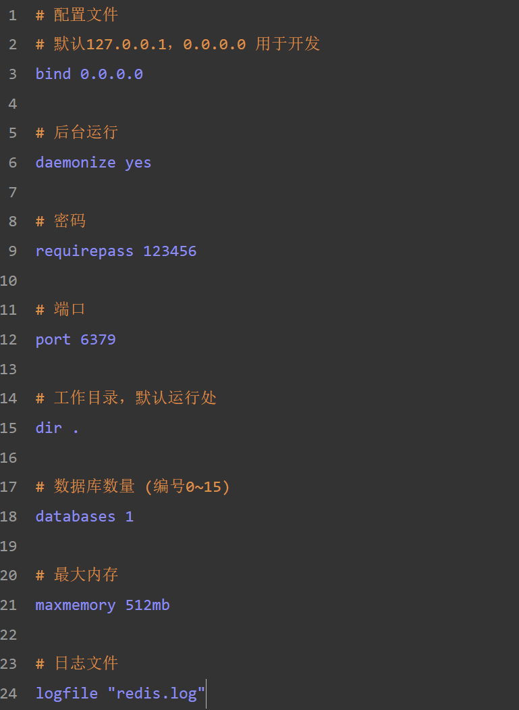
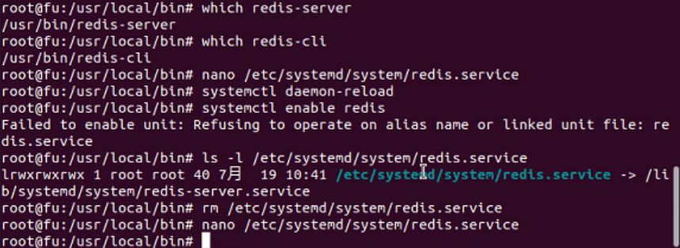
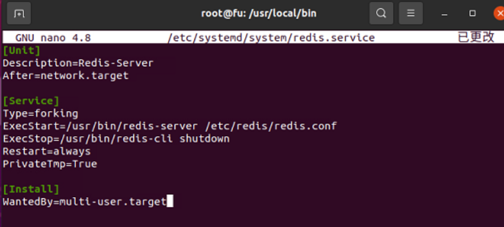
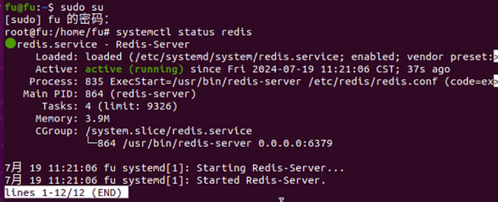

# 0720 周报

#### 学习笔记/记录

1.学习 Redis

2.配置 Redis 服务

> 在 ubuntu 中安装 Redis
> 
>
> ---
>
> 打开 redis.conf 文件并按照步骤进行配置
> 
> 
>
> ---
>
> 查询 redis 环境目录，并通过 nano 编辑器配置启动脚本
> 重启 redis 服务，并开启自动启动
> 
> 发现自动启动开启失败，通过 ls -l 命令发现该文件为链接文件(windows 中的快捷方式)
> 删除该链接文件，并重新创建和编辑新的配置文件
> 
>
> ---
>
> 配置完成后重启电脑
> 
> 查看 redis 服务状态，发现已经启动，验证自启服务已生效

3.刷力扣题，做 SQL 排序和分组章节

#### 遇到难题解决方法

无

#### leetcode 刷题

##### 力扣 1045. 买下所有产品的客户

##### 题解

group by 分组
having 分组后条件
distinct 函数去重
由于 product_key 是外键，因此计算去重后的 product_key 的数量就是所买的的产品的数量，
且其作为外键不存在不属于 Product 的产品，可以得知只要满足去重后产品的数量等于所有产品数量，
则该客户买下所有产品。

##### 代码

```mysql
# Write your MySQL query statement below
select
customer_id
from
Customer
group by
customer_id
having
count(distinct(product_key)) = (select count(*) from Product)
```
