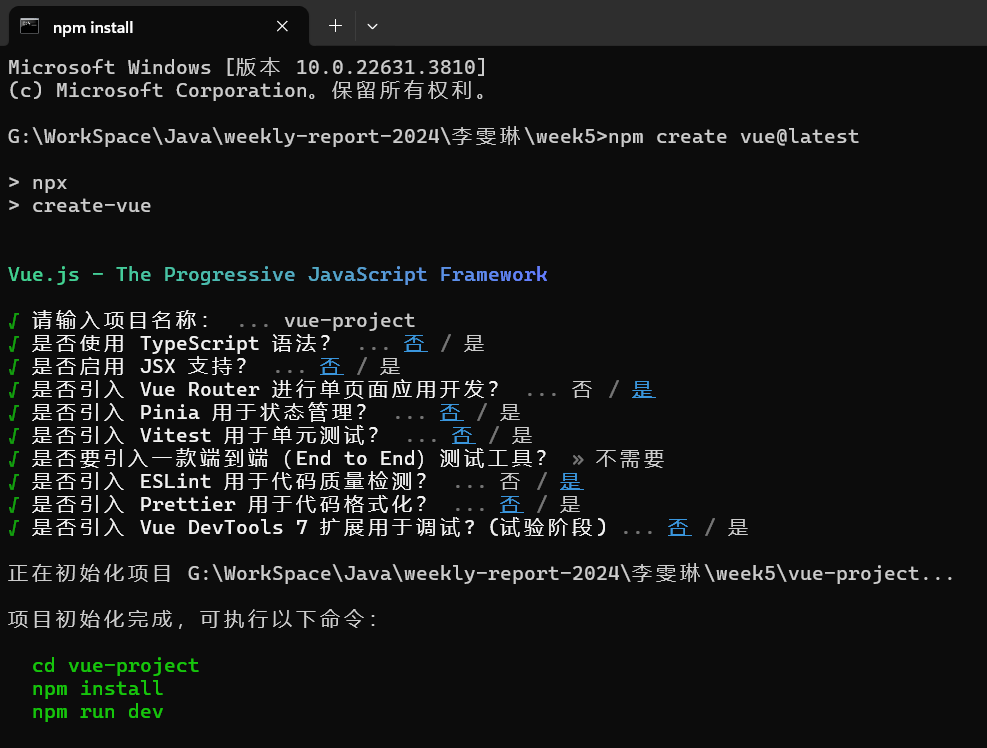
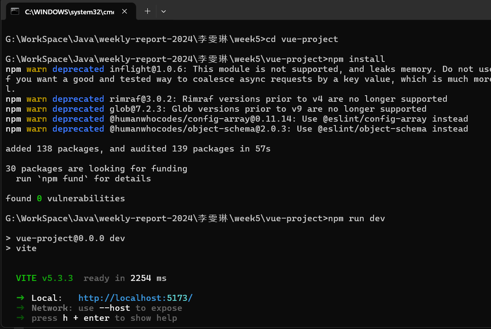
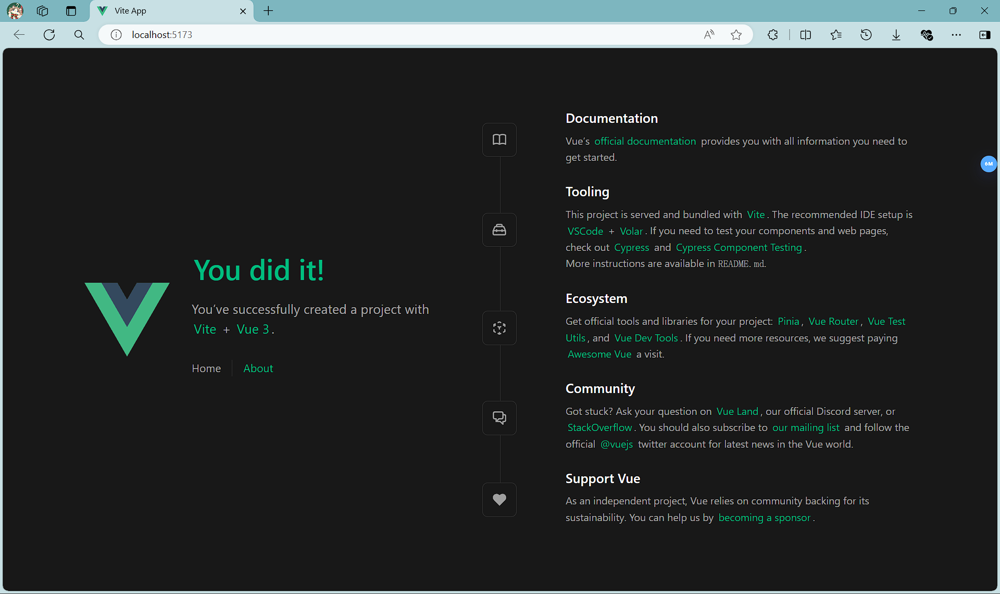
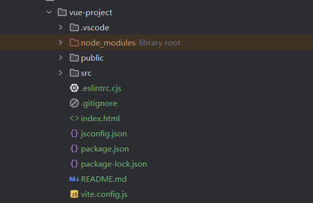

# 0707周报 
## 本周任务 
>1、学习了一些基础的JavaScript操作。  
>2、学习了如何搭建Vue项目。  
>3、在Vue官网上继续学习相关的语法。

## 遇到问题 
>**1、一开始跟着黑马程序员的视频搭建了Vue2项目。**  
~~但后来发现视频太老了，~~
Vue2已经在2023年底停止维护了，所以我又重新搭建了Vue3项目。  

>**2、JavaScript的一些语法还不是很熟悉，需要多练习。**    

> **3、html和css还是不太熟，需要多写多翻文档**

## Vue框架搭建过程  
>**1、在文件夹下打开cmd，初始化项目**
   
>**2、下载相关依赖**  
  
>**3、运行项目**  
  
>**4、项目文件夹结构**   
node_modules:第三方依赖包   
public:公共资源文件夹   
src:源代码文件夹   
jsconfig.json:js配置文件   
package.json:项目包文件   
**vite.config.js:基于vite的项目配置文件，也是和vue2基于vue-cli不同的地方**
  
>**5、修改app.vue文件内容**  
还没写完（；´Д｀）ゞ  
预计明天或后天提交修改后的项目。