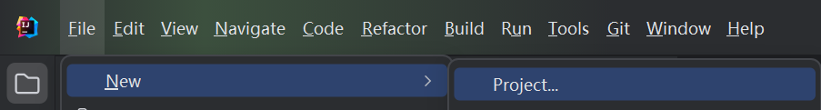
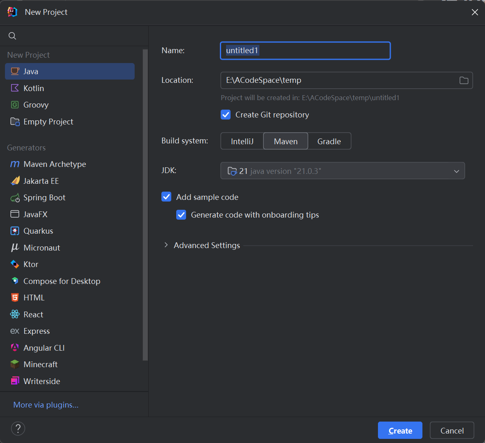
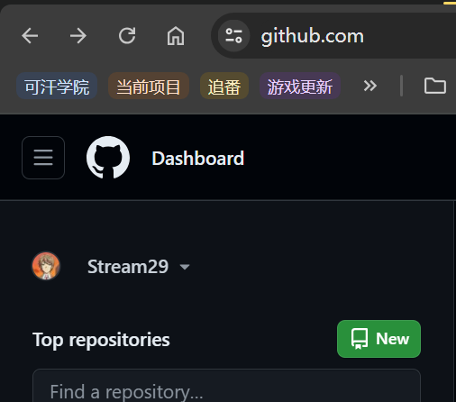
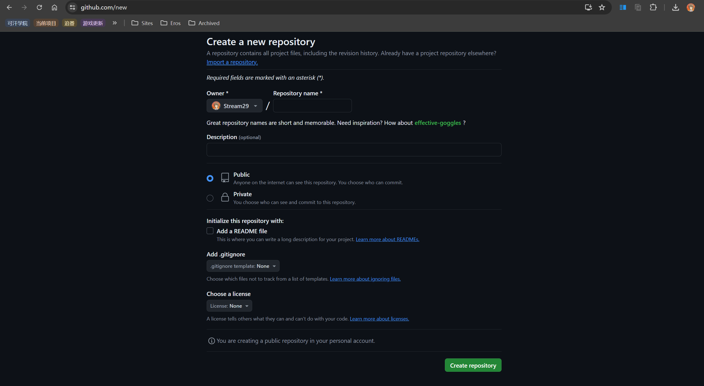
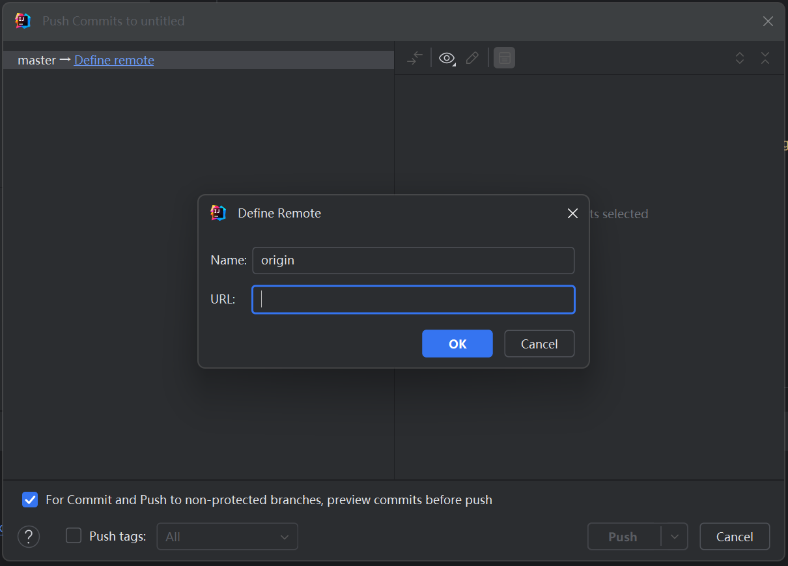
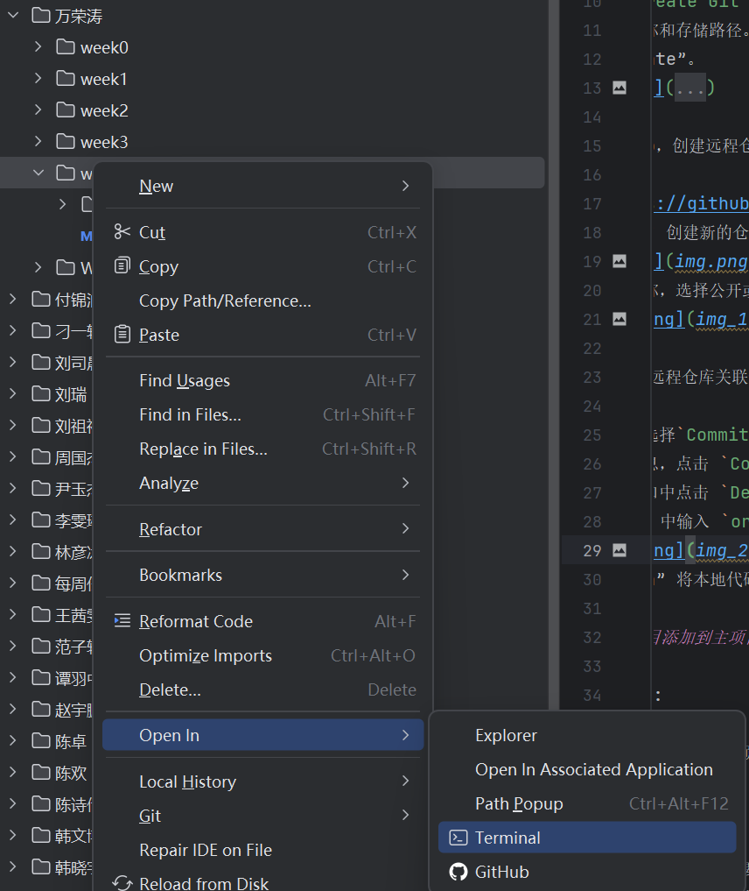
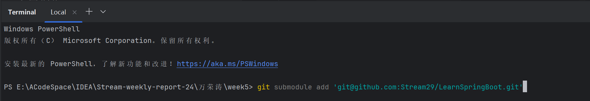
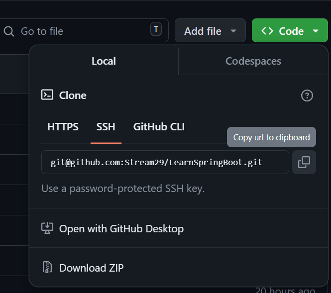

#  在 IDEA 中创建项目并作为 Submodule 添加到主项目

## 一、创建子模块项目

1. **打开 IDEA，创建本地项目**:

    - 点击 `File` -> `New` -> `Project...`。
    - 
    - 选择你需要的项目类型，例如 Java, Spring Boot 等。
    - **勾选 `Create Git repository` **
    - 输入项目名称和存储路径。
    - 点击 “Create”。
    - 

2. **打开 GitHub，创建远程仓库**:

    - 访问 https://github.com/ 并登录你的账号。
    - 点击 “New” 创建新的仓库。
    - 
    - 输入仓库名称，选择公开或私有，点击 “Create repository”。
    - 

3. **将本地项目和远程仓库关联**:

    - 在项目窗口选择`Commit`。
    - 输入提交信息，点击 `Commit and Push...`。
    - 在弹出的窗口中点击 `Define remote`。
    - 在 "Name" 中输入 `origin`，在 “URL” 中输入你的 GitHub 仓库地址，点击 “OK”。
    - 
    - 点击 “Push” 将本地代码推送到远程仓库。

## 二、将子模块项目添加到主项目

1. **打开主项目**:

    - 在 IDEA 中打开你的主项目。

2. **添加子模块**:

    - 在项目结构窗口中选中需要添加子模块的目录，点击右键，选择  `Open In` -> `Terminal`。
    - 
    - 在打开的终端窗口中，输入命令 `git submodule add <子模块仓库地址>`，例如 `git submodule add git@github.com:Stream29/NEUQ-ACM-weekly-report-24.git`。
    - 
    - 子模块仓库地址可以在子模块项目的GitHub页面中找到，类似拉取仓库，请使用 `SSH/Copy to clipboard` 。 
    - 

 
