# 0707周报

#### 学习笔记/记录
- 学习了Maven，Springboot快速⼊⻔、http、web请
  求、三层架构、分层耦合和IOC&DI的入门
- Leetcode刷题（面试经典 150 题）
- 学习搭建了两个springboot小项目，下边将展示其中一个

> 创建工程
>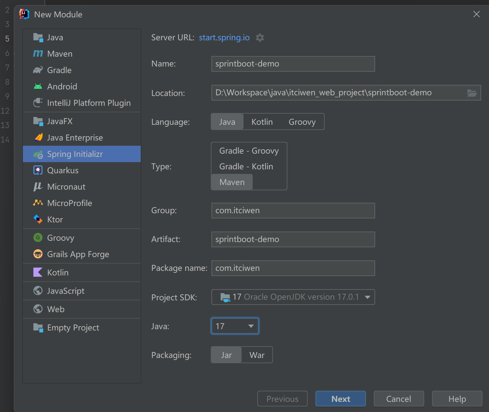
>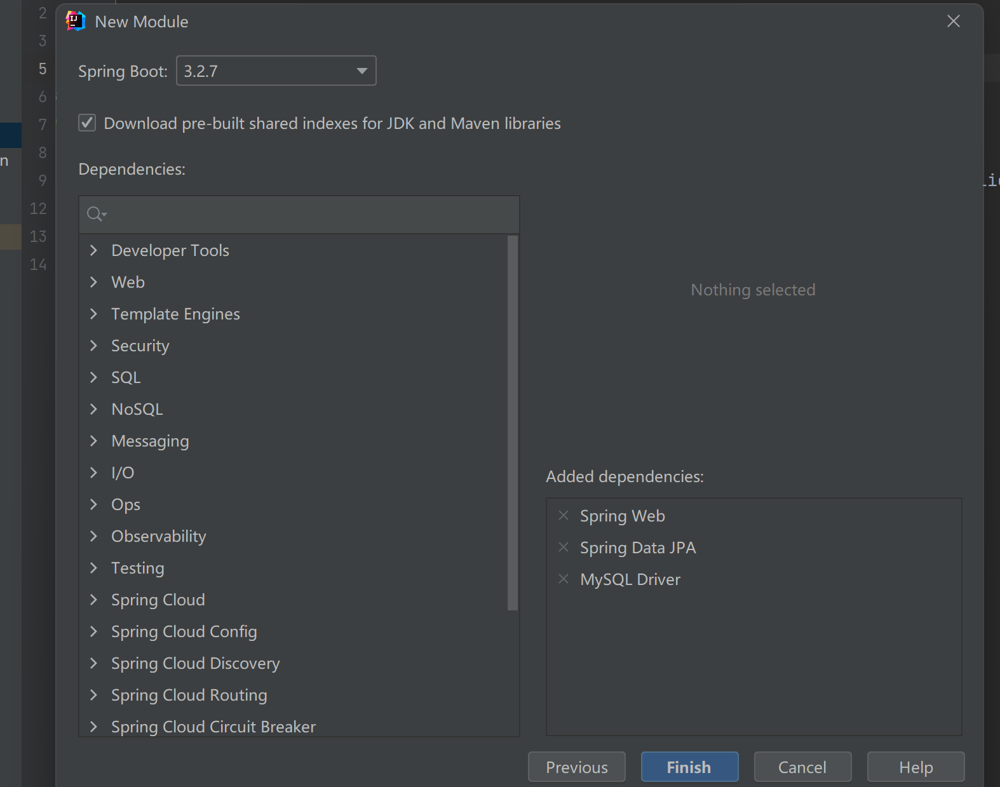

---

>创建工程后生成项目如图
> 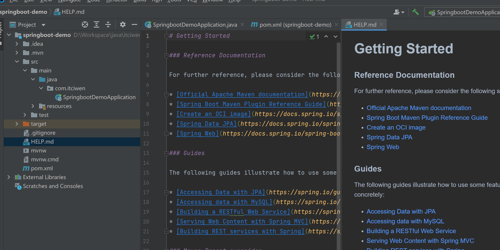

---

>创建TestController类,来测试
> 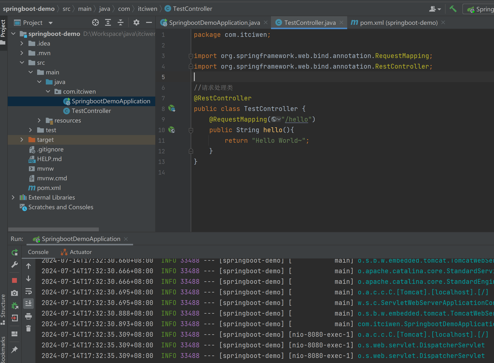

---

>访问测试的Controller是否成功，显示Hello World~，成功
> 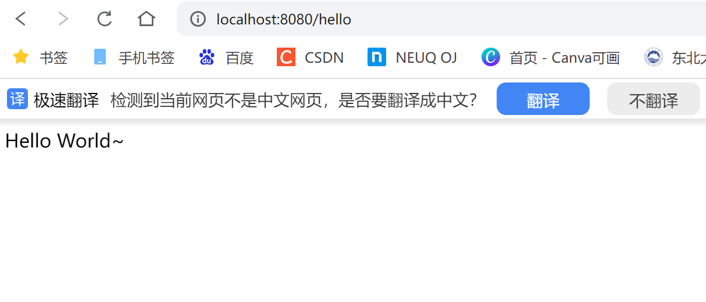

---

>数据库建表student
> 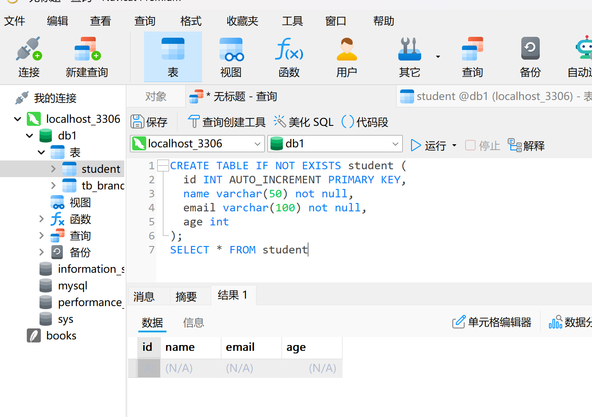

---

>数据库连接
> 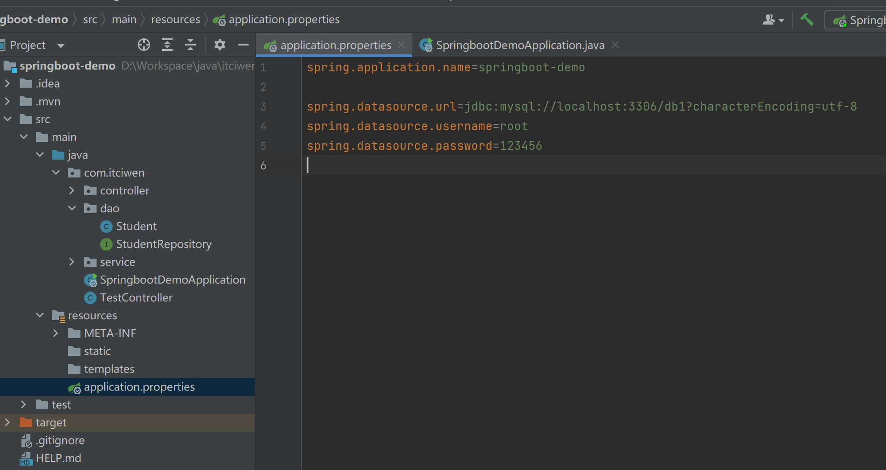

---

>编写Dao层
> 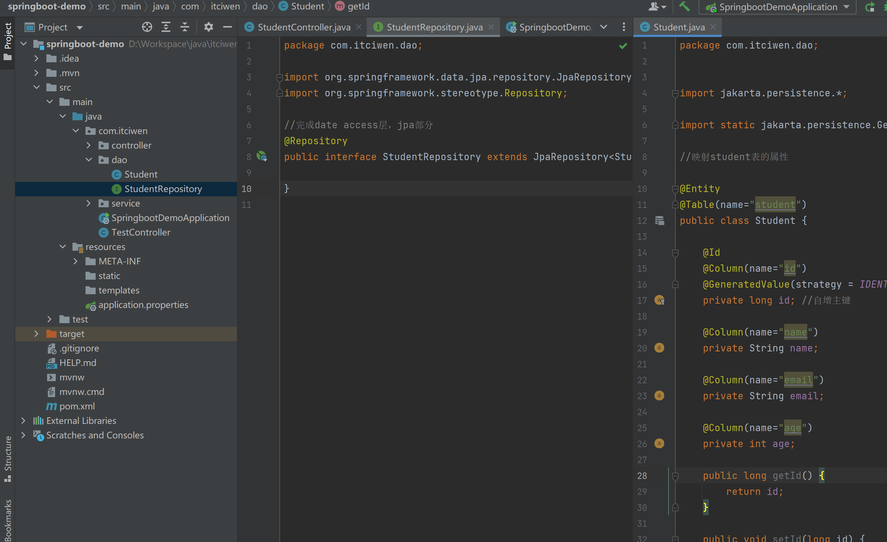

---

>编写Service层
> 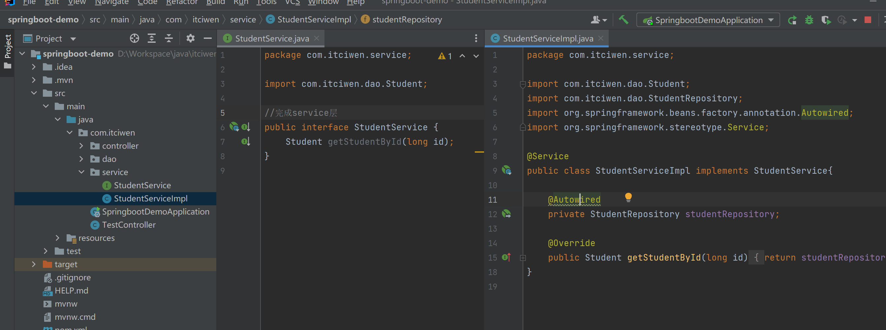

---
>编写Controller层
> 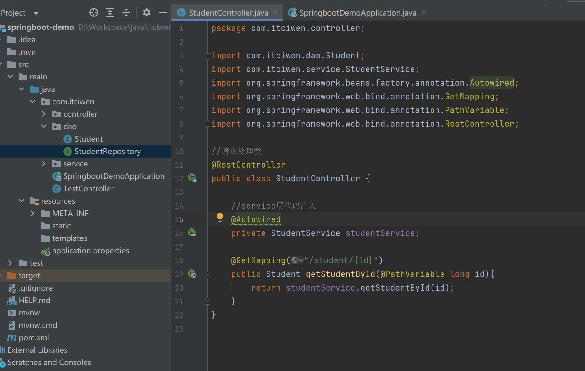

---

>这是项目主要结构,完成三层架构
> 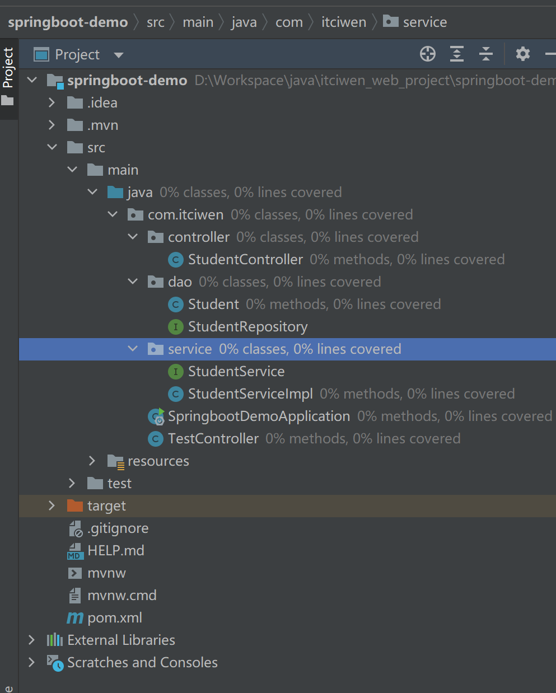

---

>项目运行，日志生成
> 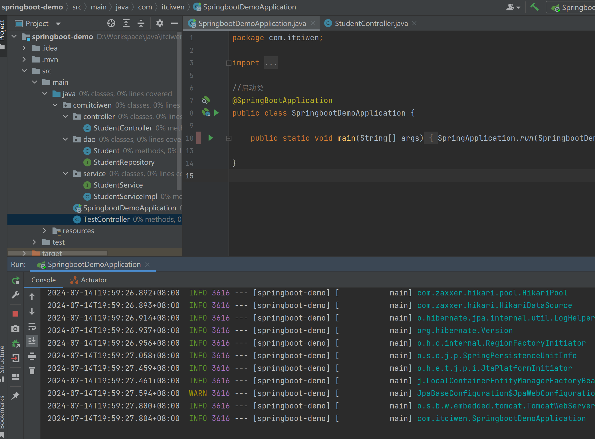

---

>项目运行后再次访问Controller,成功显示学生信息
> 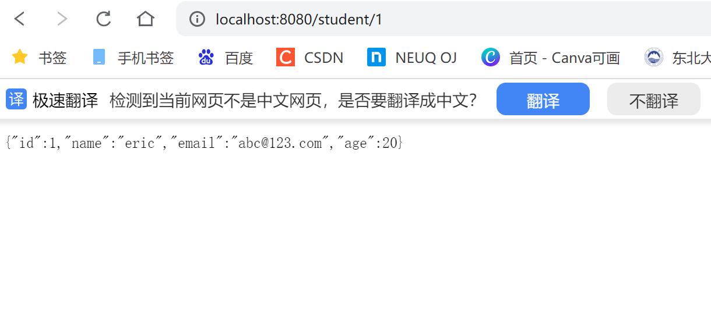

---
#### Leetcode 刷题（6.Z 字形变换）
##### 代码
```java
class Solution {
    public String convert(String s, int numRows) {
        
 if(numRows == 1 || s== null || s.length() < 2 || numRows > s.length()){
            return s;
        }
        StringBuilder[] stringArr = new StringBuilder[numRows];
        int strIndex = 0;
        boolean inverse = false;
        
        for(int i=0; i<s.length(); i++){
            if(stringArr[strIndex] == null){
                stringArr[strIndex] = new StringBuilder();
                stringArr[strIndex].append(s, i, i+1);
            }else{
                stringArr[strIndex].append(s, i, i+1);
            }
            if(!inverse){ //正序
                strIndex++;
                if(strIndex == numRows){
                    inverse = true;
                    strIndex = numRows - 2;
                }
            }else{ //逆序
                strIndex--;
                if(strIndex == -1){
                    inverse = false;
                    strIndex = 1;
                }
            }
        }
        for(int index=1; index<numRows; index++){
            stringArr[0].append(stringArr[index]);
        }
        return stringArr[0].toString();
    }
}
```
