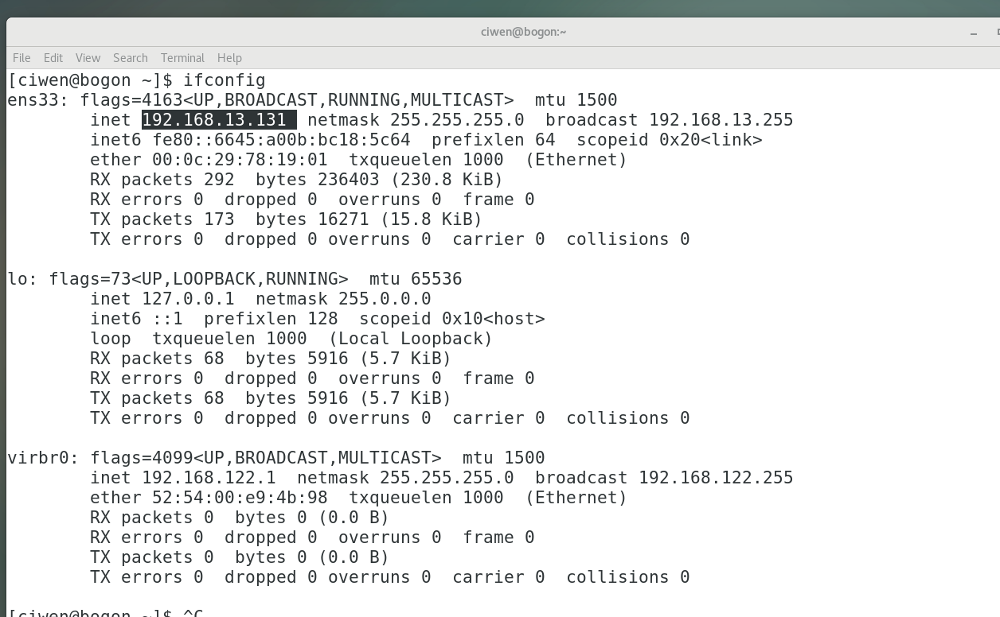
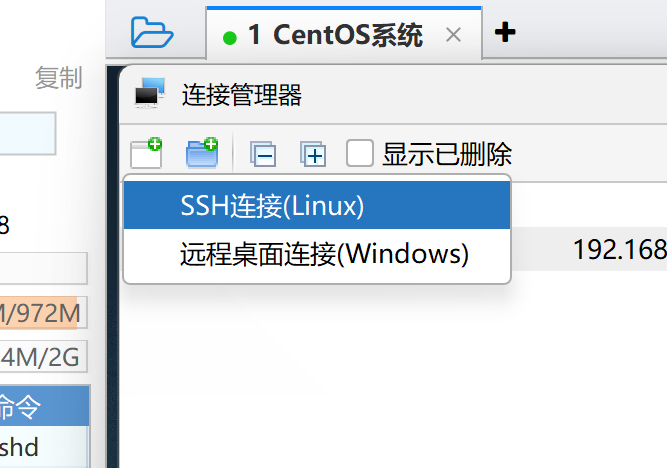
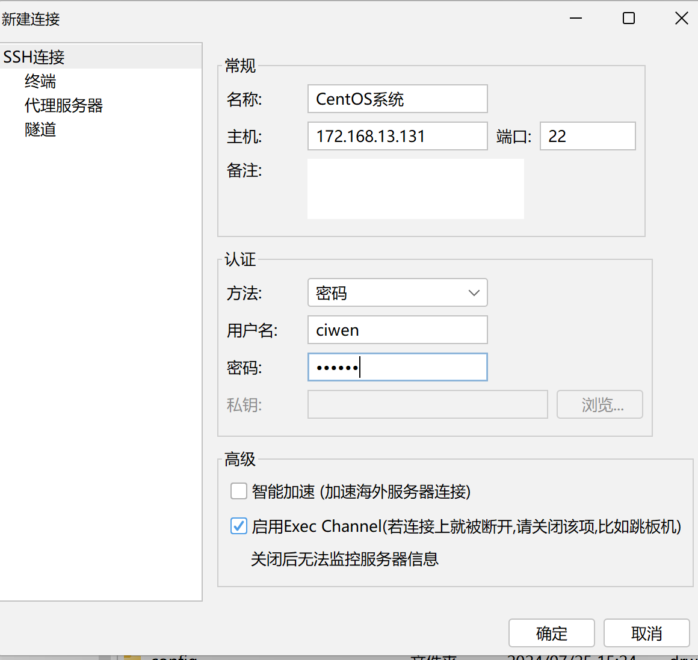
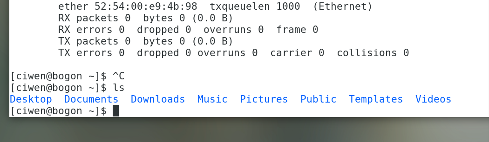
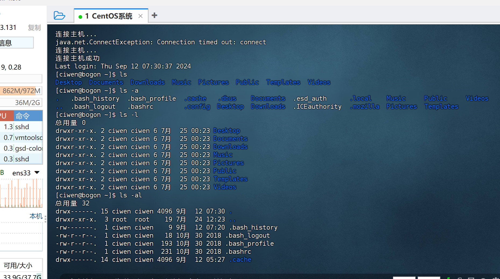
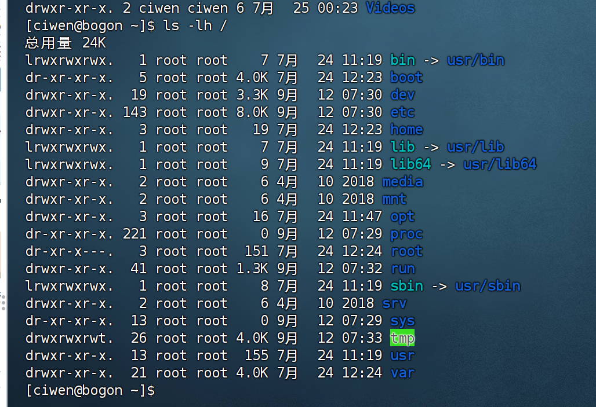
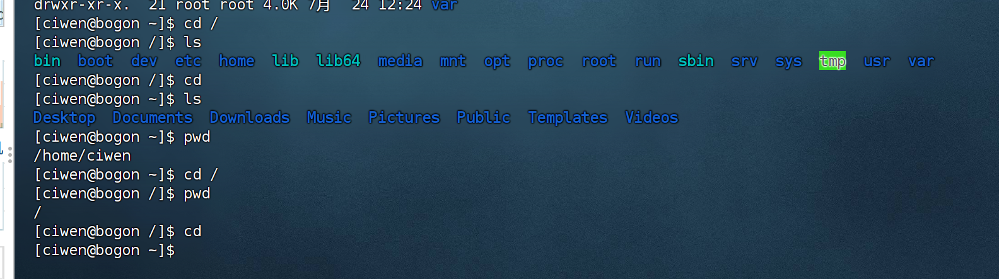
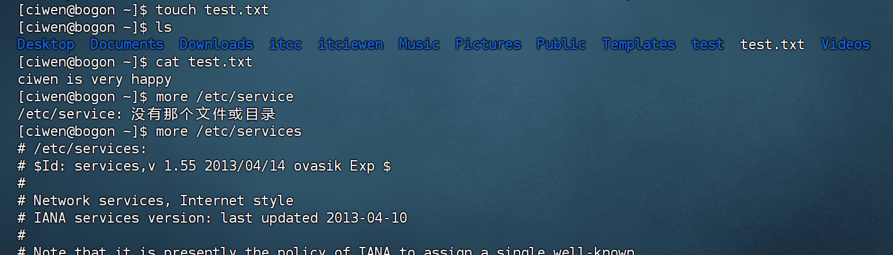
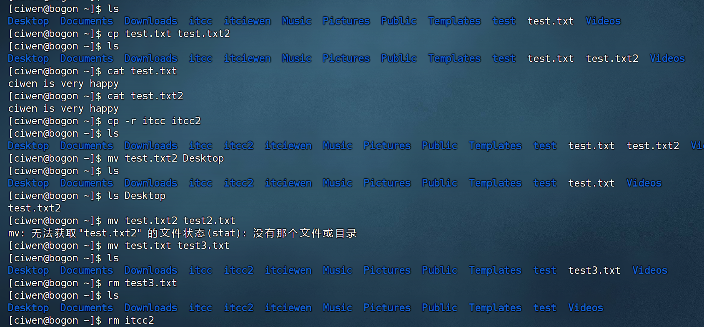

# 0725周报

#### 学习笔记/记录
-观看Linux的学习课程，学习、下载VMware、CentOS7、等的下载并安装、配置了的Linux虚拟机
- 练习了用finalshell远程连接linux系统
- 配置了WSL(ubuntu)，并练习了用Windows Terminal操作ubuntu
- 练习了用linux的快照保存状态
- 学习了Linux的基础命令
- Redis还没看，过两天补充
- Leetcode刷题（SQL基础）
---
---
#### 用finalshell远程连接linux
> 在虚拟机桌面右键点击最下方打开终端，输入ifconfig查看ip地址
>

---

>打开finalshell建立连接，输入连接信息,连接
> 
> 
---

>在虚拟机和finalshell分别输入命令ls,返回一致，连接成功
> 
> 
---
---
#### 部分linux命令演示
> ls命令
>
>
---

> cd和pwd命令,以及特殊路径符的应用
> 
> 
---

> mkdir命令
> 
> 
> 
---

> touch\cat\more命令
> 
---

> cp-mv-rm命令
> 
---
#### Leetcode 刷题（1164. 指定日期的产品价格）
##### 题解思路
首先需要用窗口函数row_number()，row_number()的partition by作用是对product_id进行分组 然后按照change_date 进行排序，然后找每个组row_num为1的，则是离筛选日期最近的那个。
然后再用union再连接一起，最后找到日期大于筛选日期的默认设置为10。
##### 代码
```mysql
# Write your MySQL query statement below
select t.product_id,t.new_price as price
from 
(
    select *,row_number() over(partition by product_id order by change_date desc) as row_num
    from Products
    where change_date <= '2019-08-16'
) as t
where row_num = 1
union 
select product_id, 10 as price
from Products
group by product_id
having min(change_date) > '2019-08-16'
```