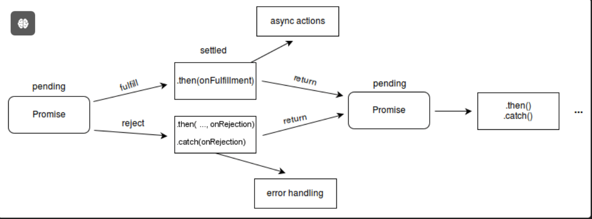
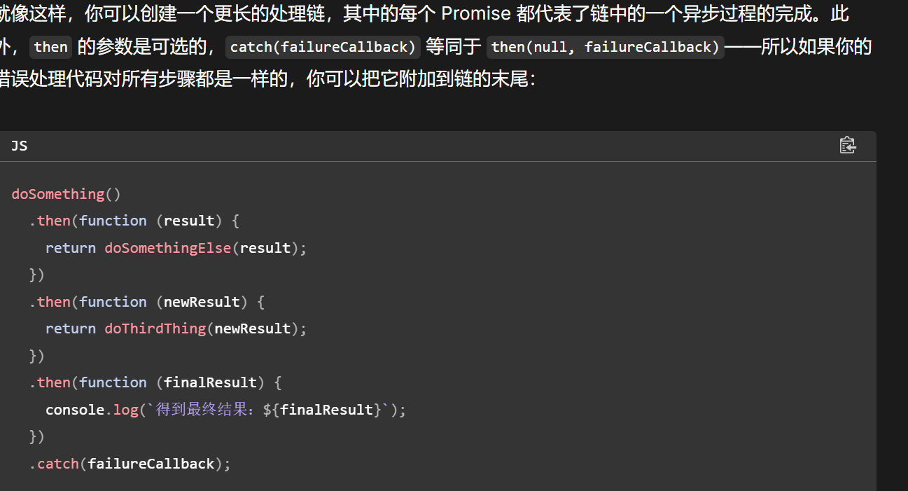
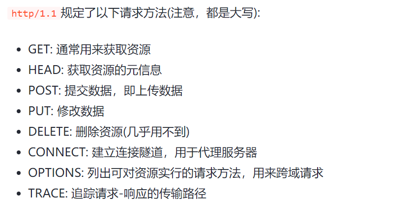
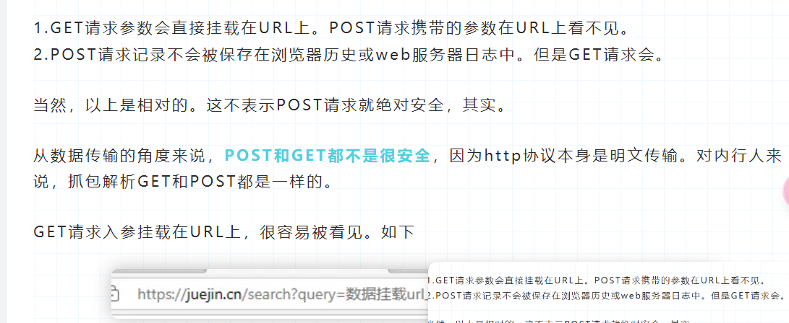
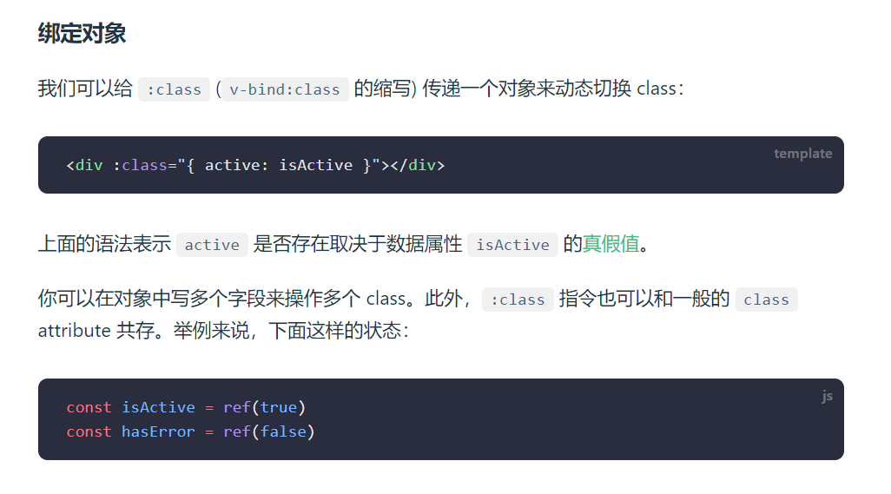
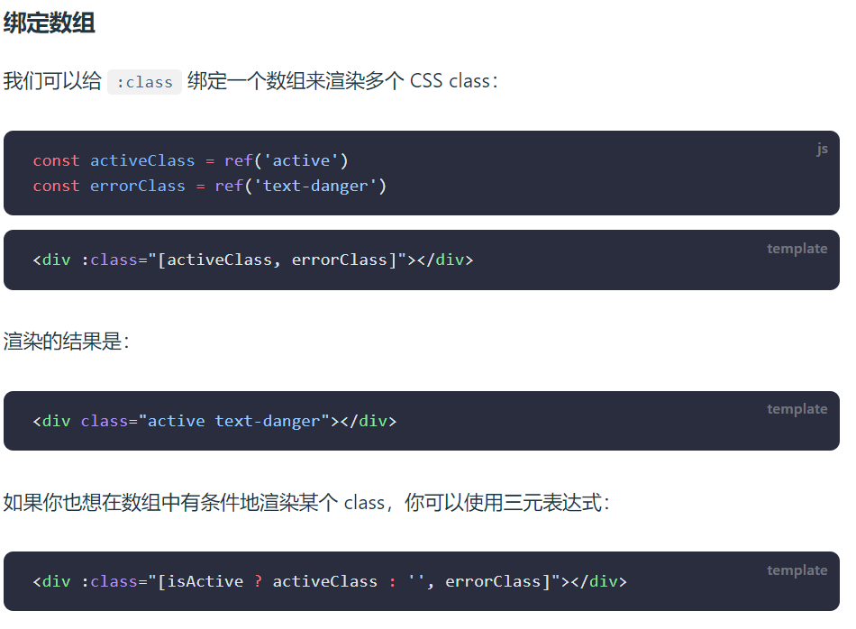
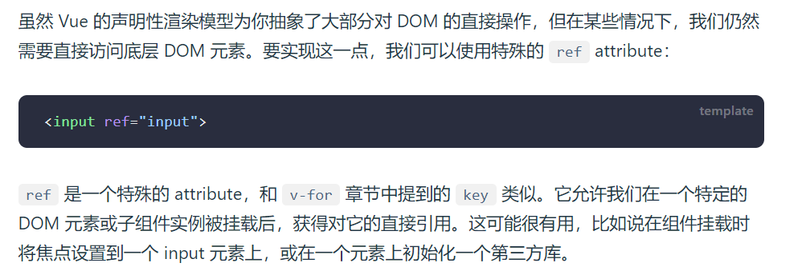

这是一次周报 *week9*
--------------
# 这次写一个拾遗周报
（网课看的太快了，很多东西都没有记牢，自己跟着在写VUE3的项目，但是推进实数有点慢，这周就写个拾遗吧）

还有就是用了vue之后确实就不用js来进行dom和bom操作了，更多是用ts和js写写逻辑。

html和css基础倒是现在比较熟练了
补补后面的东西

## *JS课程拾遗*

#### 网课js内容
>1. 立即执行函数
>````
>(function (var,var) { } ) (var,var)
>````
>以此来避免变量污染，默认只执行一遍，执行完就销毁
>2. data-xxxx 自定义属性
>>可以通过这种操作来当作index索引之类的操作
>3. setInterval & setTimeout  
>
>   这是一个异步函数 同时内部不含this指针
>> setInterval会返回一个定时器数字 同时有一个clearInterval属性
>> ````
>> n = setInertvale(fn,time) ;clearInterval(n)
>> ````
>> 来取消定时器 
>> 
>> setTimeout()这个函数同样可以设置一个定时器 也可以通过clearTimeout()来销毁
>4. clientWidt和clientHeight 用来获取元素的宽高
>5. HTMLElement.offsetLeft/Top/Right 是一个只读属性，返回当前元素左上角相对于 开启定位的第一个的 父节点的左边界偏移的像素值。
> 
>6. Windows.Location 获取Location对象 接口表示其链接到的对象的位置（URL）。所做的修改反映在与之相关的对象上
>> 包含方法.assign 重新指定url来实现跳转。 .reload 来重新加载网页 
>7. Windows.Navigator 获取Navigator对象 接口代表了用户代理的状态和身份，它允许脚本对其进行查询并注册自身以便执行某些活动。
>> 可以获得用户的硬件数据和浏览器数据
>> 
>> Navigator.clipbroad 可以获取用户剪贴版数据  注：只能他https下使用
>>
>> Navigator.onLine 只读
>> 返回浏览器的在线状态。该属性返回一个布尔值。
> 
>8. history浏览的历史记录 三个方法 back() , forward() , go(n:number) 
>9. localStorage还蛮重要的 主要是存键值对 记得是存字符串要 stringify() && parse()
>10. 数组遍历.map和.join方法 .map差不多是加强的forEach 可以返回一个处理过的数组 || .join用于数组拼接成一个字符串
>11. 正则表达式 qaq还是现查现用吧
>12. 闭包（closure）是一个函数以及其捆绑的周边环境状态（lexical environment，词法环境）的引用的组合。换而言之，闭包让开发者可以从内部函数访问外部函数的作用域。在 JavaScript 中，闭包会随着函数的创建而被同时创建。
>> 一般为这个样子 通常你使用只有一个方法的对象的地方，都可以使用闭包。
>>`````
>> function fn () {
>>  let n = ?
>>  function fnn(){
>>      对数据n的操作
>>  }
>>  ruturn fnn;
>>}
>>`````
>13. 解构 这个感觉还是蛮好用的
>14. 对象封装和构造函数
>> ````js
>> function GZ (name,tot){
>>  this.name = name
>>  this.tot = tot 
>>  this.fn = () =>{alart('aaa')}
>> }
>> const gz = new GZ(qaq,qaq) //来实现构造函数 似乎ts中的接口也可以实现类似的效果？ 但又不太一样
>>````
>值得注意的是，这里就引入了原型这个概念 fn这个函数实际在每次构造的时候都会单独创建一次 造成不必要的开销影响性能
>
>可以 通过把方法挂载到原型上来节省开销 例如GZ.prototype.fn = () =>{} 来创建fn函数
>
> 
>15. 对象复制的深浅拷贝问题 
> 
>直接用等号赋值引用数据类型，本质是获得地址值，而不是新建对象
> 
> 浅拷贝：Object.assign() 或者 const obj2 = {..obj1} 只能拷贝一层
> 深拷贝：可以通过自己手写一个递归函数或者stringify和parse或者引用工具包来完成
>
>16. lodash工具库 里面提供了很多方法来调用
>17. try和catch 进行异步处理的时候使用 
>18. apply和bind可以改变函数的指针
>19. 防抖：只执行最后一次 节流：单位事件只执行一次 都是用定时器实现的 调库就完事了


#### 自己顺带看的别的js内容

1.Promise async 和 await

>  Promise 对象表示异步操作最终的完成（或失败）以及其结果值。
> 
> 本质上 Promise 是一个函数返回的对象，我们可以在它上面绑定回调函数，这样我们就不需要在一开始把回调函数作为参数传入这个函数了。
>
> 
> 如果你希望在并发执行的两个或多个任务完成后安全地执行其他任务，那么在这些任务开始前，你必须等待对 Promise.all() 或 Promise.allSettled() 的调用。
> 
> async/await 基于 promise重构出来的 async/await 的目的在于简化使用基于 promise 的 API 时所需的语法。async/await 的行为就好像搭配使用了生成器和 promise。
> 
> Promise 对象有三种状态 待定--pending  已兑现--fulfilled 已拒绝--rejected
> 
> 可以解决链式调用的一些问题
> 
> 
> 改写成.then的形式 但是注意操作Promise对象注意return 
> 
> Promise链式调用 与等价的async await 
> 
>
> 

2.fetch() 方法
>Window 接口的 fetch() 方法用于发起获取资源的请求，它会返回一个会在请求响应后兑现的 promise。该 promise 会兑现一个表示请求响应的 Response 对象

说实话到现在没用过 可能是那个技术的底层实现？？


3. 关于import 和 花括号 在export文件中只能有一个默认的export default 若不带花括号只能导出默认导出，可以随意命名，
带上花括号后可以导出别的东西，但是只能是export文件中的那个命名（不过当然可以使用 as 重命名）


## Axios知识补充

1.Axios 是一个基于 promise 网络请求库，作用于node.js 和浏览器中。 它是 isomorphic 的(即同一套代码可以运行在浏览器和node.js中)。在服务端它使用原生 node.js http 模块, 而在客户端 (浏览端) 则使用 XMLHttpRequests。

对于各种hhtp请求方式的大概区别







感觉主要就是要了解axios能干什么，同时要学会二次封装axios，加个拦截器，判断各种状态。
然后也需要认真看看axios中的config request response到底是什么，过段时间认知看看。

## vue3课程拾遗


介于直接看的vue3课程，里面的v-bind v-if v-model 等等都没讲，我自己补充补充 

Vue 的两个核心功能：

声明式渲染：Vue 基于标准 HTML 拓展了一套模板语法，使得我们可以声明式地描述最终输出的 HTML 和 JavaScript 状态之间的关系。

响应性：Vue 会自动跟踪 JavaScript 状态并在其发生变化时响应式地更新 DOM。

有一说一setup语法糖确实带劲

语法巩固
1. 文本插值 {{ }} 
2. 在标签出使用 v-html=''rawHtml''可以插入标签。（有安全警告，一般不用）

3. v-bind:xx ===  :xx 绑定的数据完整的支持js表达式
4. v-on:click === @click 绑定事件
5. ref 和reactive 值得注意的是，reactive() 返回的是一个原始对象的 Proxy，它和原始对象是不相等的：

6. computed计算属性，用计算属性来处理复杂的逻辑 可以减少调用次数
7.  

8. v-if ， v-else 和 v-else-if ||| v-if在返回值为真的时候被渲染
9. v-for 和 key
 
10. v-model双向绑定
11. watch
12. ref    

13. 动态组件


先写这么多