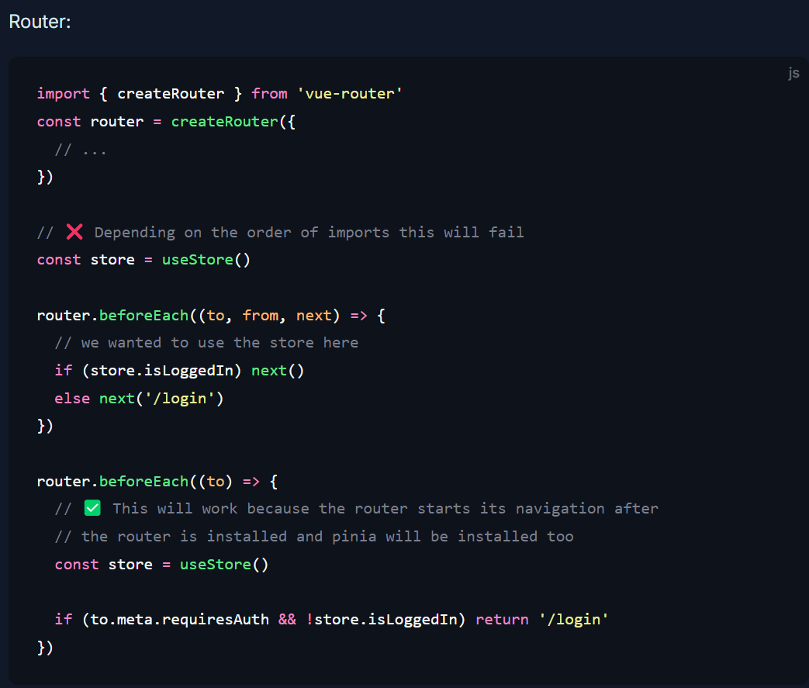

这是一次周报 *week？或许还是9*
--------------
# 这次写一写我写项目的遇到的一些知识点
##### 比较狗屎的是那个网课的后端服务器挂了，导致我只自己敲了前面拿mock造假接口的部分，后面就是看了看，不过其实能看懂的，变得不太大。
##### 可能接下来就去学学node.js自己搭个后端玩去。


遇到的一些知识点：

#### 1. 模板项目用的包管理器是pnpm

是更高性能的npm版本（差不多），计划使用的是node+pnpm+eslint+stylelint+prettier进行管理和检测代码的，
但是由于各种版本冲突，让我没有配置eslint+stylelint+prettier，过几天在研究研究怎么弄，不过这玩意我一个人写也用不着
> 安装pnpm
> `````npm i -g pnpm`````
> 
> 项目初始化
> `````pnpm create vite`````
> 
> eslint 由于版本更新已经大改，配置方法改的好多，以后真用到了在学。
> 
> prettier和stylelint 由于各种版本冲突我也没搞好
#### 2. 配置husky和commmitlint
没用到没写但是

在上面我们已经集成好了我们代码校验工具，但是需要每次手动的去执行命令才会格式化我们的代码。如果有人没有格式化就提交了远程仓库中，那这个规范就没什么用。所以我们需要强制让开发人员按照代码规范来提交。

利用husky在代码提交之前触发git hook(git在客户端的钩子)，然后执行`pnpm run format`来自动的格式化我们的代码。

对于我们的commit信息，也是有统一规范的，不能随便写,要让每个人都按照统一的标准来执行，我们可以利用**commitlint**来实现。
```
'feat',//新特性、新功能
'fix',//修改bug
'docs',//文档修改
'style',//代码格式修改, 注意不是 css 修改
'refactor',//代码重构
'perf',//优化相关，比如提升性能、体验
'test',//测试用例修改
'chore',//其他修改, 比如改变构建流程、或者增加依赖库、工具等
'revert',//回滚到上一个版本
'build',//编译相关的修改，例如发布版本、对项目构建或者依赖的改动
```

#### 3. 项目集成element-plus 有一说一这玩意真好用

安装element-plus  
`````
pnpm install element-plus @element-plus/icons-vue
`````
将默认语言设置成中文
```js
import ElementPlus from 'element-plus';
import 'element-plus/dist/index.css'
//@ts-ignore忽略当前文件ts类型的检测否则有红色提示(打包会失败)
import zhCn from 'element-plus/dist/locale/zh-cn.mjs'
app.use(ElementPlus, {
    locale: zhCn
})
```
Element Plus全局组件类型声明
```js
// tsconfig.json
{
  "compilerOptions": {
    // ...
    "types": ["element-plus/global"]
  }
}
```

#### 4. 环境变量的配置 配置下面三个文件
```js
.env.development
.env.production
.env.test
```
例如：
```
# 变量必须以 VITE_ 为前缀才能暴露给外部读取
NODE_ENV = 'development'
VITE_APP_TITLE = '硅谷甄选运营平台'
VITE_APP_BASE_API = '/dev-api'
```
并配置运行命令: package.json
```
"scripts": {
    "dev": "vite --open",
    "build:test": "vue-tsc && vite build --mode test",
    "build:pro": "vue-tsc && vite build --mode production",
    "preview": "vite preview"
  },
```

##### 5.封装全局svg图标
安装svg依赖插件
```
pnpm i vite-plugin-svg-icons -D
```
在vite.config.ts中配置插件
```js
import { createSvgIconsPlugin } from 'vite-plugin-svg-icons'
import path from 'path'
export default () => {
    return {
        plugins: [
            createSvgIconsPlugin({
                // Specify the icon folder to be cached
                iconDirs: [path.resolve(process.cwd(), 'src/assets/icons')],
                // Specify symbolId format
                symbolId: 'icon-[dir]-[name]',
            }),
        ],
    }
}
```
入口文件导入
```
import 'virtual:svg-icons-register'
```
封装成全局组件
**在src/components目录下创建一个SvgIcon组件:代表如下**
```js
<template>
  <div>
    <svg :style="{ width: width, height: height }">
      <use :xlink:href="prefix + name" :fill="color"></use>
    </svg>
  </div>
</template>

<script setup lang="ts">
defineProps({
  //xlink:href属性值的前缀
  prefix: {
    type: String,
    default: '#icon-'
  },
  //svg矢量图的名字
  name: String,
  //svg图标的颜色
  color: {
    type: String,
    default: ""
  },
  //svg宽度
  width: {
    type: String,
    default: '16px'
  },
  //svg高度
  height: {
    type: String,
    default: '16px'
  }

})
</script>
<style scoped></style>
```
在src文件夹目录下创建一个index.ts文件：用于注册components文件夹内部全部全局组件！！！
```js
import SvgIcon from './SvgIcon/index.vue';
import type { App, Component } from 'vue';
const components: { [name: string]: Component } = { SvgIcon };
export default {
    install(app: App) {
        Object.keys(components).forEach((key: string) => {
            app.component(key, components[key]);
        })
    }
}
```
在入口文件引入src/index.ts文件,通过app.use方法安装自定义插件
```js
import gloablComponent from './components/index';
app.use(gloablComponent);
```

#### 6.集成sass

`` pnpm i sass``

````
<style scoped lang="scss"></style>
````
可以添加一个reset.css
可以创建一个全局变量的scss文件 便于以后客制化？
并在vite.config.ts文件配置如下：
```js
export default defineConfig((config) => {
	css: {
      preprocessorOptions: {
        scss: {
          javascriptEnabled: true,
          additionalData: '@import "./src/styles/variable.scss";',
        },
      },
    },
	}
}
```

**`@import "./src/styles/variable.less";`后面的`;`不要忘记，不然会报错**!

配置完毕你会发现scss提供这些全局变量可以在组件样式中使用了！！！


#### 7.mock数据

``pnpm install -D vite-plugin-mock mockjs``

在 vite.config.js 配置文件启用插件。

```js
import { UserConfigExport, ConfigEnv } from 'vite'
import { viteMockServe } from 'vite-plugin-mock'
import vue from '@vitejs/plugin-vue'
export default ({ command })=> {
    return {
        plugins: [
            vue(),
            viteMockServe({
                localEnabled: command === 'serve',
            }),
        ],
    }
}
```
在根目录创建mock文件夹:去创建我们需要mock数据与接口！！！


#### 8.安装axios
并进行二次封装
``pnpm install axios``
添加请求拦截器
例如
```js
import axios from "axios";
import { ElMessage } from "element-plus";
//创建axios实例
let request = axios.create({
    baseURL: import.meta.env.VITE_APP_BASE_API,
    timeout: 5000
})
//请求拦截器
request.interceptors.request.use(config => {
    return config;
});
//响应拦截器
request.interceptors.response.use((response) => {
    return response.data;
}, (error) => {
    //处理网络错误
    let msg = '';
    let status = error.response.status;
    switch (status) {
        case 401:
            msg = "token过期";
            break;
        case 403:
            msg = '无权访问';
            break;
        case 404:
            msg = "请求地址错误";
            break;
        case 500:
            msg = "服务器出现问题";
            break;
        default:
            msg = "无网络";

    }
    ElMessage({
        type: 'error',
        message: msg
    })
    return Promise.reject(error);
});
export default request;
```

关于router中使用pinia的注意事项

