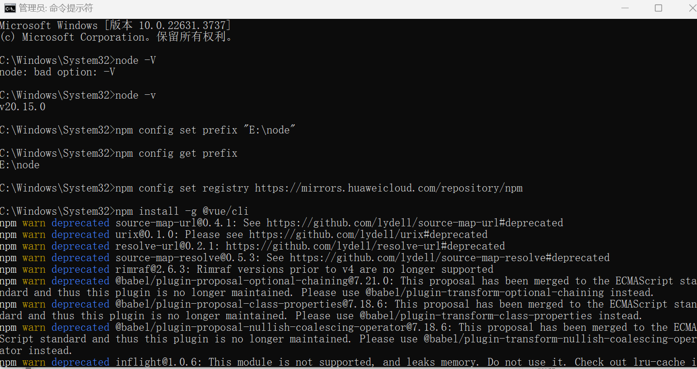
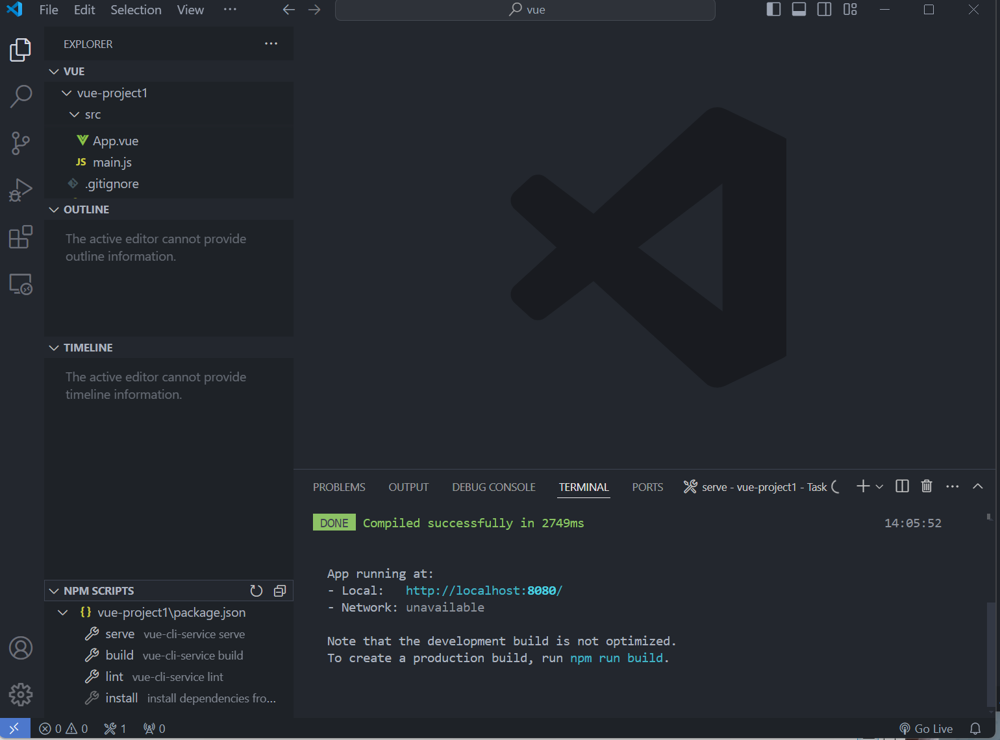
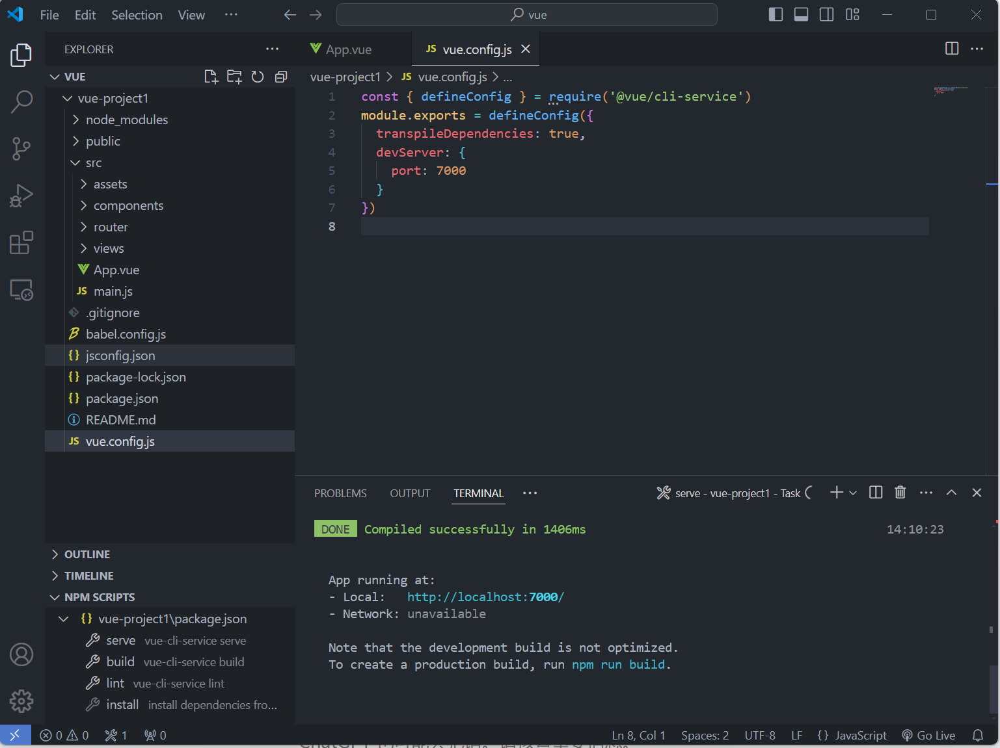
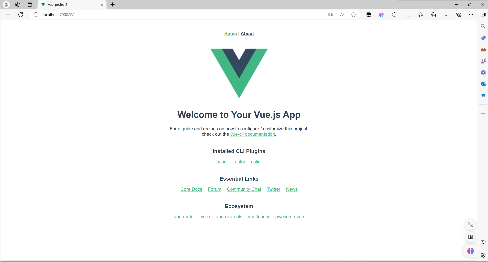

# 0619 周报

#### 学习笔记/记录

1.初步学习了前端中的js、vue、ajax和axios

2、由于是初步学习，讲的东西从来没接触过，所以视频看了很多遍，总算是稍微了解了js

3、这周作业中的构建vue工程不难，主要是理解js、vue、ajax、axios有点难度（尤其是对我这样的小白）
#### 遇到难题解决方法
难题：
视频讲解ajax和axios时，对小白很不友好

解决方法：
看了两三遍，总算有些眉目，之后深入学习应该会顺利很多

#### 构建vue大致过程

先安装vue cli

然后打开vue ui创建项目，上图是创建好的项目

然后开始构建

最终就得到了vue工程的框架
#### leetcode 刷题
回顾了一下dp
300. 最长递增子序列
     `class Solution {
     public:
     int lengthOfLIS(vector<int>& nums) {
     int n = nums.size();
     if (n == 0) return 0;

     vector<int> dp(n, 1);

     int maxLength = 1;

     for (int i = 1; i < n; ++i) {
     for (int j = 0; j < i; ++j) {
     if (nums[j] < nums[i]) {
     dp[i] = max(dp[i], dp[j] + 1);
     }
     }
     maxLength = max(maxLength, dp[i]);
     }

     return maxLength;
     }
     };
`
这道题用栈写更好写、易懂，和用动态规划复杂度一样（好吧，其实是动态规划太复杂了，我不会）
32. 最长有效括号
    `class Solution {
    public:
    int longestValidParentheses(string s) {
    int n = s.length();
    if (n == 0) return 0;

        stack<int> st;
        st.push(-1);
        
        int maxLength = 0;
        
        for (int i = 0; i < n; ++i) {
            if (s[i] == '(') {
                st.push(i);
            } else { // s[i] == ')'
                st.pop();
                if (st.empty()) {
                    st.push(i); 
                } else {
                    maxLength = max(maxLength, i - st.top());
                }
            }
        }
        
        return maxLength;
    }
    };`

