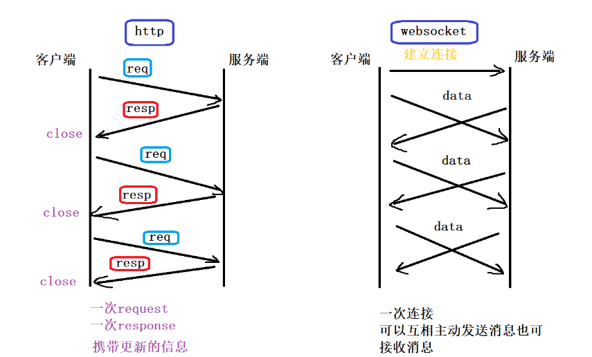

# week11-12

[苍穹外卖项目地址](https://github.com/Machisk/sky-takeaway)

做了三周。。。  
开始的比较迟了。。

整理一下：  
1.  分页查询：   
Controller返回：`PageResult`  
Service：  
&emsp;`PageHelper.startPage`(页码，每页记录数)  
&emsp;封装`PageResult`并返回    


2. 公共字段自动填充  
对于`insert`、`update`操作类型，可以使用切面进行统一拦截mapper并自动填充（注解）  
实现思路：（枚举、注解、AOP、反射）  
+ 自定义注解`AutoFill`，用于标识需要进行公共字段自动填充的方法  
+ 自定义切面类`AutoFillAspect`，统一拦截加入了`AutoFill`注解的方法，通过反射为公共字段赋值  
+ 在Mapper方法上加入`AutoFill`注解   


+ 具体步骤：  
+ 1. 创建`annotation：AutoFill`  
+ 2. 加注解： 
```java
     @Target(ElementType.METHOD)//指定注解只能加在方法上
     @Retention(RetentionPolicy.RUNTIME)
 ```
+ 3. 通过枚举方式指定加注解的当前数据库操作类型  
```java
public @interface AutoFill {
    //数据库操作类型：UPDATE，INSERT
    OperationType value();
}
```
+ 4. 切面类`aspect.AutoFillAspect`--自定义切面，实现公共字段自动填充  
+ + 加入注解：
```java
@Aspect //定义切面
@Component //Bean
```
+ + 指定切入点：`autoFillPointCut`
```java
@Pointcut("execution(* com.sky.mapper.*.*(..)) && @annotation(com.sky.annotation.AutoFill)")
public void autoFillPointCut(){}
```
&emsp;&emsp;&emsp;&emsp;`execution(所有返回类型 包.类.方法.(匹配参数类型)) && 加入AutoFill注解@annotation(自定义注解)`   
+ 5. 前置通知：通知中给公共字段赋值   
&emsp;注解：`@Before("autoFillPointCut()")`   
&emsp;例子：
```java
@Before("autoFillPointCut()")
    public void autoFill(JoinPoint joinPoint){
        log.info("开始进行公共字段自动填充...");

        //获取当前被拦截的方法上的数据库操作类型
        MethodSignature signature =(MethodSignature) joinPoint.getSignature();//方法签名对象
        AutoFill annotation = signature.getMethod().getAnnotation(AutoFill.class);//获得方法上的注解对象
        OperationType operationType = annotation.value();//获得数据库操作类型

        //获取到当前被拦截的方法的参数--实体对象
        Object[] args = joinPoint.getArgs();
        if (args == null || args.length == 0){
            return;
        }

        Object entity = args[0];

        //准备赋值的数据
        LocalDateTime now = LocalDateTime.now();
        Long currentId = BaseContext.getCurrentId();

        //根据当前不同的操作类型，为对应的属性赋值
        if (operationType == OperationType.INSERT){
            //为四个公共字段赋值
            try {
                Method setCreateTime = entity.getClass().getDeclaredMethod(AutoFillConstant.SET_CREATE_TIME,LocalDateTime.class);
                Method setCreateUser = entity.getClass().getDeclaredMethod(AutoFillConstant.SET_CREATE_USER, Long.class);
                Method setUpdateTime = entity.getClass().getDeclaredMethod(AutoFillConstant.SET_UPDATE_TIME, LocalDateTime.class);
                Method setUpdateUser = entity.getClass().getDeclaredMethod(AutoFillConstant.SET_UPDATE_USER, Long.class);

                //通过反射为对象属性赋值
                setCreateTime.invoke(entity,now);
                setCreateUser.invoke(entity,currentId);
                setUpdateTime.invoke(entity,now);
                setUpdateUser.invoke(entity,currentId);
            } catch (Exception e) {
                e.printStackTrace();
            }
        }
```
+ &emsp;&emsp;&emsp;`JoinPoint joinPoint`  在AOP中，我们知道描述切面的术语有通知（advice），切点（pointcut），连接点（join point）。  
  &emsp;&emsp;&emsp;连接点（`joinPoint`）就是在应用执行过程中能够插入切面的一个点。这个点可以是调用方法时、抛出异常时、甚至修改一个字段时。切面代码可以利用这些点插入到应用的正常流程之中，并添加新的行为。  
  &emsp;&emsp;&emsp;这个类的主要作用就是可以让我们在Advice中获取被增强方法相关的所有信息。通过`JoinPoint`可以获取被代理方法的各种信息，如方法参数，方法所在类的class对象，然后执行反射操作  
+ &emsp;&emsp;&emsp;getSignature()：返回一个 `Signature` 对象，此接口通常用于跟踪或记录应用程序以获取有关连接点的反射信息  

3. redis 设置店铺状态  
Spring Data Redis  
+ 1. 导入maven
+ 2. 配置数据源：application.yml
```
  redis:
    port: 8080  
    host: localhost
    database: 0
```
+ 3. 编写配置类，创建RedisTemplate对象  
```java
@Configuration
@Slf4j
public class RedisConfiguration {

    @Bean
    public RedisTemplate redisTemplate(RedisConnectionFactory redisConnectionFactory) {
        log.info("开始创建redis模版对象...");
        RedisTemplate redisTemplate = new RedisTemplate();
        //设置redis的连接工厂对象
        redisTemplate.setConnectionFactory(redisConnectionFactory);
        //设置redis key的序列化器
        redisTemplate.setKeySerializer(new StringRedisSerializer());
        return redisTemplate;

    }
}
```
+ 4. 通过RedisTemplate对象操作Redis  
```java
ValueOperations valueOperations = redisTemplate.opsForValue();
Integer status = (Integer) valueOperations.get(KEY);
```
4. `cpolar`实现内网穿透，获得临时网址  
cmd进入cpolar.exe所在文件夹，执行：`cpolar.exe http 80`  
5. Spring Cache 缓存  
启动类加入注解：`@EnableCaching`  
`@Cacheable`：在方法执行前查看是否有缓存对应的数据，如果有直接返回数据，如果没有调用方法获取数据返回，并缓存起来。  
`@CacheEvict`：将一条或多条数据从缓存中删除。  
`@CachePut`：将方法的返回值放到缓存中  
`@EnableCaching`：开启缓存注解功能  
   + (cacheNames = " ", key = "#user.id")
   + cacheNames 指定要放到哪个名字的缓存
   + key ：
        + `#result.id`:`result` 表示返回值
        + `#p0.id`或`#a0.id`或`#root.args[0].id`表示第一个参数的 id
   + `allEntries = true`：选定所有键
6. Spring Task 定时任务处理   
+ 启动类加入注解：`@EnableScheduling` -- 开启任务调度
+ task类编写定时任务处理方法，方法前编写cron表达式：表示多久触发一次方法  
```java
    /**
     * 处理超时订单的方法
     */
    @Scheduled(cron = "0 * * * * ?")//每分钟触发一次
    public void processTimeoutOrder(){
        log.info("定时处理超时订单：{}", LocalDateTime.now());

        //查找超时订单
        LocalDateTime time = LocalDateTime.now().plusMinutes(-15);

        //select * from orders where status = ? and order_time < (当前时间 - 15分钟)
        List<Orders> ordersList = orderMapper.getByStatusAndOrderTimeLT(Orders.PENDING_PAYMENT, time);
    }
```
7. WebSocket 实现双向交互  
   websocket约定了一个通信的规范，通过一个握手的机制，客户端和服务器之间能建立一个类似tcp的连接，从而方便它们之间的通信  
   在websocket出现之前，web交互一般是基于http协议的短连接或者长连接  
   websocket是一种全新的协议，不属于http无状态协议，协议名为"ws"  

8. Apache POI 执行文件导出
使用POI写入数据  
   [Apache POI](https://poi.apache.org/)

9. stream好用呢！！