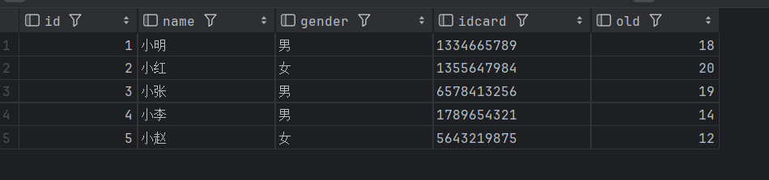
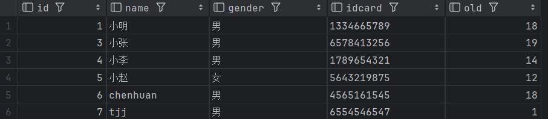

# 周报
+ 学完了Java的基础知识（上课学过的，看的就很快）  
+ 学习了MySQL的SQL语言的基础用法
+ 学习了JDBC，实现了Java连接数据库并对数据库中数据进行增删查改功能
代码的功能实现如下：

***
这是第一篇周报[Java&MySQL 学习（基础）](https://blog.csdn.net/hycccccch/article/details/140135851?spm=1001.2014.3001.5502)  
这是第二篇周报[JDBC学习（Java DataBase Connectivity）](https://blog.csdn.net/hycccccch/article/details/140149291?spm=1001.2014.3001.5502)
***
>这两天有点累了  
>不过学了这么多东西还是很开心的  
>特别是能够自己把东西做出来  
>继续加油吧