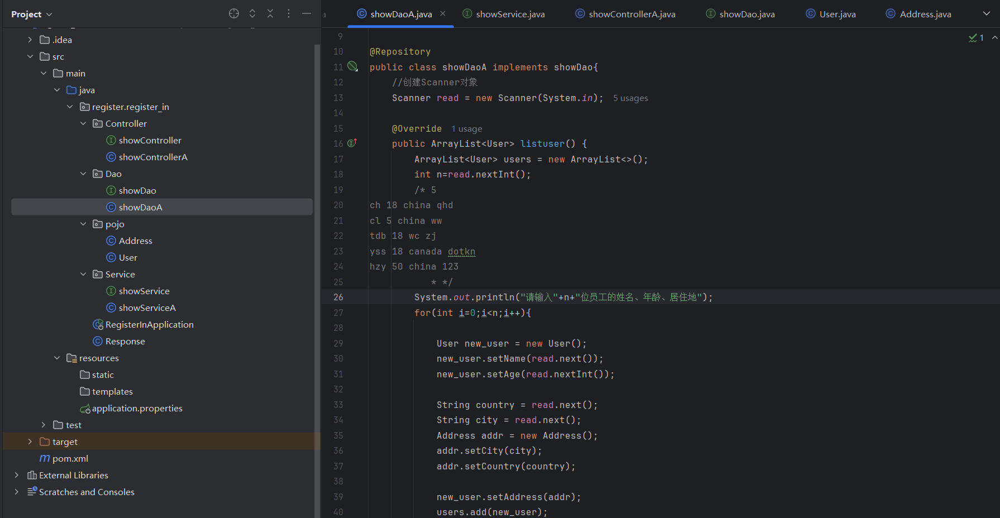
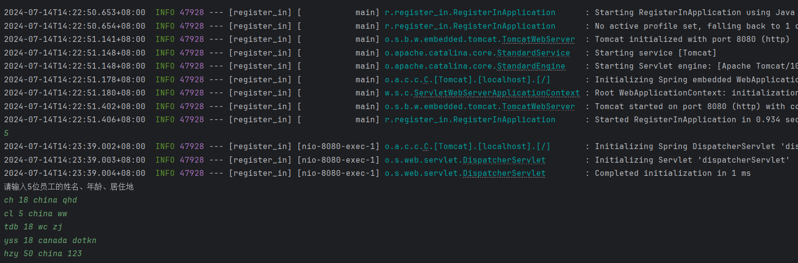
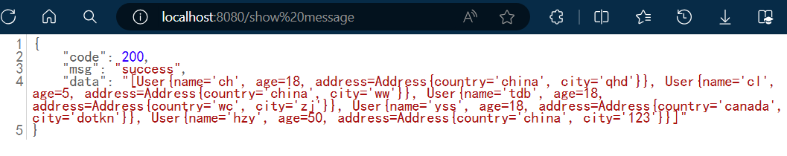

# 第五周周报
这个周报反复看了视频课挺久的时间才写出来，感觉最近也不是变难了，就是概念突然多了很多，包括一些运用啥的，不打出来试试的话基本跟不上。  
这几天学了以下内容：  
+ 看了JavaWeb后端部分课程  
+ 做了笔记 [JavaWeb后端学习](https://blog.csdn.net/hycccccch/article/details/140407556?spm=1001.2014.3001.5501)
+ 搭建一个简单的springboot工程：json格式展示输入的数据
+ 做了点mysql的题目（也是要开始刷题了。。  
至于springboot工程的搭建过程如下：
> 
 ---
> 
---
> 