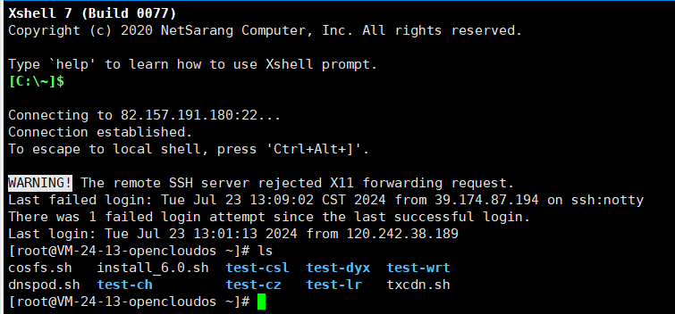

# week7周报  
有点不太能理解，为什么学Linux花了这么久。。。可能是最近有点摆，尽量找回状态！！！  
+ Linux的基础指令
+ 学习了Linux的root以及关于权限的命令
+ 使用xshell在服务器中创建了一个文件夹test-ch

[笔记](http://t.csdnimg.cn/p6TvN)  

看到week8里面还有redis，就先加一个作业  
目前正在参加三下乡活动，空闲时间也在学习后端，不过题目没有到位。。  
回去会刷的！！！