## 0708 周报
### 学习笔记/记录
- 学习JavaScript语法，对象，事件等
- 学习vue架构及指令
#### 问题
安装软件时一定要注意，如果安装到别的盘会需要改很多配置文件，那一定要完整地改完需要修改的配置，否则会浪费很多时间
### 初步搭建vue工程
#### 环境准备
1. 首先，在[Node.js官方网站](https://nodejs.org/zh-cn/download/prebuilt-installer "Nodejs官方网站")下载当前的稳定版

2. 然后点击Next直到安装完成，我们安装到D:\software\NodeJs的位置
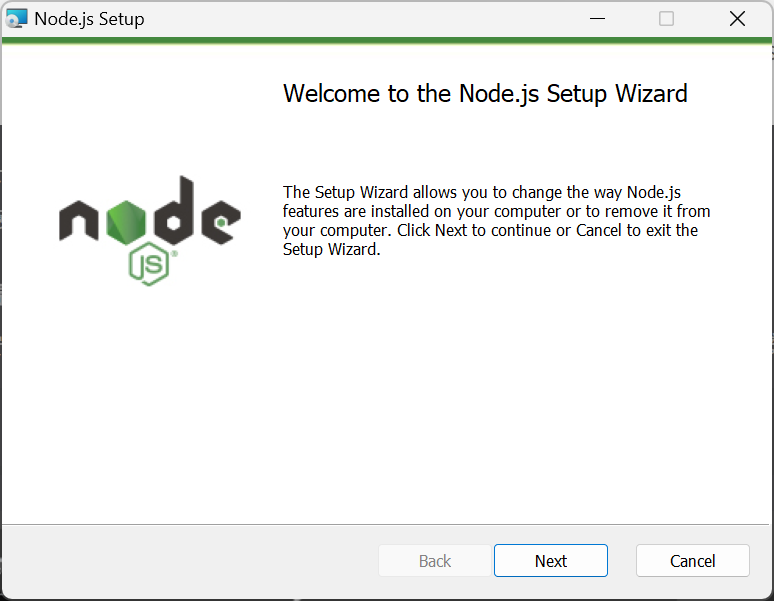
3. 在安装了Nodejs的根目录位置新建一个node_cache空文件夹和node_global空文件夹
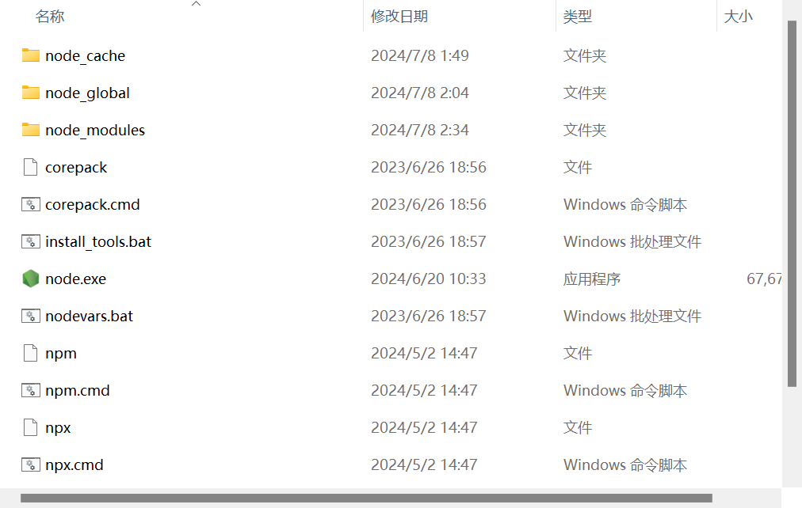
4. 检查Nodejs安装并改变cache目录为node_cache文件夹和prefix目录为node_global文件夹
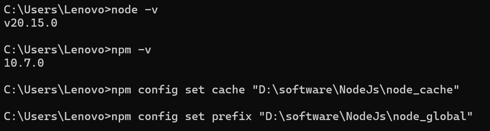
5. 在系统环境变量中新建NODE_HOME并添加为D:\software\NodeJs（根据自己安装的目录位置），新建NODE_PATH并添加为D:\software\NodeJs\node_global\node_modules
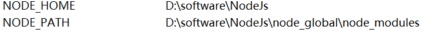
6. 在系统环境变量Path中添加NodeJs目录位置，%NODE_HOME%，%NODE_HOME%\node_global，%NODE_HOME%\node_cache
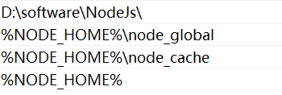
7. 在用户环境变量Path中，将npm位置改为node_global文件夹的位置
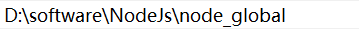
8. 管理员身份打开cmd，运行npm install -g @vue/cli，最后会出现added许多文件就表示成功了
9. 运行vue -V显示出vue-client的版本号，我们就完成了vue脚手架的安装

#### 工程的初步搭建
1. 首先在我们想要建立工程的位置新建文件夹，这里我新建vue-page的文件夹，在cmd中打开vue-page的位置，运行vue ui
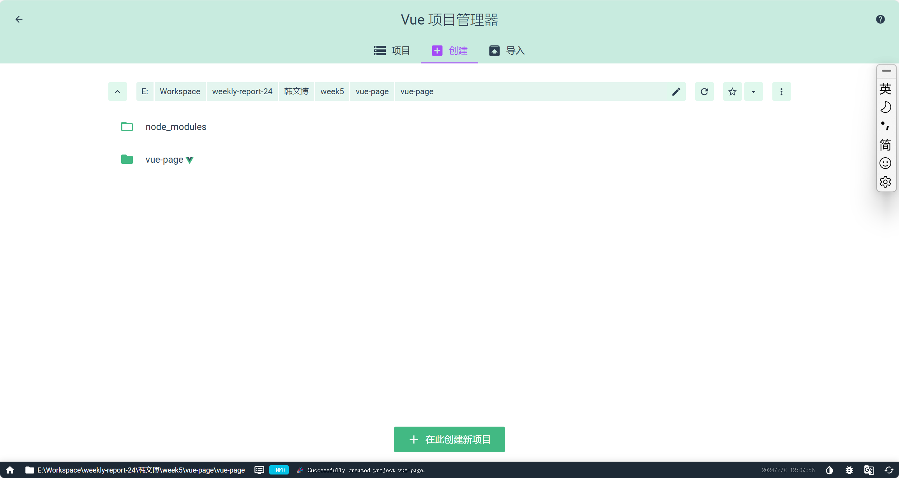
2. 接下来在项目管理器中选到自己需要建立项目的位置并开始建立项目，输入项目名称，选择手动配置进行创建
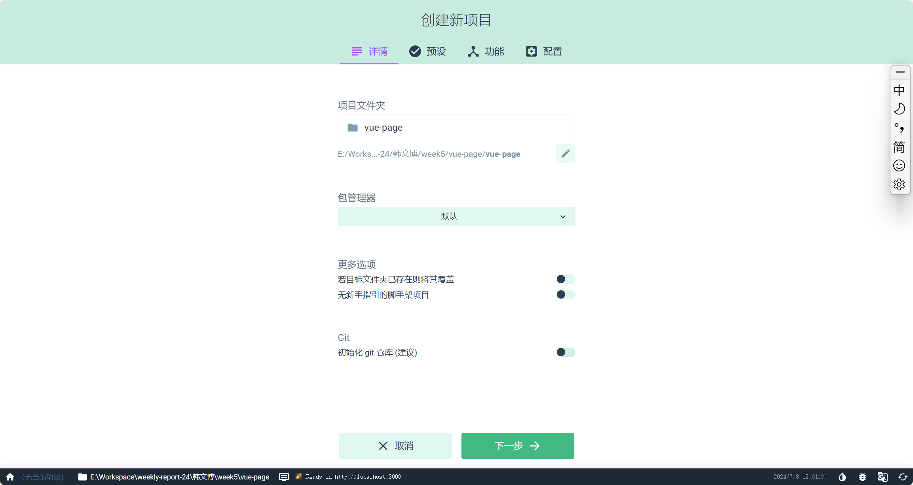
3. 添加Babel，Router，Linter/Formatter，然后创建
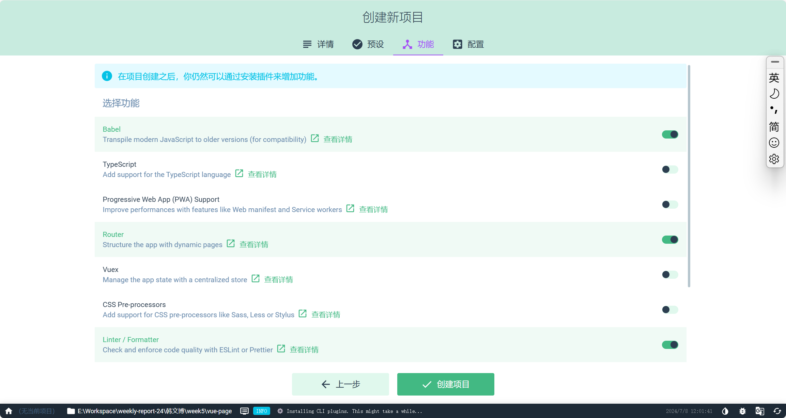
4. 选择vue版本为2.x，并选择linter配置为ESLint with error prevention only、
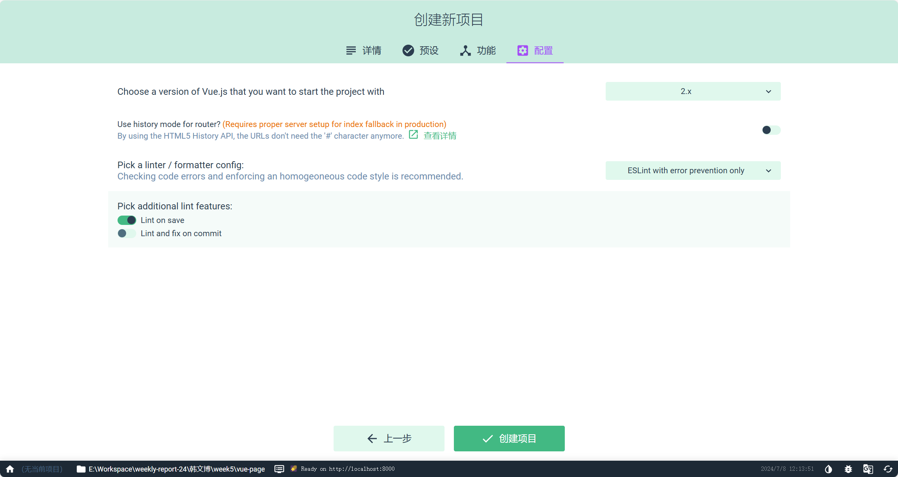
5. 最后我们就进入了项目
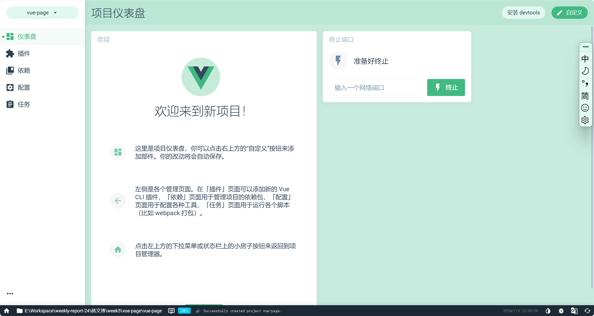

#### 2666. 只允许一次函数调用
这道题用到了try和finally，try 关键字最后可以定义 finally 代码块。 finally 块中定义的代码，总是在 try 和任何 catch 块之后、方法完成之前运行。

所以在try一次函数之后，用finally把函数变成返回undefined的函数，就可以在第一次之后都是返回undefined
```javascript
/**
 * @param {Function} fn
 * @return {Function}
 */
var once = function(fn) {
    
    return function(...args){
        try{
            return fn(...args)
        }finally{
            fn = function(){
                return undefined;
            }
        }
    }
};

/**
 * let fn = (a,b,c) => (a + b + c)
 * let onceFn = once(fn)
 *
 * onceFn(1,2,3); // 6
 * onceFn(2,3,6); // returns undefined without calling fn
 */
```

#### 2634. 过滤数组中的元素
对function传入参数的数量是可以大于设定的参数量的，只不过不会把超出参数数量的其他参数传入函数中，所以写函数的时候要注意这一点
```javascript
/**
 * @param {number[]} arr
 * @param {Function} fn
 * @return {number[]}
 */
var filter = function(arr, fn) {
        var filteredArr = [];
        for(let i = 0;i<arr.length;i++){
            if(Boolean(fn(arr[i],i))===true){
                filteredArr.push(arr[i]);
            }
        }
        return filteredArr;
    };
```