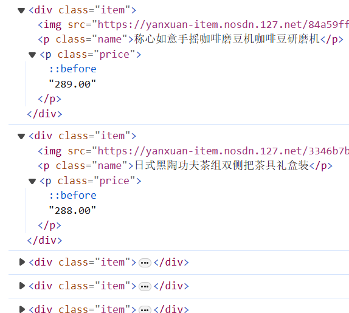
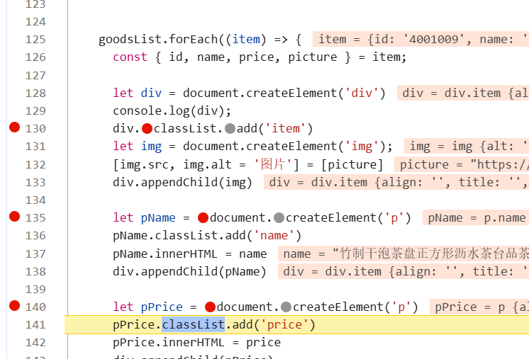
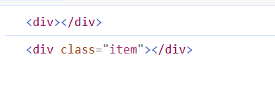

## 0719 周报
### 学习笔记/记录
- 继续学习JavaScript API和进阶知识，并复习HTML、CSS和JS基础相关语法知识
- 通过写简单的页面组合练习HTML，CSS，JavaScript

#### 问题
在声明创建div标签后，如果直接打印它会直接输出整个添加完元素后的div

但是如果打断点之后就不会输出整个元素

我觉得可能是浏览器自己优化的，按理来说不应该是先执行log这种同步任务吗？不过也有可能log作为Output确实是执行比其他异步任务要慢的

#### 要注意的知识点
- 简单数据类型要发生变化的不能用const，复杂数据类型要发生变化的可以用const，因为复杂数据类型存的是地址，地址是不变的
- 要注意少用DOM操作，能用数据操作就用数据操作，这样可以把性能用在该用的地方
- querySelector跟的参数是CSS选择器，不要忘了加.选择class，加#选择id等
- 要注意写程序的时候注意看看有的地方是不是能把事件委托给父元素来节省性能
- 要注意JS的执行机制，闭包和变量、函数提升
- 用箭头函数的时候要区分是不是需要使用this来调用对象，如果需要就不要用箭头函数了
- 数组解构和对象解构更是重中之重。多级解构的过程中，内部的对象可以再当成一个对象解构嵌套在多级解构里面
- reduce函数的回调函数中的第一个参数accumulator是上一次调用回调函数的结果，而不是一个特定的值或对象
- reduce函数在加对象里的属性的时候，初始值要给个0或者其他数，否则prev一开始会把第一个对象当成初始值，运算下去就会出错
- 做带小数的模块一定要记得先把小数乘到整数做运算再除回去，小数运算会有精度问题（当然大部分情况都没什么问题的）